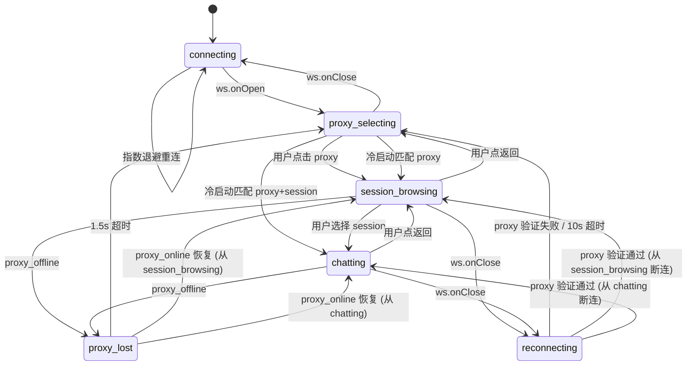

# Client 状态机统一重构计划

## 现状问题

### P0: 状态散落，行为不可预测
- 5 个 localStorage key 分散在 4 个文件中读写，清除时机依赖 React 组件卸载
- H5 和小程序的组件卸载时序不同，导致 H5 下 `useEffect` cleanup 行为不一致
- `connected` + `proxyOnline` + `selectedProxyId` 三个 boolean 组合判断当前阶段，缺乏枚举约束

### P1: 状态重复与不一致
- `dirEntries`: session-list 的 useState 和 file-store context 重复缓存
- `historySessions`: session-store 定义了类型但实际用的是 session-list 的 useState
- proxy_list_response 在 app.tsx（全局）和 proxy-select（冷启动）两处都处理

### P2: 反模式
- terminal-store reducer 里有 `Taro.setStorageSync` 副作用
- chat 页面的 useEffect deps 包含 `chatState.messages` 和 `terminalState.lines`，可能导致 stale closure

---

## 目标

1. 引入显式的 `AppPhase` 状态枚举，替代 boolean 组合
2. 集中管理 localStorage 读写，消除散落的 Storage 操作
3. 消除重复状态，统一数据源
4. 将 reducer 副作用移到 useEffect
5. 导航逻辑与状态转换绑定，不再依赖组件生命周期清理

---

## 方案设计

### Phase 枚举

```typescript
type AppPhase =
  | "connecting"        // WebSocket 未连接，显示 loading
  | "reconnecting"      // WebSocket 断开重连中，当前页面叠加浮层提示（不跳页面）
  | "proxy_selecting"   // 已连接，proxy-select 页面
  | "session_browsing"  // 已选 proxy，session-list 页面
  | "chatting"          // 在 chat 页面
  | "proxy_lost";       // proxy 掉线，toast 后回退
```

相比原方案增加了 `reconnecting`：WebSocket 断连时不立即跳走，而是在当前页面叠加"重连中"提示，超时（10s）后才回到 connecting。

不引入 `AppSubState`（proxyListLoaded、proxyValidated 等新子状态）。`connected` 和 `proxyOnline` 保留但职责收窄：不再用于判断"当前处于哪个阶段"（改用 phase），只用于页面内的 UI 判断（能否发消息、是否显示离线提示等）。

冷启动防重复触发通过 `coldStartDone` boolean 标记处理，放在 proxy-select 组件内部即可。

### 状态转换图



### localStorage 策略

Storage 写入由实体选择驱动（选了哪个 proxy/session），清除由 phase 切换驱动。

| Key | 写入时机 | 清除时机 | 读取时机 |
|-----|---------|---------|---------|
| cc_clientId | 首次启动 | 永不 | app 初始化 |
| cc_relayUrl | app 初始化 | 永不 | app 初始化、前台恢复 |
| cc_proxyId | 用户选择 proxy 时 | phase → proxy_selecting | 冷启动 |
| cc_sessionId | 用户选择 session 时 | phase → session_browsing 或 proxy_selecting | 冷启动 |
| cc_fontSizeIndex | useEffect 监听变化 | 永不 | terminal-store 初始化 |

关键变化：
- **Storage 写入**由具体的用户操作触发（选 proxy、选 session），不由 phase 触发
- **Storage 清除**在 SET_PHASE reducer 中统一处理，不依赖组件 unmount
- 重连后通过 proxy_list_response 重新验证 `cc_proxyId` 是否仍有效

### 需要处理的竞态

只列实际会发生的场景：

| 场景 | 处理 |
|------|------|
| ws 断开后很快恢复 | reconnecting 阶段不跳页面，恢复后通过 proxy_list_response 验证 proxy 状态 |
| proxy_offline 后 1.5s 内 proxy_online | 取消 reLaunch 定时器，恢复原 phase |
| 冷启动判断重复触发 | proxy-select 组件内 coldStartDone 标记防重 |

前后台切换沿用现有逻辑（useDidShow 重连），不额外建模。

---

## 实施步骤

### Step 1: 扩展 AppStore，引入 phase（低风险）

在 `app-store.ts` 中：

```typescript
type AppPhase = "connecting" | "reconnecting" | "proxy_selecting" | "session_browsing" | "chatting" | "proxy_lost";

interface AppState {
  phase: AppPhase;                  // 新增
  phaseBeforeDisconnect: AppPhase | null; // reconnecting/proxy_lost 时记住断连前的 phase
  connected: boolean;               // 保留
  proxyOnline: boolean;             // 保留
  selectedProxyId: string | null;
  selectedProxyName: string | null;
  clientId: string;
  relayUrl: string;
}
```

新增 action `SET_PHASE`。Storage 清除逻辑提取到 helper 函数中，在 dispatch 前同步调用，保证和 phase 切换原子执行，同时保持 reducer 纯净：

```typescript
// 独立 helper，不在 reducer 内部
function cleanStorageForPhaseTransition(prev: AppPhase, next: AppPhase): void {
  if (next === "proxy_selecting") {
    // 无论从哪个 phase 回到 proxy_selecting 都清（包括 reconnecting→connecting→proxy_selecting）
    Taro.removeStorageSync("cc_proxyId");
    Taro.removeStorageSync("cc_sessionId");
  }
  if (next === "session_browsing" && (prev === "chatting" || prev === "proxy_lost")) {
    Taro.removeStorageSync("cc_sessionId");
  }
}

// 封装 dispatch，保证 Storage 清除和 phase 更新同步
function transitionToPhase(prev: AppPhase, next: AppPhase, dispatch: Dispatch): void {
  cleanStorageForPhaseTransition(prev, next);
  dispatch({ type: "SET_PHASE", phase: next });
}

// reducer 保持纯函数
case "SET_PHASE": {
  const next = action.phase;
  const phaseBeforeDisconnect =
    (next === "reconnecting" || next === "proxy_lost") ? state.phase : state.phaseBeforeDisconnect;
  return { ...state, phase: next, phaseBeforeDisconnect };
}
```

各页面和 app.tsx 中调用 `transitionToPhase(stateRef.current.phase, "chatting", dispatch)` 代替直接 `dispatch({ type: "SET_PHASE" })`。

**验证点：** phase 值在 DevTools / H5 console 中可观察，单测验证 Storage 操作。

### Step 2: 各页面在导航操作时同步 phase（低风险）

**核心原则：phase 不驱动导航，导航驱动 phase。**

#### 2a. 解决 stale closure

app.tsx 的 `useEffect([], [])` 里 relay/ws handler 捕获了初始 state。后续 selectedProxyId、phase 变化后 handler 读到的还是旧值。

解决：用 ref 存最新状态，handler 通过 ref 读取：

```typescript
const stateRef = useRef(state);
stateRef.current = state;  // 每次 render 更新 ref

// handler 里用 stateRef.current 代替 state
relay.onMessage((msg) => {
  const s = stateRef.current;  // 始终读到最新值
  if (ctrl.type === "proxy_offline" && ctrl.proxyId === s.selectedProxyId) { ... }
});
```

同理 proxyLostTimer 也用 ref 存：`const proxyLostTimerRef = useRef<ReturnType<typeof setTimeout> | null>(null);`

#### 2b. 所有导航路径同步 phase

覆盖所有产生页面栈变化的路径：

```typescript
// proxy-select: 用户点击 proxy
const handleSelect = (proxy) => {
  dispatch({ type: "SET_PHASE", phase: "session_browsing" });
  Taro.navigateTo({ url: "/pages/session-list/index" });
};

// session-list: 用户选择 session
const handleSelectSession = (sessionId) => {
  dispatch({ type: "SET_PHASE", phase: "chatting" });
  Taro.navigateTo({ url: `/pages/chat/index?sessionId=${sessionId}` });
};

// session-list: 恢复历史会话
const handleResumeHistory = (historySession) => {
  dispatch({ type: "SET_PHASE", phase: "chatting" });
  Taro.navigateTo({ url: "/pages/chat/index" });
};

// session-list: 新建会话后跳转
const handleDirSelect = (cwd) => {
  dispatch({ type: "SET_PHASE", phase: "chatting" });
  Taro.navigateTo({ url: "/pages/chat/index" });
};

// safe-area-header: 自定义返回按钮
const handleBack = () => {
  if (state.phase === "chatting") dispatch({ type: "SET_PHASE", phase: "session_browsing" });
  if (state.phase === "session_browsing") dispatch({ type: "SET_PHASE", phase: "proxy_selecting" });
  Taro.navigateBack();
};
```

#### 2c. useDidShow 兜底校验

物理返回键和 iOS 滑动手势不走 handleBack，页面被系统直接 pop。用 useDidShow 在页面重新显示时校正 phase：

```typescript
// session-list/index.tsx
Taro.useDidShow(() => {
  if (state.phase !== "session_browsing") {
    dispatch({ type: "SET_PHASE", phase: "session_browsing" });
  }
});

// proxy-select/index.tsx
Taro.useDidShow(() => {
  if (state.phase !== "proxy_selecting" && state.phase !== "connecting") {
    dispatch({ type: "SET_PHASE", phase: "proxy_selecting" });
  }
});
```

这样无论通过什么方式回到页面，phase 都能最终对齐。

#### 2d. 系统事件处理

proxy 离线、relay 断连仍然在事件处理函数里直接导航，不经过 useEffect：

```typescript
// app.tsx（handler 通过 stateRef 读最新状态）
const proxyLostTimerRef = useRef<ReturnType<typeof setTimeout> | null>(null);

// proxy 离线处理，支持 1.5s 内恢复取消
if (ctrl.type === "proxy_offline" && ctrl.proxyId === stateRef.current.selectedProxyId) {
  dispatch({ type: "SET_PHASE", phase: "proxy_lost" });
  Taro.showToast({ title: "Proxy disconnected", icon: "none", duration: 1500 });
  proxyLostTimerRef.current = setTimeout(() => {
    proxyLostTimerRef.current = null;
    dispatch({ type: "SET_PHASE", phase: "proxy_selecting" });
    Taro.reLaunch({ url: "/pages/proxy-select/index" });
  }, 1500);
}

if (ctrl.type === "proxy_online" && ctrl.proxyId === stateRef.current.selectedProxyId) {
  if (proxyLostTimerRef.current) {
    clearTimeout(proxyLostTimerRef.current);
    proxyLostTimerRef.current = null;
    dispatch({ type: "SET_PHASE", phase: stateRef.current.phaseBeforeDisconnect ?? "session_browsing" });
  }
  dispatch({ type: "SET_PROXY_ONLINE", online: true });
  Taro.showToast({ title: "Proxy reconnected", icon: "none", duration: 1500 });
}

// ws 断连：进入 reconnecting，不跳页面
const reconnectTimerRef = useRef<ReturnType<typeof setTimeout> | null>(null);

ws.onStatusChange((connected) => {
  const s = stateRef.current;
  if (!connected && s.phase !== "connecting") {
    dispatch({ type: "SET_PHASE", phase: "reconnecting" });
    // 10s 超时回首页
    reconnectTimerRef.current = setTimeout(() => {
      reconnectTimerRef.current = null;
      dispatch({ type: "SET_PHASE", phase: "connecting" });
      Taro.reLaunch({ url: "/pages/proxy-select/index" });
    }, 10000);
  }
  if (connected && s.phase === "reconnecting") {
    // 清除超时 timer
    if (reconnectTimerRef.current) {
      clearTimeout(reconnectTimerRef.current);
      reconnectTimerRef.current = null;
    }
    // 不立即恢复 phase，先注册并请求 proxy 列表验证
    relay.register();
    relay.listProxies();
    // phase 恢复延迟到 proxy_list_response 中：验证 proxy 仍在线后才恢复，否则回 proxy_selecting
  }
});
```

**验证点：** 物理返回键行为不变；stale closure 不再发生；E2E 测试覆盖用户操作 + 系统事件两种导航路径。

### Step 3: 移除组件生命周期的 Storage 操作（低风险）

删除：
- `session-list/index.tsx` 中 `useEffect cleanup → removeStorageSync("cc_proxyId")`
- `chat/index.tsx` 中 `useEffect cleanup → removeStorageSync("cc_sessionId")`

这些已经被 Step 2 中导航前的 `SET_PHASE` 处理了（phase 切换时在 reducer 里统一清理 Storage）。

**验证点：** H5 下导航不再因 unmount 时序导致 Storage 提前清除。

### Step 4: 消除重复状态（低风险）

- `historySessions`：从 session-list useState 移入 session-store
- `dirEntries`：统一使用 file-store，删除 session-list 的 useState 版本
- session-list 的 `relay.onMessage` 中 `dir_list_response` 改为 dispatch 到 file-store

**验证点：** 单测 + 手动验证目录选择器功能正常。

### Step 5: 修复 reducer 副作用 + chat stale closure（低风险）

**5a.** terminal-store 的 `SET_FONT_SIZE_INDEX` 中移除 `Taro.setStorageSync` 调用。

在 chat/index.tsx 中加 useEffect：

```typescript
useEffect(() => {
  Taro.setStorageSync("cc_fontSizeIndex", terminalState.fontSizeIndex);
}, [terminalState.fontSizeIndex]);
```

**5b.** chat 页面的 relay.onMessage handler 的 useEffect deps 包含 `chatState.messages` 和 `terminalState.lines`，每次消息到来都重新注册 handler，流式输出时可能漏消息或读到旧值。

修法：和 Step 2a 同一思路，用 ref 存最新的 chatState 和 terminalState：

```typescript
const chatStateRef = useRef(chatState);
chatStateRef.current = chatState;
const terminalStateRef = useRef(terminalState);
terminalStateRef.current = terminalState;

useEffect(() => {
  if (!relay || !sessionId) return;
  const unsub = relay.onMessage((msg) => {
    const cs = chatStateRef.current;    // 始终最新
    const ts = terminalStateRef.current;
    // ... 使用 cs、ts 代替 chatState、terminalState
  });
  return unsub;
}, [relay, sessionId]);  // deps 不再包含 messages/lines
```

**验证点：** 字体大小切换后重新进入 chat 页面字号保持；流式输出时不丢消息。

### Step 6: 冷启动逻辑统一到 app.tsx（中风险）

当前 `resolveColdStart` 在 proxy-select 的 `onMessage` 里调用。重构后移到 app.tsx 的 `proxy_list_response` handler 中。

这不违反"phase 不驱动导航"原则——冷启动是在 onMessage 事件处理函数里同时设 phase 和导航，和用户点击 proxy 时的 handleSelect 是同一个模式（事件 → SET_PHASE + navigateTo）。

```typescript
// app.tsx 的 relay.onMessage handler 中
if (ctrl.type === "proxy_list_response") {
  const s = stateRef.current;
  // 仅首次触发冷启动判断
  if (!coldStartDoneRef.current && s.phase === "proxy_selecting") {
    coldStartDoneRef.current = true;
    const result = resolveColdStart(
      Taro.getStorageSync("cc_proxyId"),
      Taro.getStorageSync("cc_sessionId"),
      ctrl.proxies,
    );
    if (result) {
      dispatch({ type: "SET_PROXY", proxyId: result.proxy.proxyId, proxyName: result.proxy.name });
      dispatch({ type: "SET_PROXY_ONLINE", online: true });
      relay.selectProxy(result.proxy.proxyId);
      // 根据目标设 phase 并导航
      const targetPhase = result.url.includes("chat") ? "chatting" : "session_browsing";
      dispatch({ type: "SET_PHASE", phase: targetPhase });
      Taro.navigateTo({ url: result.url });
      return;
    }
  }
  // 非冷启动场景：正常更新 proxy 在线状态 + 处理重连验证
  if (s.selectedProxyId) {
    const selected = ctrl.proxies.find((p) => p.proxyId === s.selectedProxyId);
    dispatch({ type: "SET_PROXY_ONLINE", online: selected?.online ?? false });

    // 重连后验证：如果当前是 reconnecting，根据 proxy 是否仍在线决定恢复还是回退
    if (s.phase === "reconnecting") {
      if (selected?.online) {
        // proxy 仍在线，恢复到断连前的 phase
        transitionToPhase(s.phase, s.phaseBeforeDisconnect ?? "session_browsing", dispatch);
      } else {
        // proxy 已下线，回到 proxy_selecting
        transitionToPhase(s.phase, "proxy_selecting", dispatch);
        Taro.reLaunch({ url: "/pages/proxy-select/index" });
      }
    }
  }
}
```

proxy-select 页面删除冷启动逻辑，只负责显示 proxy 列表和响应用户点击。

**验证点：** cold-start.test.ts 纯函数测试不变，E2E 测试验证实际跳转。重连后 proxy 下线场景有测试覆盖。

---

## 实施顺序与依赖

```
Step 5 (reducer 副作用) ─── 独立，零风险
Step 4 (消除重复) ─── 独立，低风险
Step 1 (AppStore + phase) ──→ Step 2 (导航同步 phase) ──→ Step 3 (删 cleanup)
Step 6 (冷启动统一) ──→ 依赖 Step 1 + Step 2
```

建议顺序：Step 5 → Step 4 → Step 1 → Step 2 → Step 3 → Step 6

先清理反模式（5、4），再加 phase 机制（1），然后在各导航点同步 phase（2），
确认 Storage 由 phase 管理后删旧 cleanup（3），最后统一冷启动（6）。

---

## 验证策略

| 层级 | 工具 | 覆盖范围 |
|------|------|---------|
| 单元测试 | vitest | phase 转换逻辑、Storage 操作、reducer |
| E2E 测试 | Playwright + H5 | 冷启动导航、proxy 离线回退、页面间状态传递 |
| 手动测试 | 飞书小程序 | 真实 WebSocket、前后台切换、多页面栈 |

每个 Step 完成后都跑一遍全量测试 + H5 手动验证。
