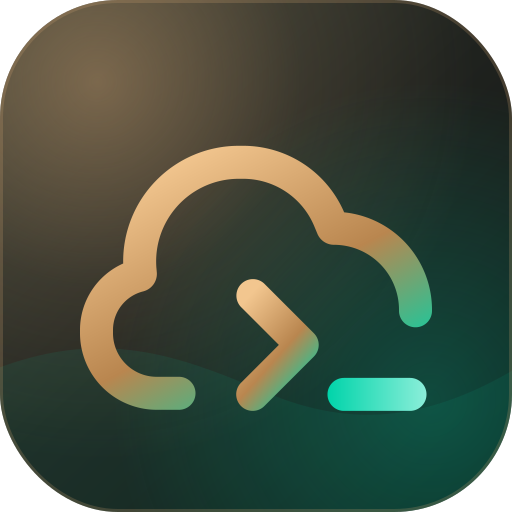
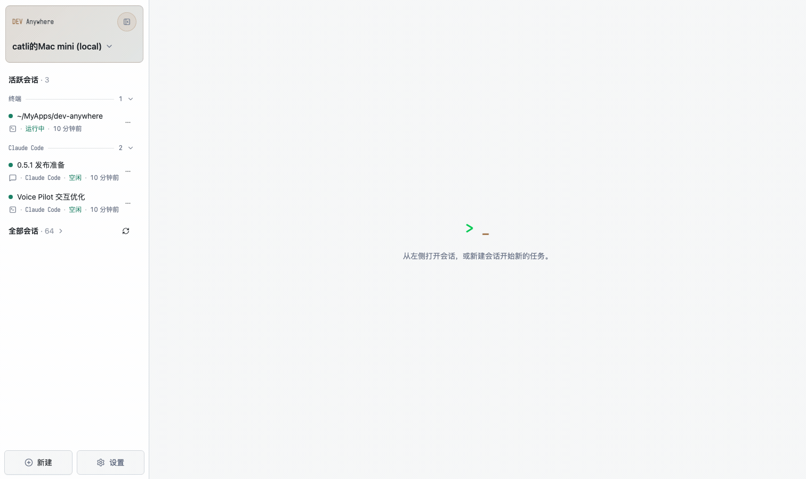
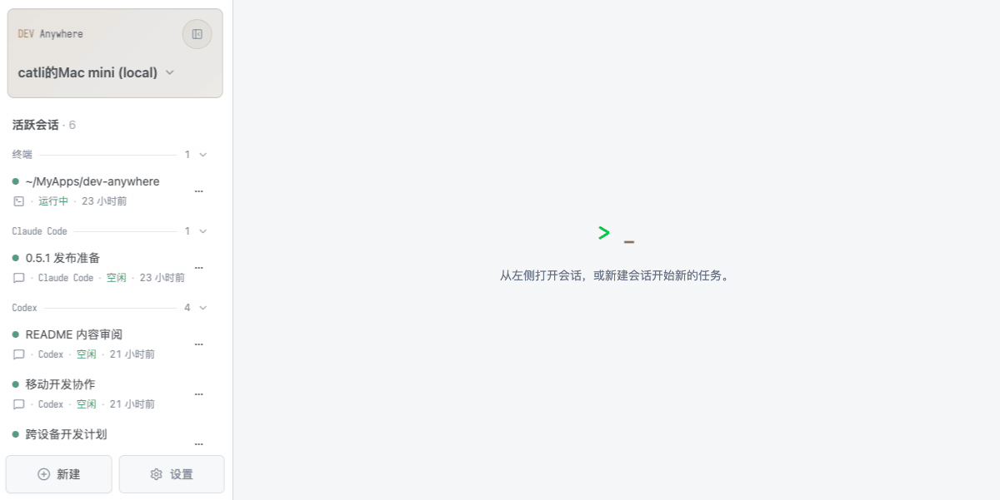
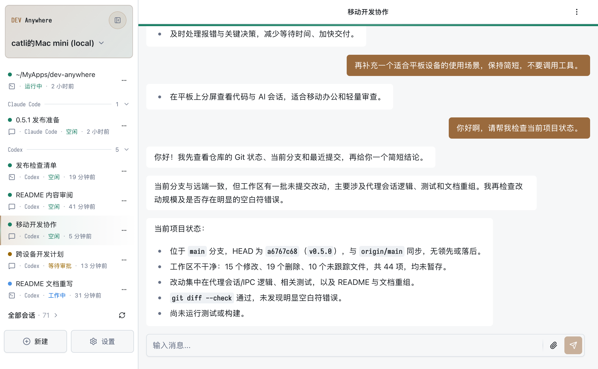
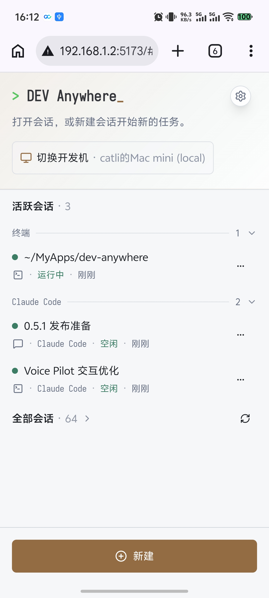
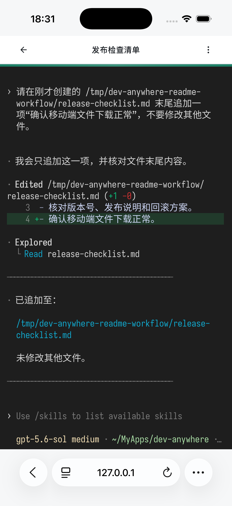
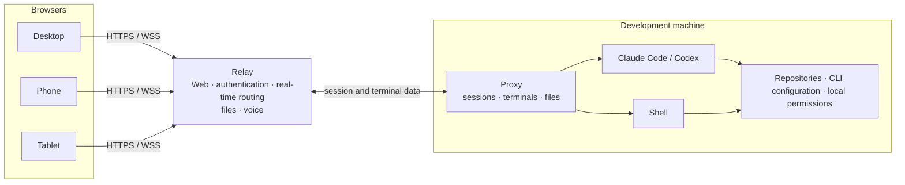

<div align="center">
  
  <h1>DEV Anywhere</h1>
  <p>Create, control, and manage Claude Code, Codex, and Shell sessions on your development machine from a browser.</p>
  <p>
    <a href="./README.md">中文</a>
    ·
    <a href="#quick-start">Quick start</a>
    ·
    <a href="./docs/DEPLOYMENT.md">VPS deployment (Chinese)</a>
  </p>
  <p>
    <a href="https://www.npmjs.com/package/@dev-anywhere/proxy"></a>
    <a href="./LICENSE"></a>
    
  </p>
</div>



## What it is

DEV Anywhere is a self-hosted remote AI coding workspace for operating Claude Code, Codex, and Shell sessions on your development machine from a browser. From any device with a browser, you can take over a session already running in a local terminal, continue a previous session, or start a new one remotely.

To relay a session started on your development machine through DEV Anywhere, add the `dev-anywhere` prefix when starting `claude` or `codex`; all other CLI arguments and terminal interaction remain unchanged. The command starts the Proxy when needed and makes the session available on the Web. Sessions created from the Web also run on the development machine and keep using its local CLIs, environment variables, and working directories.

DEV Anywhere is designed around remote coding agent workflows. In addition to reading coding agent output, you can track running state, handle tool approvals, upload or download files, search previous output, and receive browser notifications when work finishes. Your repositories, coding agent CLIs, and model credentials remain on the development machine.

> **Why build this?**
>
> After stepping away from the computer, I still wanted to keep vibe coding through the coding agent on my development machine. I wanted to check coding agent progress over a meal 🍜, handle an approval from the toilet 🚽, and even use voice interaction 🎙️ to hear results and give instructions while driving with driver assistance. Being able to AI code from anywhere is why I started this project.

## Quick start

### Prerequisites

Install [Node.js 20 or later](https://nodejs.org/en/download) on the development machine. npm is included with Node.js. Verify the environment with:

```bash
node --version
npm --version
```

To create coding agent sessions, install and authenticate Claude Code or Codex first. You can skip this step if you only need Shell sessions.

### 1. Install the local Proxy

Install DEV Anywhere on the development machine:

```bash
npm install -g @dev-anywhere/proxy
```

### 2. Establish a connection

DEV Anywhere supports two ways to connect. A VPS (virtual private server) is a cloud server that can be reached over the public internet.

| Option                            | Best for                     | Requirements                       |
| --------------------------------- | ---------------------------- | ---------------------------------- |
| Quick Tunnel                      | Evaluation and temporary use | Node.js 20+, `cloudflared`         |
| [VPS Relay](./docs/DEPLOYMENT.md) | Long-term, stable access     | Linux VPS with a public IP address |

#### Option 1: Quick Tunnel for evaluation

Quick Tunnel is for people who do not have a VPS but still want to run the project before making a deployment decision. It starts a temporary Relay, Web server, and Proxy on the development machine, then uses Cloudflare to create a random HTTPS address without requiring an account.

On macOS, install `cloudflared` with Homebrew:

```bash
brew install cloudflared
```

For other platforms, follow Cloudflare's [`cloudflared` installation guide](https://developers.cloudflare.com/cloudflare-one/networks/connectors/cloudflare-tunnel/downloads/).

Start the temporary connection on the development machine:

```bash
dev-anywhere tunnel
```

The first run initializes `~/.dev-anywhere` automatically, so no manual Relay configuration is required.

After the public-connectivity check succeeds, the command prints an access URL containing a temporary Client Token. Keep the command running and open the URL in a browser. Pressing `Ctrl+C` stops the Proxy, Relay, and tunnel together.

The random domain changes between runs, the URL stops working when the process exits, and there is no availability guarantee. Quick Tunnel is useful for evaluation, not as infrastructure to depend on.

#### Option 2: VPS Relay for regular use

For long-term use, deploy the Relay to a Linux VPS with a public IP. You can use the VPS's public IPv4 address directly or a domain pointing to it; the deployment script detects either form and configures the matching HTTPS certificate automatically. Public deployments serve the application only over HTTPS/WSS. Port 80 is used only for certificate validation and redirects. One Relay container serves the Web interface, HTTP API, files, voice endpoints, and WebSockets.

After deploying the Relay, initialize DEV Anywhere on the development machine:

```bash
dev-anywhere init
```

Edit `~/.dev-anywhere/config.json` with the Relay URL and the `RELAY_PROXY_TOKEN` printed by the deployment script:

```json
{
  "defaultProfile": "default",
  "profiles": {
    "default": {
      "relay": "cloud"
    }
  },
  "relays": {
    "cloud": {
      "url": "wss://203.0.113.10",
      "proxyToken": "RELAY_PROXY_TOKEN from deployment output"
    }
  }
}
```

When using a domain, replace `url` with `wss://your-domain`. The deployment script prints a configuration example matching the selected public entry point.

Connect the development machine to the Relay:

```bash
dev-anywhere serve start --relay cloud
dev-anywhere serve status
```

Open the Web URL printed by the deployment script. On first access, enter `RELAY_CLIENT_TOKEN` under Settings → Relay Token.

See the [VPS deployment guide](./docs/DEPLOYMENT.md) for deployment, upgrades, and troubleshooting. The guide is currently maintained in Chinese only.

### 3. Start or take over a session

Once connected, use the browser to take over a coding agent session started in a terminal on the development machine or start a new session directly.

#### Take over a development-machine terminal session from the browser

When starting Claude Code or Codex, add `dev-anywhere` before the original command:

For example, change `claude --permission-mode plan` to `dev-anywhere claude --permission-mode plan`. Apart from the `dev-anywhere` prefix, CLI arguments and the local terminal experience remain unchanged, and you can continue the same session later from the Web.

Locally started DEV Anywhere sessions connect to the Proxy automatically, so you do not need to start the Proxy service manually.

**With a VPS Relay deployment**

```bash
dev-anywhere claude
dev-anywhere codex
```

**With Quick Tunnel**

Keep `dev-anywhere tunnel` running and use another terminal:

```bash
dev-anywhere --profile quick-tunnel claude
dev-anywhere --profile quick-tunnel codex
```

#### Start a new session from the browser

Open DEV Anywhere, select a development machine, and click New to start Claude Code, Codex, or Shell in a directory on that machine.

## Main features

### Session management

- Create Claude Code, Codex, and Shell sessions directly from the browser.
- When creating a coding agent session, choose the working directory, terminal or chat interaction, and permission mode.
- Attach sessions started from a local terminal, or resume historical sessions.
- Rename, terminate, or detach sessions; hosted terminals can reconnect after a Proxy restart.
- Switch between development machines, and inspect or disconnect clients currently connected to the Relay.



### Terminal and chat views

The **terminal view** presents the original CLI interface and preserves colors, cursor behavior, keyboard interaction, and full-screen programs. The **chat view** organizes coding agent output, tool calls, approvals, and final responses into messages that are easier to read and operate by touch.


### Approvals, search, and files

- See working, idle, awaiting-approval, and connection states in real time.
- Handle tool approvals in the page; `Always Yes` can automatically confirm later approvals for a specific session.
- Enable session idle notifications to receive a browser alert when a coding agent finishes work and becomes idle.
- Search terminal and chat history with `Cmd/Ctrl + F` or the menu, then jump to a match.
- Upload images and files through the file picker, drag and drop, or the clipboard. Click a file path in coding agent output to preview the image or download the file directly in the browser.


### Voice Pilot

Voice Pilot is for times when watching or operating the screen continuously is inconvenient. Once enabled, it listens to your voice. After you finish speaking, the recognized text is sent to the coding agent automatically; when the coding agent replies, Voice Pilot reads the response aloud automatically. You can also use voice commands to handle permission approvals, generate progress summaries, or repeat the previous response. Say a natural phrase such as “exit Voice Pilot” to leave voice mode; keyboard and touch controls remain available for precise editing.


### Access across devices

DEV Anywhere supports desktop, Android, iPhone, and iPad. The mobile interface includes adaptations for touch selection, soft keyboards, terminal helper keys, file operations, and session creation. The iPad experience is also specifically adapted for use with a Magic Keyboard and other hardware keyboards.

<table>
  <tr>
    <td width="56%"><strong>iPad · Safari</strong></td>
    <td width="22%"><strong>Android · Chrome</strong></td>
    <td width="22%"><strong>iPhone · Safari</strong></td>
  </tr>
  <tr>
    <td></td>
    <td></td>
    <td></td>
  </tr>
</table>

## How it works



- **Web client**: provides session lists, terminal and chat interfaces, approvals, file operations, and Voice Pilot.
- **Relay**: serves the Web application, authenticates connections, and forwards real-time traffic between browsers and development machines.
- **Proxy**: runs on the development machine and manages coding agents, terminals, session history, and file access.
- **Coding agent / Shell**: keeps using the CLI, environment variables, repositories, and local permissions on the development machine.

Repositories and coding agent processes remain on the development machine. The Relay server forwards terminal, message, file, and voice data and can read that content, so it must run on infrastructure you trust. The current release does not provide end-to-end encryption.

## Platform support

| Platform | OS version | Browsers                                       |
| -------- | ---------- | ---------------------------------------------- |
| macOS    | 26+        | Chrome, Edge, Safari                           |
| Windows  | 11+        | Chrome, Edge                                   |
| Android  | 16+        | Chrome, Edge                                   |
| iPhone   | iOS 26+    | Safari, Chrome, Edge                           |
| iPad     | iPadOS 26+ | Safari; third-party browsers are not supported |

## Security boundaries

- Coding agents and Shells run with the current development-machine user's permissions. DEV Anywhere does not provide sandboxing.
- `RELAY_PROXY_TOKEN` authenticates a development machine and goes in the matching Relay's `proxyToken` field in `~/.dev-anywhere/config.json`; `RELAY_CLIENT_TOKEN` authenticates a browser and is entered under Settings → Relay Token on first access. The VPS deployment script generates both; see the [deployment guide](./docs/DEPLOYMENT.md#连接开发机).
- A public Relay server must use HTTPS/WSS. Tokens are bearer credentials and must be rotated immediately after a leak.
- The Relay server forwards terminal, message, file, and voice data, so deploy it on infrastructure you trust.
- Tool approvals remain an important security boundary. `Always Yes` and bypass-approval modes reduce prompts and increase the impact of mistakes.
- Do not share token-bearing access URLs with untrusted people, and never commit `~/.dev-anywhere/config.json` to a repository.

## Development

See the [development guide](./docs/DEVELOPMENT.md) for the repository layout, isolated local environment, test matrix, and release gates. That document is currently maintained in Chinese only.

## License

[MIT License](./LICENSE)
