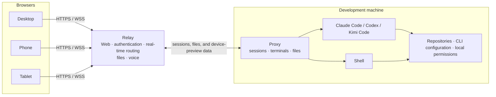

<div align="center">
  
  <h1>DEV Anywhere</h1>
  <p>Connect to your development machine from a browser and keep coding with AI from anywhere.</p>
  <p>
    <a href="./README.md">中文</a>
    ·
    <a href="#quick-start">Quick start</a>
    ·
    <a href="#upgrading">Upgrading</a>
    ·
    <a href="./docs/DEPLOYMENT.md">VPS deployment (Chinese)</a>
  </p>
  <p>
    <a href="https://www.npmjs.com/package/@dev-anywhere/proxy"></a>
    <a href="./LICENSE"></a>
    
  </p>
</div>


## What it is

DEV Anywhere lets you continue using Claude Code, Codex, Kimi Code, and Shell on your development machine from a browser. From another computer, phone, or tablet, you can continue your current session, resume a previous session, or start a new one. You can also preview web apps and interact with running iOS Simulators and Android Emulators on the development machine.

To continue a locally started Claude Code, Codex, or Kimi Code session from the browser, add `dev-anywhere` before the original command. Apart from the prefix, the development experience stays exactly the same. The session also appears in the DEV Anywhere Web interface, so you can continue working anytime and anywhere. You can also create a new coding agent session directly from the Web.

Kimi Code supports both its native terminal interface and ACP chat sessions. ACP chat streams responses and tool calls, lets you allow once, always allow, or reject tool approvals in the Web, and supports cancelling the current turn and resuming historical sessions.

DEV Anywhere is designed around remote coding agent workflows. In addition to reading coding agent output, you can track running state, handle tool approvals, upload or download files, search previous output, and receive browser notifications when work finishes. Your repositories, coding agent CLIs, and model credentials remain on the development machine.

> **Why build this?**
>
> After stepping away from the computer, I still wanted to keep vibe coding through the coding agent on my development machine. I wanted to check coding agent progress over a meal 🍜, handle an approval from the toilet 🚽, and even use voice interaction 🎙️ to hear results and give instructions while driving with driver assistance. Being able to AI code from anywhere is why I started this project.

## Quick start

### Prerequisites

Install [Node.js 20 or later](https://nodejs.org/en/download) on the development machine. npm is included with Node.js. Verify the environment with:

```bash
node --version
npm --version
```

To create coding agent sessions, install and authenticate Claude Code, Codex, or Kimi Code first. You can skip this step if you only need Shell sessions.

### 1. Install the local Proxy

Install DEV Anywhere on the development machine:

```bash
npm install -g @dev-anywhere/proxy
```

### 2. Establish a connection

DEV Anywhere supports two ways to connect. A VPS (virtual private server) is a cloud server that can be reached over the public internet.

| Option                            | Best for                     | Requirements                       |
| --------------------------------- | ---------------------------- | ---------------------------------- |
| Quick Tunnel                      | Evaluation and temporary use | Node.js 20+, `cloudflared`         |
| [VPS Relay](./docs/DEPLOYMENT.md) | Long-term, stable access     | Linux VPS with a public IP address |

#### Option 1: Quick Tunnel for evaluation

Quick Tunnel is for people who do not have a VPS but still want to run the project before making a deployment decision. It starts a temporary Relay, Web server, and Proxy on the development machine, then uses Cloudflare to create a random HTTPS address without requiring an account.

On macOS, install `cloudflared` with Homebrew:

```bash
brew install cloudflared
```

For other platforms, follow Cloudflare's [`cloudflared` installation guide](https://developers.cloudflare.com/cloudflare-one/networks/connectors/cloudflare-tunnel/downloads/).

Start the temporary connection on the development machine:

```bash
dev-anywhere tunnel
```

The first run initializes `~/.dev-anywhere` automatically, so no manual Relay configuration is required.

After the public-connectivity check succeeds, the command prints an access URL containing a temporary Client Token. Keep the command running and open the URL in a browser. Pressing `Ctrl+C` stops the Proxy, Relay, and tunnel together.

The random domain changes between runs, the URL stops working when the process exits, and there is no availability guarantee. Quick Tunnel is useful for evaluation, not as infrastructure to depend on.

#### Option 2: VPS Relay for regular use

For long-term use, deploy the Relay to a Linux VPS with a public IP. You can use the VPS's public IPv4 address directly or a domain pointing to it; the deployment script detects either form and configures the matching HTTPS certificate automatically. Public deployments serve the application only over HTTPS/WSS. Port 80 is used only for certificate validation and redirects. One Relay container serves the Web interface, HTTP API, files, voice endpoints, and WebSockets.

After deploying the Relay, initialize DEV Anywhere on the development machine:

```bash
dev-anywhere init
```

Edit `~/.dev-anywhere/config.json` with the Relay URL and the `RELAY_PROXY_TOKEN` printed by the deployment script:

```json
{
  "defaultProfile": "default",
  "profiles": {
    "default": {
      "relay": "cloud"
    }
  },
  "relays": {
    "cloud": {
      "url": "wss://203.0.113.10",
      "proxyToken": "RELAY_PROXY_TOKEN from deployment output"
    }
  }
}
```

When using a domain, replace `url` with `wss://your-domain`. The deployment script prints a configuration example matching the selected public entry point.

If an agent CLI is not detected automatically, select its executable when creating a session.

Connect the development machine to the Relay:

```bash
dev-anywhere serve start --relay cloud
dev-anywhere serve status
```

Open the Web URL printed by the deployment script. On first access, enter `RELAY_CLIENT_TOKEN` under Settings → Relay Token.

See the [VPS deployment guide](./docs/DEPLOYMENT.md) for deployment, upgrades, and troubleshooting. The guide is currently maintained in Chinese only.

### 3. Start or take over a session

Once connected, use the browser to take over a coding agent session started in a terminal on the development machine or start a new session directly.

#### Take over a development-machine terminal session from the browser

When starting Claude Code, Codex, or Kimi Code, add `dev-anywhere` before the original command:

For example, change `claude --permission-mode plan` to `dev-anywhere claude --permission-mode plan`. The CLI arguments and local terminal experience stay the same. The session also appears in DEV Anywhere, where you can take it over from a browser at any time.

**With a VPS Relay deployment**

```bash
dev-anywhere claude
dev-anywhere codex
dev-anywhere kimi
```

**With Quick Tunnel**

Keep `dev-anywhere tunnel` running and use another terminal:

```bash
dev-anywhere --profile quick-tunnel claude
dev-anywhere --profile quick-tunnel codex
dev-anywhere --profile quick-tunnel kimi
```

#### Start a new session from the browser

Open DEV Anywhere, select a development machine, and click New to start Claude Code, Codex, Kimi Code, or Shell in a directory on that machine. Claude Code, Codex, and Kimi Code all offer terminal and chat modes; Kimi Code chat runs over ACP.

## Upgrading

### Quick Tunnel

Press `Ctrl+C` to stop the running Quick Tunnel, then update the local Proxy and start it again:

```bash
npm install -g @dev-anywhere/proxy@latest
dev-anywhere tunnel
```

### VPS Relay

From the DEV Anywhere project directory, run the following commands to upgrade the Relay:

```bash
git pull --ff-only
bash scripts/deploy/install-relay.sh \
  --ssh root@your-vps \
  dev-anywhere.example.com
```

Keep the last argument consistent with the initial deployment: pass the domain again for a domain deployment, or the public IP for an IP deployment. The installer reuses the existing tokens on the VPS.

DEV Anywhere 0.9.0 is incompatible with earlier releases. After upgrading the Relay, manually update and restart DEV Anywhere on every development machine:

```bash
npm install -g @dev-anywhere/proxy@0.9.0
dev-anywhere serve restart --relay cloud
```

After all development machines are updated, refresh the browser and restart any sessions that were still running before the upgrade.

You can then verify the version and connection on any development machine:

```bash
dev-anywhere --version
dev-anywhere serve status
```

For pinned versions or VPS container checks, see the [VPS deployment guide](./docs/DEPLOYMENT.md#升级).

## Main features

### Session management

- Create terminal or chat sessions for Claude Code, Codex, and Kimi Code, plus Shell sessions, directly from the browser.
- Choose the working directory, terminal or chat interaction, and permission mode for Claude Code, Codex, or Kimi Code sessions.
- Attach sessions started from a local terminal, or resume Claude Code, Codex, and Kimi Code historical sessions.
- Rename, terminate, or detach sessions; sessions started from a local terminal can reconnect after a Proxy restart.
- Switch between development machines, and inspect or disconnect clients currently connected to the Relay. Remove an unused offline machine by swiping left on mobile or using its desktop overflow menu; it will appear again if it reconnects.


### Terminal and chat views

The **terminal view** presents the original CLI interface and preserves colors, cursor behavior, keyboard interaction, and full-screen programs. The **chat view** organizes coding agent output, tool calls, approvals, and final responses into messages that are easier to read and operate by touch. Kimi Code chat uses ACP and supports streaming output, tool calls and approvals, cancelling the current turn, and resuming historical sessions.


### Web and mobile device simulator previews

Select Preview from the New menu to view a web app on the development machine or interact with a running iOS Simulator or Android Emulator.


- **Web previews** turn a website that is only available on the development machine (for example at `http://localhost` or `http://127.0.0.1`), an HTML file, or a directory containing web pages into a temporary HTTPS link. You can copy the link or, when supported, send it through your browser's system share feature. The link stops working as soon as you stop the preview.
- **Mobile device simulator previews** let you view and operate a simulator directly in the browser. They support basic touch actions such as tap, long-press, and swipe, as well as rotation, Home, Android Back, and pasting text.


- Web previews require `cloudflared` or `cpolar`; Cpolar must also be authenticated before use.
- iOS Simulator previews are available only from a macOS development machine and require Baguette 0.1.96 or later.
- Android Emulator previews require `adb`.

### Approvals, search, and files

- See working, idle, awaiting-approval, and connection states in real time.
- Handle tool approvals in the page; `Always Yes` can automatically confirm later approvals for a specific session.
- Enable session idle notifications to receive a browser alert when a coding agent finishes work and becomes idle.
- Search terminal and chat history with `Cmd/Ctrl + F` or the menu, then jump to a match.
- Upload images and files through the file picker, drag and drop, or the clipboard. Click a file path in coding agent output to preview the image or download the file directly in the browser.


### Voice Pilot

Voice Pilot is for times when watching or operating the screen continuously is inconvenient. Once enabled, it listens to your voice. After you finish speaking, the recognized text is sent to the coding agent automatically; when the coding agent replies, Voice Pilot reads the response aloud automatically. You can also use voice commands to handle permission approvals, generate progress summaries, or repeat the previous response. Say a natural phrase such as “exit Voice Pilot” to leave voice mode; keyboard and touch controls remain available for precise editing.


### Access across devices

DEV Anywhere supports desktop, Android, iPhone, and iPad. The mobile interface includes adaptations for touch selection, soft keyboards, terminal helper keys, file operations, and session creation. The iPad experience is also specifically adapted for use with a Magic Keyboard and other hardware keyboards.

<table>
  <tr>
    <td width="56%"><strong>iPad · Safari</strong></td>
    <td width="22%"><strong>Android · Chrome</strong></td>
    <td width="22%"><strong>iPhone · Safari</strong></td>
  </tr>
  <tr>
    <td></td>
    <td></td>
    <td></td>
  </tr>
</table>

## How it works


```mermaid
flowchart LR
  subgraph clients["Browsers"]
    direction TB
    desktop["Desktop"]
    phone["Phone"]
    tablet["Tablet"]
  end

  relay["Relay<br/>Web · authentication · real-time routing<br/>files · voice"]

  subgraph machine["Development machine"]
    direction TB
    proxy["Proxy<br/>sessions · terminals · files"]
    agent["Claude Code / Codex / Kimi Code"]
    shell["Shell"]
    local["Repositories · CLI configuration · local permissions"]

    proxy --> agent
    proxy --> shell
    agent --> local
    shell --> local
  end

  desktop -->|"HTTPS / WSS"| relay
  phone -->|"HTTPS / WSS"| relay
  tablet -->|"HTTPS / WSS"| relay
  relay <-->|"sessions, files, and device-preview data"| proxy
```

- **Web client**: provides session lists, terminal and chat interfaces, web and simulator previews, approvals, file operations, and Voice Pilot.
- **Relay**: serves the Web application, authenticates browsers and development machines, and forwards session and device-preview data.
- **Proxy**: runs on the development machine, manages coding agents, terminals, session history, and file access, and provides web and simulator previews.
- **Coding agent / Shell**: keeps using the CLI, environment variables, repositories, and local permissions on the development machine.

Repositories and coding agent processes remain on the development machine. The Relay forwards and can read terminal, message, file, voice, and device-preview data, so it must run on infrastructure you trust. Web-preview pages and assets bypass the Relay and are served through Cloudflare Tunnel or Cpolar; preview commands and metadata still pass through the Relay. The current release does not provide end-to-end encryption.

## Platform support

| Platform | OS version | Browsers                                       |
| -------- | ---------- | ---------------------------------------------- |
| macOS    | 26+        | Chrome, Edge, Safari                           |
| Windows  | 11+        | Chrome, Edge                                   |
| Android  | 16+        | Chrome, Edge                                   |
| iPhone   | iOS 26+    | Safari, Chrome, Edge                           |
| iPad     | iPadOS 26+ | Safari; third-party browsers are not supported |

## Security boundaries

- Coding agents and Shells run as the system user who started the Proxy. They can access the files and processes available to that user. DEV Anywhere does not add another sandbox around them.
- `RELAY_PROXY_TOKEN` authenticates a development machine and is stored in the matching Relay's `proxyToken` field in `~/.dev-anywhere/config.json`. `RELAY_CLIENT_TOKEN` authenticates a browser and is entered under Settings → Relay Token on first access. The VPS deployment script generates both; see the [deployment guide](./docs/DEPLOYMENT.md#连接开发机).
- Removing an offline development machine from the list only deletes its saved Relay record. It does not invalidate the Proxy Token stored on that machine. If a machine is lost, transferred, or sold with its DEV Anywhere configuration possibly intact, replace the Relay's Proxy Token and update the machines you still use with the new Token.
- A public Relay must use HTTPS/WSS. A Token is an access credential; anyone who obtains it may be able to connect to DEV Anywhere as the corresponding identity. Replace it immediately if it leaks.
- The Relay can read the terminal, message, file, voice, and device-preview data that it forwards, as well as web-preview settings and status, so deploy it only on infrastructure you trust.
- Tool approvals ask for confirmation before an operation that needs authorization. Enabling `Always Yes` or bypassing approvals reduces those confirmations and may increase the impact of mistakes.
- Web preview links are not protected by the Relay Token. Anyone with a link can access it. When you select an HTML file, other non-hidden files in its folder may also be available through the preview link; when you select a directory, every file that the preview server can serve from that directory may be accessible. Preview only content you are willing to expose, and stop the preview when you are done.
- Do not share token-bearing access URLs with people you do not trust.
- `~/.dev-anywhere/config.json` may contain a Proxy Token. Do not put it in a project directory or upload it to GitHub, GitLab, or another code-hosting service.

## Development

See the [development guide](./docs/DEVELOPMENT.md) for the repository layout, isolated local environment, test matrix, and release gates. That document is currently maintained in Chinese only.

## License

[MIT License](./LICENSE)
