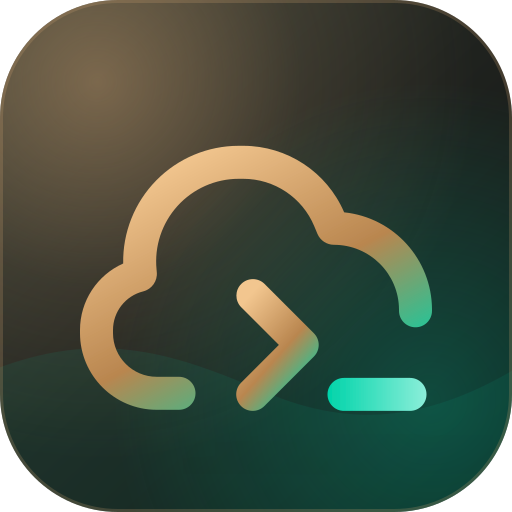
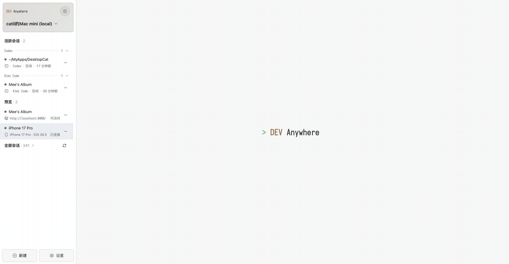
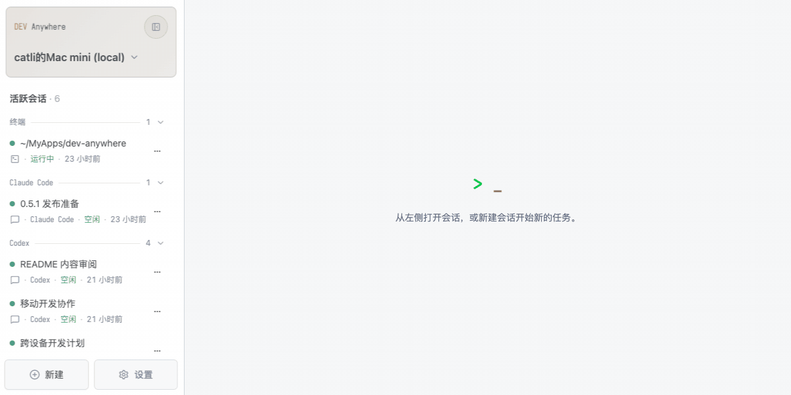
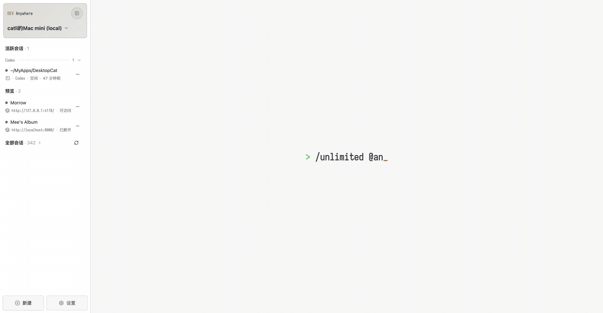
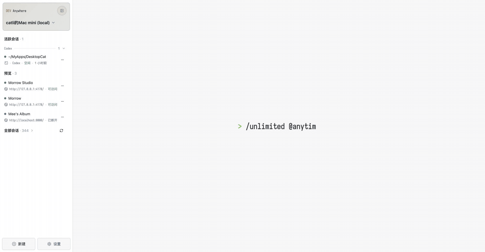
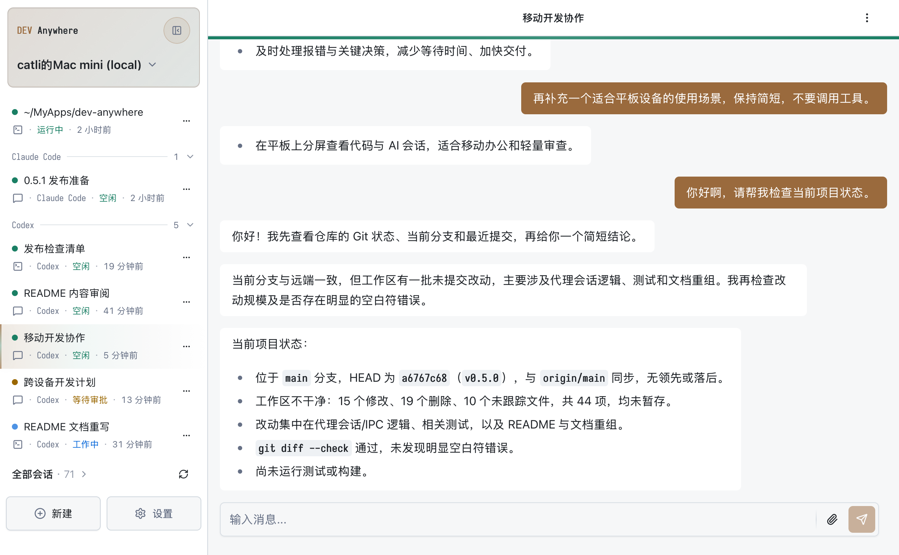
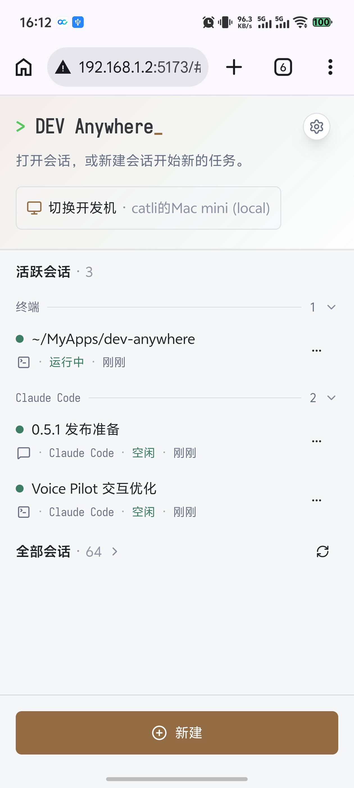
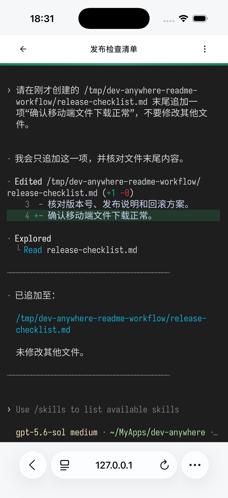
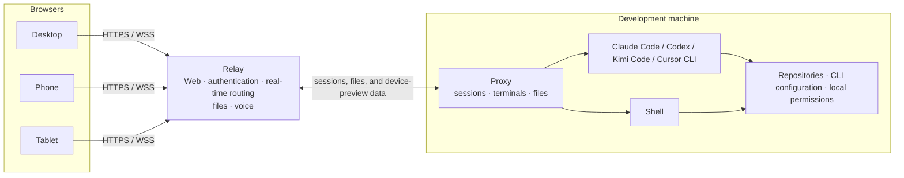

<div align="center">
  
  <h1>DEV Anywhere</h1>
  <p>Connect to your development machine from a browser and keep coding with AI from anywhere.</p>
  <p>
    <a href="./README.md">中文</a>
    ·
    <a href="#quick-start">Quick start</a>
    ·
    <a href="#upgrading">Upgrading</a>
    ·
    <a href="./docs/DEPLOYMENT.md">VPS deployment (Chinese)</a>
  </p>
  <p>
    <a href="https://www.npmjs.com/package/@dev-anywhere/proxy"></a>
    <a href="./LICENSE"></a>
    
  </p>
</div>



## What it is

DEV Anywhere lets you use Claude Code, Codex, Kimi Code, Cursor CLI, and Shell on your development machine remotely from a computer, phone, or tablet. In the Web interface, you can chat with coding agents, interact with terminals, handle tool approvals, transfer files, preview web apps, and operate iOS Simulators and Android Emulators already running on the development machine.

To continue a locally started Claude Code, Codex, Kimi Code, or Cursor CLI session from the browser, add `dev-anywhere` before the original command. Once started, you can work in your local terminal as usual or use the DEV Anywhere Web interface anytime, anywhere to continue your work or create a new coding agent session.

> **Why build this?**
>
> After stepping away from the computer, I still wanted to keep vibe coding through the coding agent on my development machine. I wanted to check coding agent progress over a meal 🍜, handle an approval from the toilet 🚽, and even use voice interaction 🎙️ to hear results and give instructions while driving with driver assistance. Being able to AI code from anywhere is why I started this project.

## Quick start

### Prerequisites

Use a development machine running macOS, Linux, or Windows 11. Windows works natively without WSL.

Install [Node.js 22.22.2 or later](https://nodejs.org/en/download) on the development machine. npm is included with Node.js. Verify the environment with:

```bash
node --version
npm --version
```

Install and sign in to the coding agent you want to use: Claude Code, Codex, Kimi Code, or Cursor CLI. You can skip this step if you only need Shell sessions.

### 1. Install DEV Anywhere

Install DEV Anywhere's local program (the Proxy) on the development machine:

```bash
npm install -g @dev-anywhere/proxy
```

### 2. Establish a connection

Choose one of the following ways to connect to your development machine:

| Option                            | Best for                     | Requirements                       |
| --------------------------------- | ---------------------------- | ---------------------------------- |
| Quick Tunnel                      | Evaluation and temporary use | Node.js 22.22.2+, `cloudflared`    |
| [VPS Relay](./docs/DEPLOYMENT.md) | Long-term, stable access     | Linux VPS with a public IP address |

#### Option 1: Quick Tunnel for evaluation

Quick Tunnel lets you try DEV Anywhere without a VPS or Cloudflare account. It generates a temporary HTTPS address for remote access to your development machine.

On macOS, install `cloudflared` with Homebrew:

```bash
brew install cloudflared
```

For other platforms, follow Cloudflare's [`cloudflared` installation guide](https://developers.cloudflare.com/cloudflare-one/networks/connectors/cloudflare-tunnel/downloads/).

Once installed, run this on the development machine:

```bash
dev-anywhere tunnel
```

The first run configures everything automatically. When the terminal prints an access URL, open it in a browser on another device to use DEV Anywhere. The URL includes an access credential, so keep it private.

Keep the command running while you use it. Pressing `Ctrl+C` ends the connection and invalidates the URL. Each run generates a random address, and the connection may be unreliable; for regular use, choose VPS Relay below.

#### Option 2: VPS Relay for regular use

For regular use, deploy the Relay on a Linux VPS (cloud server) to connect browsers with your development machine. You can use the VPS's public IPv4 address or a domain pointing to it; the deployment script configures HTTPS automatically.

You can deploy the Relay to a Linux VPS from a macOS, Linux, or Windows computer without cloning the repository. Set up [SSH key access](./docs/DEPLOYMENT.md#配置-ssh-免密登录) before running the commands below, or [log in to the VPS and run the installer there](./docs/DEPLOYMENT.md#直接在-vps-上运行).

Run the command below from a local macOS or Linux terminal. `203.0.113.10` is an example IP; replace it with your VPS's public IPv4 address. Replace `root` with your SSH username and `dev-anywhere.example.com` with the VPS's domain or public IPv4 address:

```bash
curl -fsSL https://raw.githubusercontent.com/lichenxicatapple-blip/dev-anywhere/main/install.sh | bash -s -- --ssh root@203.0.113.10 dev-anywhere.example.com
```

On Windows, run this in PowerShell, then enter the VPS's SSH login address and domain or public IPv4 address when prompted:

```powershell
irm https://raw.githubusercontent.com/lichenxicatapple-blip/dev-anywhere/main/install.ps1 | iex
```

After deploying the Relay, initialize DEV Anywhere on the development machine:

```bash
dev-anywhere init
```

Edit `~/.dev-anywhere/config.json` (`%USERPROFILE%\.dev-anywhere\config.json` on Windows) with the Relay URL and the `RELAY_PROXY_TOKEN` printed by the deployment script:

```json
{
  "defaultProfile": "default",
  "profiles": {
    "default": {
      "relay": "cloud"
    }
  },
  "relays": {
    "cloud": {
      "url": "wss://203.0.113.10",
      "proxyToken": "RELAY_PROXY_TOKEN from deployment output"
    }
  }
}
```

Replace `url` with `wss://YOUR_VPS_PUBLIC_IP` or `wss://your-domain`; do not use the example IP as-is. The deployment script also prints a configuration example using the domain or IP you supplied.

Save the configuration, then connect the development machine to the Relay:

```bash
dev-anywhere serve start --relay cloud
dev-anywhere serve status
```

Once the status shows that the Relay is connected, open the Web URL printed by the deployment script and enter `RELAY_CLIENT_TOKEN` under Settings → Relay Token to complete the initial connection.

See the [VPS deployment guide](./docs/DEPLOYMENT.md) for deployment, upgrades, and troubleshooting. The guide is currently maintained in Chinese only.

### 3. Start a session

Once connected, you can start a session from a terminal on the development machine or from the DEV Anywhere Web interface.

#### Start from the Web interface

Select a development machine, click New, choose a coding agent or Shell, and set the working directory. Coding agent sessions also let you choose a permission mode and a terminal or chat view.

If a coding agent is installed but reported as not found, enter or browse for its executable path on the development machine under **CLI 路径** (CLI path) in the new-session dialog, then click **保存** (Save).

> **macOS folder permissions:** Accessing Desktop, Documents, Downloads, and other protected folders may require approval on the Mac. Grant access before working remotely; see [folder access settings](./docs/SYSTEM-SERVICE.md#macos-文件夹访问) (Chinese).

#### Start from a terminal on the development machine

Add `dev-anywhere` before the original command to start a session. For example, write `claude --permission-mode plan` as `dev-anywhere claude --permission-mode plan`, keeping the original arguments.

**With a VPS Relay deployment**

```bash
dev-anywhere claude
dev-anywhere codex
dev-anywhere kimi
dev-anywhere cursor
```

You can also launch Cursor CLI with `dev-anywhere agent ...`.

**With Quick Tunnel**

Keep `dev-anywhere tunnel` running and use another terminal:

```bash
dev-anywhere --profile quick-tunnel claude
dev-anywhere --profile quick-tunnel codex
dev-anywhere --profile quick-tunnel kimi
dev-anywhere --profile quick-tunnel cursor
```

Once the session starts, you can keep working in your local terminal or open the DEV Anywhere Web interface and select that session from the session list to continue your work.

## Automatic startup

After connecting successfully through a VPS Relay, you can set the development machine to connect automatically. Keep it powered on, connected to the network, and awake.

### Start at login

Run these commands on the development machine:

```bash
dev-anywhere serve autostart enable
dev-anywhere serve autostart status
```

DEV Anywhere will connect to the Relay the next time you log in. To disable this, run `dev-anywhere serve autostart disable`. These commands change future startup behavior without starting or stopping the current Proxy. Supported on macOS, Linux with systemd user services, and Windows.

### Start at boot, before login

To connect to the Relay at boot without logging in to the desktop, enable the system service. Run this from the account you normally use for DEV Anywhere and approve the administrator authorization prompt:

```bash
dev-anywhere serve autostart enable --system --now
```

The service runs under that account, and `--now` restarts the Proxy immediately. Create new sessions after enabling the service if you need them to remain available after logout. Supported on macOS, Linux with systemd, and Windows. Initial setup on Windows also requires the account password, not a PIN.

See the [system service guide](./docs/SYSTEM-SERVICE.md) (Chinese) for disabling the service, verification, and troubleshooting.

> **macOS startup unlock:** With FileVault enabled, you must enter a password to unlock the disk after restarting your Mac before DEV Anywhere can start. To connect automatically after a restart, turn off FileVault and enable the system service; automatic login is not required. Turning off FileVault removes the disk protection provided by your login password. See the [system service guide](./docs/SYSTEM-SERVICE.md) (Chinese) for instructions.

## Upgrading

Before upgrading, check that Node.js on the development machine meets the required version. DEV Anywhere's automatic updater does not upgrade Node.js.

### Quick Tunnel

Press `Ctrl+C` to stop the running Quick Tunnel, then update the local Proxy and start it again:

```bash
npm install -g @dev-anywhere/proxy@latest
dev-anywhere tunnel
```

### VPS Relay

Rerun the deployment command to pull the latest published Relay image. On macOS or Linux:

```bash
curl -fsSL https://raw.githubusercontent.com/lichenxicatapple-blip/dev-anywhere/main/install.sh | bash -s -- --ssh root@203.0.113.10 dev-anywhere.example.com
```

On Windows PowerShell:

```powershell
irm https://raw.githubusercontent.com/lichenxicatapple-blip/dev-anywhere/main/install.ps1 | iex
```

Use the same SSH login address and domain or public IPv4 address as the initial deployment. The installer preserves existing tokens. Globally npm-installed Proxies with automatic updates enabled follow new Relay releases and reconnect after updating. Refresh the page once the update finishes.

Verify the version and connection on the development machine:

```bash
dev-anywhere --version
dev-anywhere serve status
```

For pinned versions, disabled automatic updates, or migration from a release older than 0.9.2, see the [VPS deployment guide](./docs/DEPLOYMENT.md#升级). For connection problems, see [troubleshooting](./docs/DEPLOYMENT.md#排障).

## Main features

### Session management

- Create coding agent or Shell sessions in a directory of your choice; coding agent sessions also offer permission and interaction modes.
- Continue interacting with sessions started locally through `dev-anywhere` in the Web interface, or resume previous coding agent sessions.
- Rename, terminate, or detach sessions; sessions started from a local terminal can reconnect after a Proxy restart.
- Switch between development machines and manage connected clients and offline machines.



### Terminal and chat views

The **terminal view** preserves the CLI interface and keyboard controls for users comfortable with a terminal. The **chat view** presents responses, tool calls, and approvals as messages that are easier to read and operate by touch.

Claude Code, Codex, Kimi Code, and Cursor CLI all support both views. Kimi Code and Cursor CLI chat use ACP, with streaming responses, tool calls, cancellation of the current response, and history resumption. Cursor ACP also supports questions, plan approval, and todo lists.


### Web and mobile device simulator previews

Select Preview from the New menu to view a web app on the development machine or interact with a running iOS Simulator or Android Emulator.



- **Web previews** create a temporary HTTPS link for a local website (such as `http://localhost`), an HTML file, or a web directory on the development machine. Open the link on another device or share it with others. Stopping the preview invalidates the link.
- **Mobile device simulator previews** let you view and operate a simulator directly in the browser. They support basic touch actions such as tap, long-press, and swipe, as well as rotation, Home, Android Back, and pasting text.

Updating or restarting the Proxy preserves web-preview links, and simulator video resumes after reconnection. To end sharing, stop the preview itself; stopping only the Proxy does not invalidate the shared link.



- Web previews require `cloudflared` or `cpolar`; Cpolar must also be authenticated before use.
- iOS Simulator previews are available only from a macOS development machine and require Baguette 0.1.96 or later.
- Android Emulator previews require `adb`.

### Approvals, search, and files

- See whether a session is working, awaiting approval, or idle, along with the development machine's connection status.
- Handle tool approvals in the page, or enable `Always Yes` for sessions that support it. Codex terminal sessions require manual confirmation or an approval policy chosen at creation.
- Enable session idle notifications to receive a browser alert when a coding agent finishes work and becomes idle.
- Search terminal and chat history with `Cmd/Ctrl + F` or the menu, then jump to a match.
- Upload images and files through the file picker, drag and drop, or the clipboard. Click a file path in coding agent output to preview the image or download the file directly in the browser.


### Voice Pilot

When you cannot keep watching the screen, use Voice Pilot to talk with your coding agent. It turns your speech into text, sends it to the agent, and reads replies aloud. You can also approve actions, request a progress summary, or hear the last reply again. Say “exit Voice Pilot” to leave voice mode; keyboard and touch controls remain available throughout.


### Access across devices

DEV Anywhere works on computers, Android phones, iPhones, and iPads. The mobile interface supports touch selection, soft keyboards, and terminal helper keys. You can also use a Magic Keyboard to operate DEV Anywhere on an iPad.

<table>
  <tr>
    <td width="56%"><strong>iPad · Safari</strong></td>
    <td width="22%"><strong>Android · Chrome</strong></td>
    <td width="22%"><strong>iPhone · Safari</strong></td>
  </tr>
  <tr>
    <td></td>
    <td></td>
    <td></td>
  </tr>
</table>

## How it works


```mermaid
flowchart LR
  subgraph clients["Browsers"]
    direction TB
    desktop["Desktop"]
    phone["Phone"]
    tablet["Tablet"]
  end

  relay["Relay<br/>Web · authentication · real-time routing<br/>files · voice"]

  subgraph machine["Development machine"]
    direction TB
    proxy["Proxy<br/>sessions · terminals · files"]
    agent["Claude Code / Codex / Kimi Code / Cursor CLI"]
    shell["Shell"]
    local["Repositories · CLI configuration · local permissions"]

    proxy --> agent
    proxy --> shell
    agent --> local
    shell --> local
  end

  desktop -->|"HTTPS / WSS"| relay
  phone -->|"HTTPS / WSS"| relay
  tablet -->|"HTTPS / WSS"| relay
  relay <-->|"sessions, files, and device-preview data"| proxy
```

- The **Web interface** is where you interact with sessions, files, and previews remotely.
- The **Relay** serves the Web interface, authenticates connections, and forwards data between browsers and development machines.
- The **Proxy** runs on the development machine, starts coding agents and Shells, manages sessions, and handles file and preview operations.

Coding agents and Shells run on the development machine using its local environment and files. Web previews use Cloudflare Tunnel or Cpolar for access, so their pages and assets bypass the Relay; preview creation and status updates still go through it.

## Browser platform support

The table below covers devices used to access the Web interface. Development machines running coding agents support macOS, Linux, and Windows 11.

| Platform | OS version | Browsers                                       |
| -------- | ---------- | ---------------------------------------------- |
| macOS    | 26+        | Chrome, Edge, Safari                           |
| Windows  | 11+        | Chrome, Edge                                   |
| Android  | 16+        | Chrome, Edge                                   |
| iPhone   | iOS 26+    | Safari, Chrome, Edge                           |
| iPad     | iPadOS 26+ | Safari; third-party browsers are not supported |

## Security boundaries

- Coding agents and Shells use the permissions of the account running the Proxy and can access its files and processes. DEV Anywhere does not add a sandbox.
- Public access must use HTTPS/WSS, but the application does not provide end-to-end encryption. The Relay can read forwarded sessions, files, voice, simulator video and interactions, and web-preview settings and status. Deploy it on infrastructure you trust.
- `RELAY_PROXY_TOKEN` and `RELAY_CLIENT_TOKEN` authenticate development machines and browsers respectively. Keep both private: do not share token-bearing links or commit `~/.dev-anywhere/config.json` to a project repository. Replace credentials if they leak.
- Removing an offline machine from the list does not revoke its access. If a machine is lost, sold, or transferred, replace the Relay's Proxy Token and update the other development machines.
- Tool approvals ask for confirmation before an operation that needs authorization. Enabling `Always Yes` or bypassing approvals reduces those confirmations and may increase the impact of mistakes.
- Web preview links are not protected by the Relay Token. Anyone with a link can access it. When you select an HTML file, other non-hidden files in its folder may also be available through the preview link; when you select a directory, every file that the preview server can serve from that directory may be accessible. Preview only content you are willing to expose, and stop the preview when you are done.

## Development

If you want to work on the project itself, follow the [development guide](./docs/DEVELOPMENT.md) to install dependencies and set up local configuration. Then run `pnpm dev:restart` to start the development environment and `pnpm dev:health` to check the connection.

Local development supports macOS, Linux, and native Windows 11. The default Web URL is `http://localhost:5173`. The development guide also covers the repository layout, debugging, tests, and releases, and is currently maintained in Chinese only.

## Acknowledgements

- [Ryan Yeung](https://github.com/Yangxulight)

## License

[MIT License](./LICENSE)
