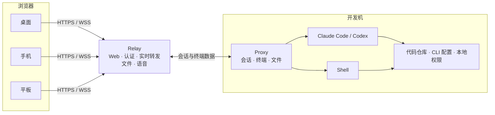

<div align="center">
  
  <h1>DEV Anywhere</h1>
  <p>在浏览器中创建、接管和管理开发机上的 Claude Code、Codex 与 Shell 会话。</p>
  <p>
    <a href="./README.en.md">English</a>
    ·
    <a href="#快速开始">快速开始</a>
    ·
    <a href="./docs/DEPLOYMENT.md">VPS 部署</a>
  </p>
  <p>
    <a href="https://www.npmjs.com/package/@dev-anywhere/proxy"></a>
    <a href="./LICENSE"></a>
    
  </p>
</div>


## 这是什么

DEV Anywhere 是一个自托管的远程 AI coding 工作台，用浏览器操作开发机上的 Claude Code、Codex 和 Shell 会话。你可以远程启动新会话、继续历史会话，或接管已经从本地终端启动的会话。Agent 会话可以选择终端模式或聊天模式，Shell 会话使用终端模式。

本地接入时，只需把 `claude` 或 `codex` 改为 `dev-anywhere claude` 或 `dev-anywhere codex`。其余 CLI 参数和终端交互保持不变；命令会按需启动 Proxy，并让会话出现在 Web 中。从 Web 创建的会话也仍在开发机上运行，继续使用本地的 CLI、环境变量和工作目录。

DEV Anywhere 直接围绕远程 Agent 工作流设计。除了查看终端输出，你还可以跟踪运行状态、处理工具审批、上传或下载文件、搜索历史输出，并在任务完成时接收浏览器通知。代码仓库、Agent CLI 和模型凭据仍然留在开发机上。

> **为什么做这个？**
>
> 离开电脑后，我还是想通过开发机上的 Agent 继续 vibe coding。我想在吃饭时 🍜 看看 Agent 干到哪了，坐在马桶上 🚽 顺手处理一次审批；甚至在使用辅助驾驶时，也能通过语音交互 🎙️ 听取结果、下达指令（⚠️ 辅助驾驶不等于自动驾驶，请始终关注路况，切勿操作屏幕）。

## 快速开始

### 1. 安装本地 Proxy

在开发机上安装 DEV Anywhere：

```bash
npm install -g @dev-anywhere/proxy
```

如果要创建 Agent 会话，还需要提前安装并登录 Claude Code 或 Codex。只使用 Shell 时可以跳过这一步。

### 2. 建立连接

DEV Anywhere 提供两种连接方式：

| 方式                              | 适合场景           | 需要准备                   |
| --------------------------------- | ------------------ | -------------------------- |
| Quick Tunnel                      | 首次体验、临时使用 | Node.js 20+、`cloudflared` |
| [VPS Relay](./docs/DEPLOYMENT.md) | 长期使用、稳定访问 | Linux VPS、域名、HTTPS     |

#### 方式一：Quick Tunnel（体验）

Quick Tunnel 是给没有 VPS、又想先实际跑起来看一眼的用户准备的。它会在开发机上启动临时 Relay、Web 和 Proxy，再通过 Cloudflare 生成一个无需账号的随机 HTTPS 地址。

macOS 可以使用 Homebrew 安装 `cloudflared`：

```bash
brew install cloudflared
```

其他平台参见 Cloudflare 的 [`cloudflared` 安装说明](https://developers.cloudflare.com/cloudflare-one/networks/connectors/cloudflare-tunnel/downloads/)。

在开发机上启动临时链路：

```bash
dev-anywhere tunnel
```

首次运行会自动初始化 `~/.dev-anywhere`，不需要手动配置 Relay。

公网连通性检查通过后，命令会打印一个包含临时 Client Token 的访问地址。保持命令运行，在浏览器中打开该地址即可。按 `Ctrl+C` 会同时停止 Proxy、Relay 和隧道。

Quick Tunnel 的随机域名会变化，进程退出后地址立即失效，也没有可用性承诺。它适合体验，不适合长期依赖。

#### 方式二：VPS Relay（推荐）

长期使用时，推荐在有公网 IP 的 Linux VPS 上部署 Relay，并用自己的域名提供 HTTPS 访问。一个 Relay 容器会同时托管 Web、HTTP API、文件、语音和 WebSocket 服务；宿主机 Nginx 负责 HTTPS。

部署 Relay 后，在开发机上初始化 DEV Anywhere：

```bash
dev-anywhere init
```

编辑 `~/.dev-anywhere/config.json`，填入 Relay 地址和部署脚本输出的 `RELAY_PROXY_TOKEN`：

```json
{
  "defaultProfile": "default",
  "profiles": {
    "default": {
      "relay": "cloud"
    }
  },
  "relays": {
    "cloud": {
      "url": "wss://dev-anywhere.example.com",
      "proxyToken": "部署输出中的 RELAY_PROXY_TOKEN"
    }
  }
}
```

让开发机连接 Relay：

```bash
dev-anywhere serve start --relay cloud
dev-anywhere serve status
```

打开部署脚本输出的 Web 地址，首次访问时在“设置 → Relay Token”中填写 `RELAY_CLIENT_TOKEN`。

部署、升级和排障步骤见 [VPS 部署指南](./docs/DEPLOYMENT.md)。

### 3. 开始使用

连接建立后，可以直接从 Web 远程创建会话；也可以先在开发机的终端开工，离开电脑后再从浏览器继续。

#### 从 Web 远程创建

打开访问地址，选择开发机并点击“新建”，即可创建 Claude Code、Codex 或 Shell 会话。Quick Tunnel 和 VPS Relay 的操作相同，不需要先在本地启动 Agent。

#### 从本地终端启动

如果希望在本地启动的 AI Agent 会话还能从浏览器接管，只需在原命令前加上 `dev-anywhere`，本地 Agent 的使用体验不会有变化。

**VPS Relay**

```bash
dev-anywhere claude
dev-anywhere codex
```

这两个命令会在需要时自动启动已配置的 Proxy，其他 CLI 参数会继续传给 Claude Code 或 Codex。

**Quick Tunnel**

保持 `dev-anywhere tunnel` 运行，并在另一个终端执行：

```bash
dev-anywhere --profile quick-tunnel claude
dev-anywhere --profile quick-tunnel codex
```

## 主要功能

### 会话管理

- 直接从浏览器创建 Claude Code、Codex 和 Shell 会话。
- 创建时选择工作目录、交互方式和 Agent 权限模式。
- 接入从本地终端启动的会话，也可以恢复历史会话。
- 重命名、终止或分离会话；托管终端在 Proxy 重启后可以重新连接。
- 在多台开发机之间切换，并查看、断开当前连接到 Relay 的客户端。


### 终端与聊天视图

**终端视图**直接呈现 CLI 的原始界面，保留颜色、光标、键盘交互和全屏程序。**聊天视图**将 Agent 输出、工具调用、审批和最终回复整理为更易阅读和触摸操作的消息。


### 审批、搜索与文件

- 实时显示会话的工作、空闲、等待审批和连接状态。
- 在页面中处理工具审批；`Always Yes` 可以为指定会话自动确认后续审批。
- 会话从工作转为空闲时，可按设置发送浏览器通知。
- 使用 `Cmd/Ctrl + F` 或菜单入口搜索终端与聊天记录，并定位到命中位置。
- 支持上传图片和文件、拖放与剪贴板粘贴；输出中的真实路径可以预览图片或流式下载文件。


### Voice Pilot

Voice Pilot 面向不方便持续盯着或操作屏幕的场景。它可以在聊天会话中通过语音交互的方式提交指令、播报或复述回复、处理权限审批，并生成阶段性总结；也能听懂“退出语音助手”等自然表达。

语音识别与语音合成服务由 Relay 配置；浏览器端负责录音、状态机、提示音与播放。该功能目前更适合作为辅助操作方式，而不是替代所有精细的键盘输入。


### 跨设备访问

DEV Anywhere 支持桌面、Android、iPhone 和 iPad，也可以添加到手机或平板的主屏幕。移动端界面针对触摸选择、软键盘、终端辅助键、文件操作和会话创建进行了适配。

<table>
  <tr>
    <td width="56%"><strong>iPad · Safari</strong></td>
    <td width="22%"><strong>Android · Chrome</strong></td>
    <td width="22%"><strong>iPhone · Safari</strong></td>
  </tr>
  <tr>
    <td></td>
    <td></td>
    <td></td>
  </tr>
</table>

## 工作方式



- **Web 客户端**：提供会话列表、终端与聊天界面、审批、文件操作和 Voice Pilot。
- **Relay**：托管 Web，认证并转发浏览器与开发机之间的实时流量。
- **Proxy**：运行在开发机上，管理 Agent、终端、会话历史和文件访问。
- **Agent/Shell**：继续使用开发机上的 CLI、环境变量、仓库和本地权限。

代码仓库和 Agent 进程都留在开发机上。Relay 会转发终端、消息、文件和语音数据，并且能够读取这些内容，因此必须部署在受信任的服务器上。当前版本不提供端到端加密。

## 平台支持

| 平台    | 系统版本   | 浏览器                       |
| ------- | ---------- | ---------------------------- |
| macOS   | 26+        | Chrome、Edge、Safari         |
| Android | 16+        | Chrome、Edge                 |
| iPhone  | iOS 26+    | Safari、Chrome、Edge         |
| iPad    | iPadOS 26+ | Safari；暂不支持第三方浏览器 |

## 安全边界

- Agent 与 Shell 以开发机当前用户的权限运行。DEV Anywhere 不提供沙箱隔离。
- `RELAY_PROXY_TOKEN` 用于认证开发机，写入 `~/.dev-anywhere/config.json` 中对应 Relay 的 `proxyToken`；`RELAY_CLIENT_TOKEN` 用于认证浏览器，首次访问时填入“设置 → Relay Token”。VPS 部署脚本会生成两者，具体见 [部署指南](./docs/DEPLOYMENT.md#连接开发机)。
- 公网 Relay 必须使用 HTTPS/WSS。Token 是持有者凭据，泄露后应立即轮换。
- Relay 会转发终端、消息、文件和语音数据，应部署在你信任的服务器上。
- 工具审批仍然是重要的安全边界。`Always Yes` 和跳过审批模式会减少确认，也会扩大误操作的影响范围。
- 不要把带 Token 的访问链接发给不受信任的人，也不要将 `~/.dev-anywhere/config.json` 提交到版本库。

## 开发

仓库结构、本地隔离环境、测试矩阵和发布门禁见 [开发指南](./docs/DEVELOPMENT.md)。

## 许可证

[MIT License](./LICENSE)
