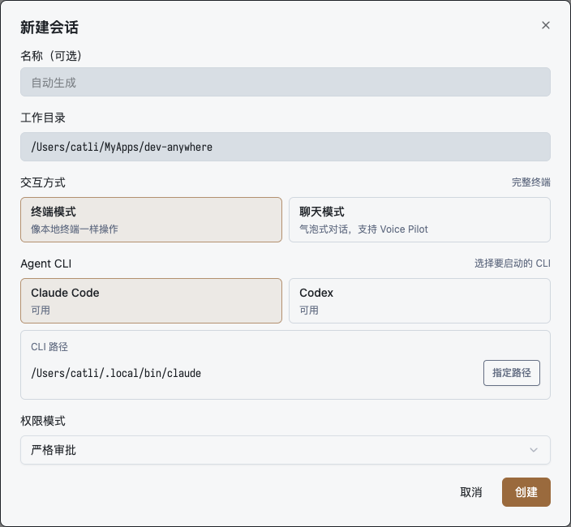
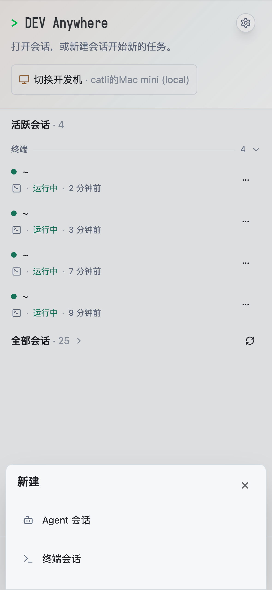
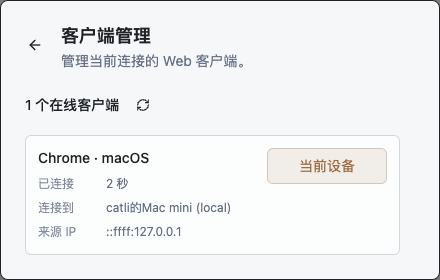

<p align="center">
  
</p>

<h1 align="center">DEV Anywhere</h1>

<p align="center">
  <strong>Create and control Claude Code, Codex, and shell sessions on your own developer machine from any browser.</strong>
</p>

<p align="center">
  <a href="README.zh-CN.md">简体中文</a>
</p>

<p align="center">
  = 20" />
  
  
  
</p>

DEV Anywhere is a self-hosted browser control layer for local development sessions. It can start Claude Code or Codex in a project directory, open a plain shell, attach to sessions started from the local CLI, handle tool approvals, and move files between the browser and the developer machine.

Your repositories, shell state, agent CLIs, API keys, and credentials stay on the machine that already has your development environment. The relay only forwards authenticated WebSocket and file traffic between that machine and your desktop, iPad, phone, or installed PWA.

```text
Browser / PWA
    <-> Relay + Web client
    <-> Local proxy daemon
    <-> Claude Code / Codex / Shell
```

## Why It Exists

Projects such as [code-server](https://github.com/coder/code-server) and [OpenVSCode Server](https://github.com/gitpod-io/openvscode-server) bring a full IDE to the browser. [ttyd](https://github.com/tsl0922/ttyd) exposes a terminal over the web. [OpenHands](https://github.com/OpenHands/openhands) focuses on agent-driven software work.

DEV Anywhere is narrower: it is not a cloud IDE and it does not try to replace your local terminal setup. It gives the browser a clean control surface for the sessions you actually use while coding: agent CLIs, plain shells, approvals, mobile controls, and file transfer.

## Core Workflows

### Create Agent Sessions

Create a Claude Code or Codex session from the web client, choose the working directory, pick terminal or chat mode, and select the permission mode before the process starts.

<p>
  
</p>

You can also start from the local CLI:

```bash
dev-anywhere claude
dev-anywhere codex
```

Those sessions appear in the browser sidebar and can be resumed after refreshes, network changes, or browser switches.

### Open Plain Terminals

When you do not need an agent turn, create a terminal session directly from the browser. It opens a normal shell on the developer machine, keeps the session in the same sidebar, and supports the same PTY controls as agent terminal mode.

Terminal sessions are useful for checking logs, restarting a service, running one-off commands, or keeping a long command visible from mobile while the actual process stays on the developer machine.

### Work From Phone Or Tablet

The mobile UI uses the same session model as desktop, but it is not a shrunken desktop layout. Creation, session switching, terminal helper keys, file actions, and PWA usage are adapted for touch.

<p>
  
</p>

### Approve Tools And Manage Clients

Agent tool approvals are sent to the browser before scoped local commands proceed. For repeated prompts, Always Yes can be enabled per session.

The settings panel also shows connected browser and PWA clients so stale clients can be disconnected without touching the proxy daemon.

<p>
  
</p>

### Move Files Through The Relay

DEV Anywhere supports practical file paths instead of directory browsing:

- paste images into chat or PTY sessions to upload them to the developer machine;
- click supported image paths in terminal or chat output to preview them;
- click supported file paths to download them through the relay;
- configure `previewRoots` when images outside the active project or OS temp directory must be previewed.

## Quick Start

### Try It Without A VPS

For a temporary evaluation, install
[`cloudflared`](https://developers.cloudflare.com/cloudflare-one/networks/connectors/cloudflare-tunnel/do-more-with-tunnels/trycloudflare/)
and the DEV Anywhere CLI:

```bash
npm install -g @dev-anywhere/proxy
dev-anywhere tunnel
```

The command:

- starts an isolated local Relay, Web client, and Proxy profile;
- creates a random `trycloudflare.com` HTTPS address without a Cloudflare account;
- verifies the public Web page, health endpoint, and WebSocket connection;
- prints a URL that securely imports the temporary Client Token from its fragment.

Keep the command running while you evaluate DEV Anywhere. Press `Ctrl+C` to stop
the tunnel and temporary Proxy. Cloudflare Quick Tunnels have no uptime SLA, are
limited to 200 in-flight requests, and are intended only for testing and
development. Use the VPS deployment below for regular use.

### Recommended VPS Deployment

The hosted setup has two parts:

1. a VPS that runs the combined Relay and Web service;
2. the developer machine that runs the local proxy daemon and agent CLIs.

#### 1. Deploy Relay And Web

From a checkout of this repository:

```bash
IMAGE_TAG=latest ./scripts/deploy/install-relay.sh --ssh ubuntu@dev-anywhere.example.com dev-anywhere.example.com
```

The installer configures Docker, nginx, TLS, and the combined Relay container. It prints:

- `RELAY_PROXY_TOKEN` for local proxy daemons;
- `RELAY_CLIENT_TOKEN` for browsers and PWAs;
- the web URL, such as `https://dev-anywhere.example.com/`.

#### 2. Configure The Developer Machine

Install the proxy on the developer machine where your repositories are checked out and Claude Code or Codex is installed:

```bash
npm install -g @dev-anywhere/proxy
dev-anywhere init
```

Edit `~/.dev-anywhere/config.json`:

```json
{
  "defaultProfile": "default",
  "profiles": {
    "default": {
      "relay": "cloud"
    }
  },
  "relays": {
    "cloud": {
      "url": "wss://dev-anywhere.example.com",
      "proxyToken": "<RELAY_PROXY_TOKEN>"
    }
  },
  "previewRoots": []
}
```

Start the daemon:

```bash
dev-anywhere serve start --relay cloud
dev-anywhere serve status
```

#### 3. Open The Web Client

Open the web URL printed by the installer. In **Settings -> Relay Token**, paste `RELAY_CLIENT_TOKEN`, reconnect, then choose your developer machine.

On iPhone or iPad, add the site to the home screen if you want the PWA experience.

#### 4. Start Working

Create an agent session or terminal session from the web client, or start an agent session from the local CLI:

```bash
dev-anywhere claude
dev-anywhere codex
```

## Local Development Relay

For local testing without a VPS, run a relay directly:

```bash
npm install -g @dev-anywhere/relay
RELAY_PROXY_TOKEN="$(openssl rand -hex 24)" \
RELAY_CLIENT_TOKEN="$(openssl rand -hex 24)" \
PORT=3100 dev-anywhere-relay
```

The npm Relay package serves the Web/PWA client, HTTP API, files, voice endpoints, and WebSockets from the same port. Public deployments should still use the Docker installer so nginx can terminate TLS and manage certificates.

## Security Model

- The relay does not need repository access and does not run agent CLIs.
- CLI processes, shell state, local paths, API keys, and credentials stay on the developer machine.
- Public relays must set both `RELAY_PROXY_TOKEN` and `RELAY_CLIENT_TOKEN`, and should run behind HTTPS.
- Tool approvals are sent to the browser before scoped local commands proceed.
- File preview and download require explicit paths; DEV Anywhere does not expose directory browsing.
- Additional preview roots are opt-in through `previewRoots`.

An unauthenticated public relay is unsafe. Anyone who can reach it may list connected proxies or attempt to bind to them.

## Packages

| Package               | Purpose                                                          |
| --------------------- | ---------------------------------------------------------------- |
| `@dev-anywhere/proxy` | Local daemon, CLI wrapper, PTY/session runtime, and file bridge. |
| `@dev-anywhere/relay` | WebSocket relay for proxy daemons, browser clients, and files.   |
| `@dev-anywhere/web`   | React browser/PWA client, published as a Docker image.           |

## Repository Layout

```text
apps/proxy       Local daemon and session runtime
apps/relay       WebSocket relay service
apps/web         React web/PWA client
packages/shared  Shared protocol schemas and utilities
docs             Public documentation and README assets
scripts          Development, verification, deployment, and release helpers
```

## Development

```bash
pnpm install
pnpm typecheck
pnpm test
pnpm release:check
```

Useful local loops:

```bash
pnpm dev:web -- --relay cloud --port 5174
pnpm dev:restart
pnpm dev:health
```

`dev:web` runs local web code against a relay. `dev:restart` and `dev:health` exercise the local proxy/relay/web loop using the isolated `local` profile.

## Documentation

- [Deployment guide](docs/DEPLOYMENT.md)
- [Configuration reference](docs/CONFIG.md)
- [PWA install guide](docs/PWA.md)
- [Testing guide](docs/TESTING.md)
- [Script guide](docs/SCRIPTS.md)
- [Proxy package README](apps/proxy/README.md)
- [Relay package README](apps/relay/README.md)
- [Publishing](PUBLISHING.md)
- [Changelog](CHANGELOG.md)

## License

MIT
