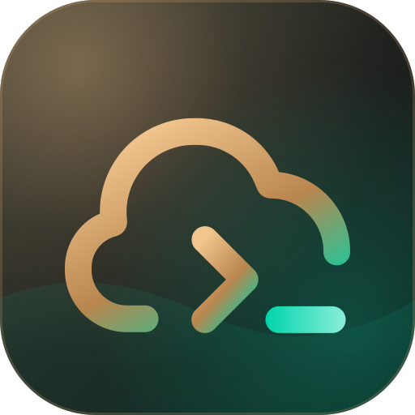
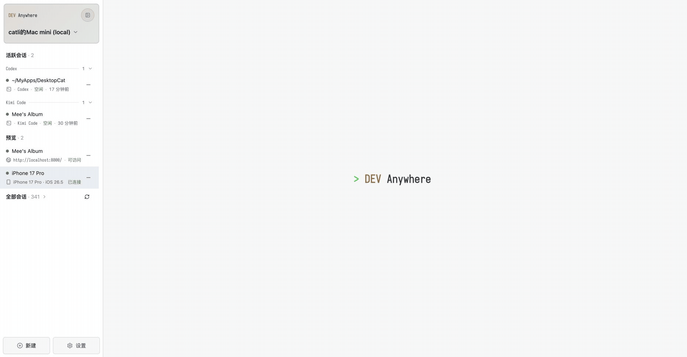
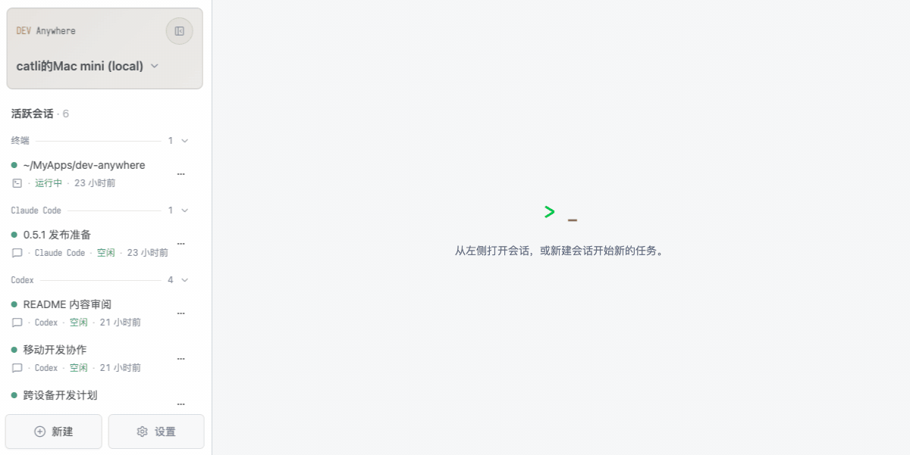
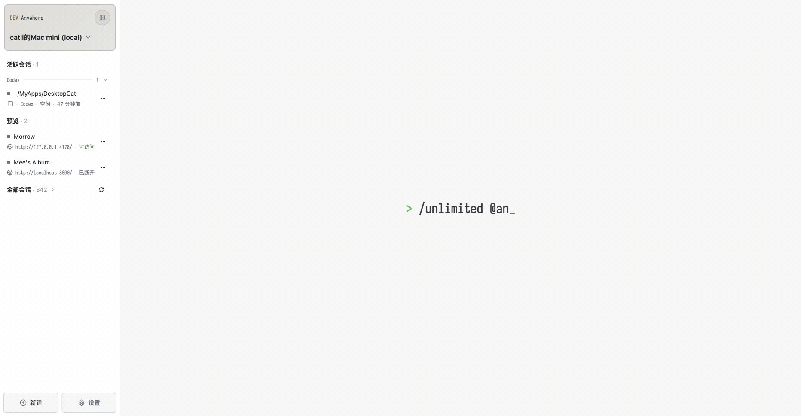
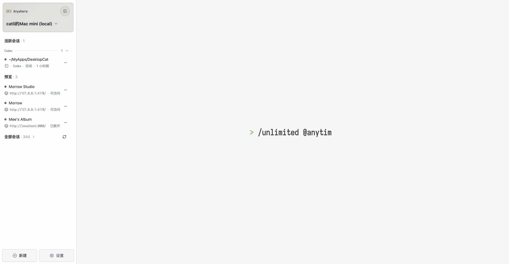
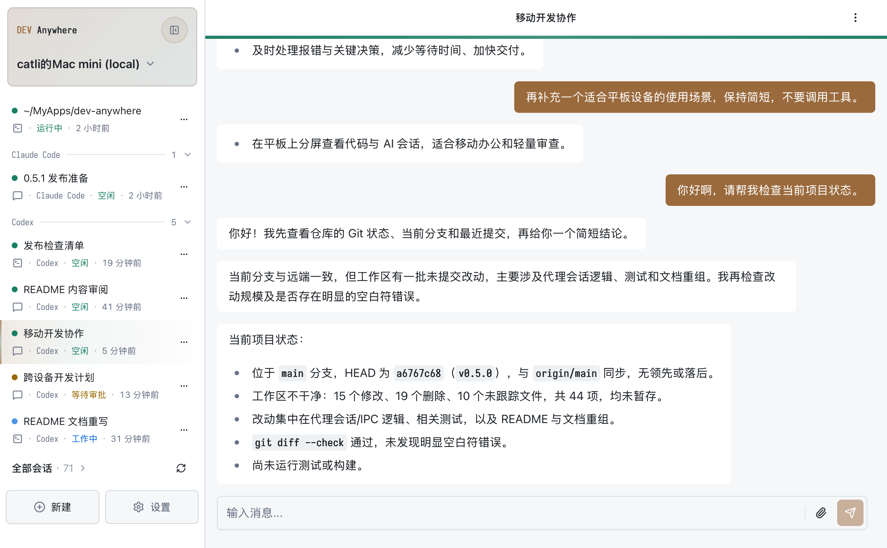
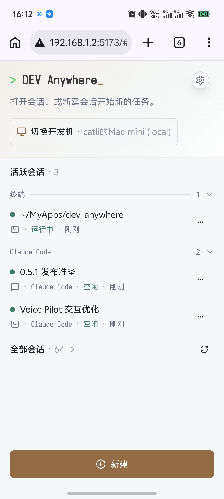
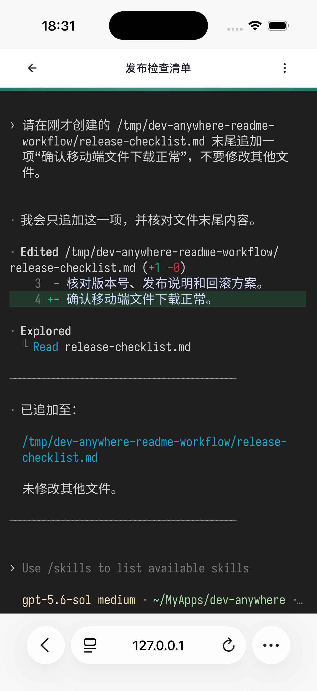
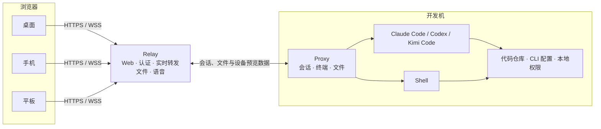

<div align="center">
  
  <h1>DEV Anywhere</h1>
  <p>通过浏览器连接开发机，随时继续 AI coding。</p>
  <p>
    <a href="./README.en.md">English</a>
    ·
    <a href="#快速开始">快速开始</a>
    ·
    <a href="#升级">升级</a>
    ·
    <a href="./docs/DEPLOYMENT.md">VPS 部署</a>
  </p>
  <p>
    <a href="https://www.npmjs.com/package/@dev-anywhere/proxy"></a>
    <a href="./LICENSE"></a>
    
  </p>
</div>



## 这是什么

DEV Anywhere 让你通过浏览器继续使用开发机上的 Claude Code、Codex、Kimi Code 和 Shell。无论手边是另一台电脑、手机还是平板，都能继续当前会话、恢复历史会话或启动新会话。你还可以预览网页效果，并查看和操控开发机上已经启动的 iOS Simulator 与 Android Emulator。

想让本地启动的 Claude Code、Codex 或 Kimi Code 随时能在浏览器中继续操作，只需在原命令前加上 `dev-anywhere`。除了多了这个前缀，其他都和你原来的开发体验完全一致；但启动后，对应会话会出现在 DEV Anywhere 的 Web 界面里，方便你随时随地继续开发。你也可以直接从 Web 创建新的 coding agent 会话。

Kimi Code 同时支持原生终端与 ACP 聊天会话。ACP 聊天会流式显示回复和工具调用，支持在 Web 中允许、始终允许或拒绝工具审批，也可以取消当前回合并从历史会话恢复。

DEV Anywhere 直接围绕远程 coding agent 工作流设计。除了查看 coding agent 的输出，你还可以跟踪运行状态、处理工具审批、上传或下载文件、搜索历史输出，并在任务完成时接收浏览器通知。代码仓库、coding agent CLI 和模型凭据仍然留在开发机上。

> **为什么做这个？**
>
> 离开电脑后，我还是想通过开发机上的 coding agent 继续 vibe coding。我想在吃饭时 🍜 看看 coding agent 干到哪了，坐在马桶上 🚽 顺手处理一次审批；甚至在开车使用辅助驾驶时，也能通过语音交互 🎙️ 听取结果、下达指令。能在任意位置进行 AI coding，就是我开发这个项目的初心。

## 快速开始

### 前置条件

开发机支持 macOS、Linux 和原生 Windows 11；Windows 无需安装 WSL。

在开发机上安装 [Node.js 20 或更高版本](https://nodejs.org/zh-cn/download)，npm 会随 Node.js 一起安装。可以用以下命令确认环境：

```bash
node --version
npm --version
```

如果要创建 coding agent 会话，还需要提前安装并登录 Claude Code、Codex 或 Kimi Code。只使用 Shell 时可以跳过这一步。

### 1. 安装本地 Proxy

在开发机上安装 DEV Anywhere：

```bash
npm install -g @dev-anywhere/proxy
```

### 2. 建立连接

DEV Anywhere 提供两种部署方式：

| 方式                              | 适合场景           | 需要准备                   |
| --------------------------------- | ------------------ | -------------------------- |
| Quick Tunnel                      | 首次体验、临时使用 | Node.js 20+、`cloudflared` |
| [VPS Relay](./docs/DEPLOYMENT.md) | 长期使用、稳定访问 | 有公网 IP 的 Linux VPS     |

#### 方式一：Quick Tunnel（体验）

Quick Tunnel 是给没有 VPS、又想先实际跑起来看一眼的用户准备的。它会在开发机上启动临时 Relay、Web 和 Proxy，再通过 Cloudflare 生成一个无需账号的随机 HTTPS 地址。

macOS 可以使用 Homebrew 安装 `cloudflared`：

```bash
brew install cloudflared
```

其他平台参见 Cloudflare 的 [`cloudflared` 安装说明](https://developers.cloudflare.com/cloudflare-one/networks/connectors/cloudflare-tunnel/downloads/)。

在开发机上启动临时链路：

```bash
dev-anywhere tunnel
```

首次运行会自动初始化 `~/.dev-anywhere`，不需要手动配置 Relay。

公网连通性检查通过后，命令会打印一个包含临时 Client Token 的访问地址。保持命令运行，在浏览器中打开该地址即可。按 `Ctrl+C` 会同时停止 Proxy、Relay 和隧道。

Quick Tunnel 的随机域名会变化，进程退出后地址立即失效，也没有可用性承诺。它适合体验，不适合长期依赖。

#### 方式二：VPS Relay（推荐）

VPS 是 Virtual Private Server 的缩写，通常就是一台可以通过公网访问的云服务器。长期使用时，推荐在 Linux VPS 上部署 Relay。你可以直接使用 VPS 的公网 IPv4，也可以使用指向该 VPS 的域名；部署脚本会识别两种入口并自动配置对应的 HTTPS 证书。公网环境只通过 HTTPS/WSS 提供服务，HTTP 端口仅用于证书验证和跳转。一个 Relay 容器会同时托管 Web、HTTP API、文件、语音和 WebSocket 服务。

部署 Relay 后，在开发机上初始化 DEV Anywhere：

```bash
dev-anywhere init
```

编辑 `~/.dev-anywhere/config.json`（Windows 为 `%USERPROFILE%\.dev-anywhere\config.json`），填入 Relay 地址和部署脚本输出的 `RELAY_PROXY_TOKEN`：

```json
{
  "defaultProfile": "default",
  "profiles": {
    "default": {
      "relay": "cloud"
    }
  },
  "relays": {
    "cloud": {
      "url": "wss://203.0.113.10",
      "proxyToken": "部署输出中的 RELAY_PROXY_TOKEN"
    }
  }
}
```

使用域名时，将 `url` 换成 `wss://你的域名`。部署脚本会输出与当前入口匹配的配置示例。

如果没有自动找到 Agent CLI，可以在新建会话时选择它的可执行文件。

让开发机连接 Relay：

```bash
dev-anywhere serve start --relay cloud
dev-anywhere serve status
```

打开部署脚本输出的 Web 地址，首次访问时在“设置 → Relay Token”中填写 `RELAY_CLIENT_TOKEN`。

部署、升级和排障步骤见 [VPS 部署指南](./docs/DEPLOYMENT.md)。

#### 可选：登录后自动启动

配置好 Relay 后，可以让开发机在登录系统后自动连接：

```bash
dev-anywhere serve autostart enable
dev-anywhere serve autostart status
```

使用 `dev-anywhere serve autostart disable` 取消。开启或取消只影响之后的登录，不会启动、重启或停止当前 Proxy。支持 macOS、提供 systemd 用户服务的 Linux，以及 Windows 当前用户。

### 3. 启动或接管会话

连接建立后，可以在浏览器中接管开发机终端里启动的 coding agent 会话，或直接启动新会话。

#### 从浏览器接管开发机终端中的会话

启动 Claude Code、Codex 或 Kimi Code 时，只需在原命令前加上 `dev-anywhere`：

例如，将 `claude --permission-mode plan` 改为 `dev-anywhere claude --permission-mode plan`。CLI 参数和本地终端体验都不变。该会话也会出现在 DEV Anywhere 的 Web 界面中，随时可以从浏览器接管。

**使用 VPS Relay 部署时**

```bash
dev-anywhere claude
dev-anywhere codex
dev-anywhere kimi
```

**使用 Quick Tunnel 时**

保持 `dev-anywhere tunnel` 运行，并在另一个终端执行：

```bash
dev-anywhere --profile quick-tunnel claude
dev-anywhere --profile quick-tunnel codex
dev-anywhere --profile quick-tunnel kimi
```

#### 从浏览器启动新会话

打开 DEV Anywhere，选择开发机后点击“新建”，即可在该开发机的指定目录中启动 Claude Code、Codex、Kimi Code 或 Shell。Claude Code、Codex 和 Kimi Code 都可以选择终端或聊天模式；Kimi Code 的聊天模式通过 ACP 工作。

## 升级

### Quick Tunnel

先按 `Ctrl+C` 结束正在运行的 Quick Tunnel，然后更新本机 Proxy 并重新启动：

```bash
npm install -g @dev-anywhere/proxy@latest
dev-anywhere tunnel
```

### VPS Relay

从此前版本首次升级到 0.9.2，需要进行一次手动更新。先在每台开发机上使用升级前的 CLI 停止 Proxy，再继续以下升级步骤：

```bash
dev-anywhere serve stop
```

进入 DEV Anywhere 项目目录，运行以下命令升级 Relay：

```bash
git pull --ff-only
bash scripts/deploy/install-relay.sh \
  --ssh root@your-vps \
  dev-anywhere.example.com
```

最后一个参数应与首次部署时保持一致：使用域名部署就继续传域名，使用公网 IP 部署就传公网 IP。部署脚本会复用 VPS 上已有的 Token。

Relay 更新后，在每台开发机上安装并启动 0.9.2：

```bash
npm install -g @dev-anywhere/proxy@0.9.2
dev-anywhere serve start --relay cloud
```

全部开发机更新完成后，刷新浏览器，并重新启动升级前仍在运行的会话。

升级后可在任意开发机确认版本和连接状态：

```bash
dev-anywhere --version
dev-anywhere serve status
```

安装指定版本的命令见 [VPS 部署指南的升级章节](./docs/DEPLOYMENT.md#升级)；如果升级后 Web 无法访问或开发机无法上线，请按 [排障步骤](./docs/DEPLOYMENT.md#排障) 查看 Relay 与 Nginx 日志。

## 主要功能

### 会话管理

- 直接从浏览器创建 Claude Code、Codex、Kimi Code 的终端或聊天会话，以及 Shell 会话。
- 创建 Claude Code、Codex 或 Kimi Code 会话时，可以选择工作目录、终端或聊天交互方式，以及权限模式。
- 接入从本地终端启动的会话，也可以恢复 Claude Code、Codex 与 Kimi Code 的历史会话。
- 重命名、终止或分离会话；从本地终端启动的会话在 Proxy 重启后可以重新连接。
- 在多台开发机之间切换，并查看、断开当前连接到 Relay 的客户端；不再使用的离线开发机可在手机上左滑移除，或从桌面端的更多菜单移除，重新连接后会再次出现。



### 终端与聊天视图

**终端视图**直接呈现 CLI 的原始界面，保留颜色、光标、键盘交互和全屏程序。**聊天视图**将 coding agent 输出、工具调用、审批和最终回复整理为更易阅读和触摸操作的消息。Kimi Code 的聊天视图使用 ACP，支持流式输出、工具调用与审批、取消当前回合和恢复历史会话。


### 网页与移动设备模拟器预览

从“新建”菜单选择“预览”，可以查看开发机上的网页效果，或直接查看和操控已经启动的 iOS Simulator 与 Android Emulator。



- **网页预览**：把只能在开发机上打开的网站（例如通过 `http://localhost` 或 `http://127.0.0.1` 访问）、HTML 文件或包含网页文件的目录变成一个临时 HTTPS 链接。你可以复制链接；浏览器支持系统分享时，也可以直接发送给别人。停止预览后，链接立即失效。
- **移动设备模拟器预览**：直接在浏览器中查看和操作模拟器。支持点击、长按、滑动等基本触控操作，也可以旋转画面、返回主屏幕、使用 Android 返回键和粘贴文字。



- 网页预览需要安装 `cloudflared` 或 `cpolar`；使用 Cpolar 前还需要完成账号认证。
- iOS Simulator 预览仅支持 macOS 开发机，并需要 Baguette 0.1.96 或更高版本。
- Android Emulator 预览需要 `adb`。

### 审批、搜索与文件

- 实时显示会话的工作、空闲、等待审批和连接状态。
- 在页面中处理工具审批；`Always Yes` 可以为指定会话自动确认后续审批。
- 开启“会话空闲通知”后，coding agent 完成工作并进入空闲状态时，浏览器会发送提醒。
- 使用 `Cmd/Ctrl + F` 或菜单入口搜索终端与聊天记录，并定位到命中位置。
- 通过文件选择器、拖放或剪贴板上传图片和文件；点击 coding agent 输出中的文件路径，可以直接在浏览器中预览图片或下载文件。


### Voice Pilot

Voice Pilot 面向不方便持续盯着或操作屏幕的场景。开启后，它会监听你的语音；你说完后，识别结果会自动发送给 coding agent，coding agent 回复后，Voice Pilot 会自动播报回复内容。你还可以通过语音处理权限审批、生成阶段性总结或复述上一条回复。说“退出语音助手”等自然表达即可退出，需要精细编辑时仍可使用键盘或触摸操作。


### 跨设备访问

DEV Anywhere 支持桌面、Android、iPhone 和 iPad。移动端界面针对触摸选择、软键盘、终端辅助键、文件操作和会话创建进行了适配；针对 iPad 搭配妙控键盘等实体键盘的使用场景，也做了专门适配。

<table>
  <tr>
    <td width="56%"><strong>iPad · Safari</strong></td>
    <td width="22%"><strong>Android · Chrome</strong></td>
    <td width="22%"><strong>iPhone · Safari</strong></td>
  </tr>
  <tr>
    <td></td>
    <td></td>
    <td></td>
  </tr>
</table>

## 工作方式


```mermaid
flowchart LR
  subgraph clients["浏览器"]
    direction TB
    desktop["桌面"]
    phone["手机"]
    tablet["平板"]
  end

  relay["Relay<br/>Web · 认证 · 实时转发<br/>文件 · 语音"]

  subgraph machine["开发机"]
    direction TB
    proxy["Proxy<br/>会话 · 终端 · 文件"]
    agent["Claude Code / Codex / Kimi Code"]
    shell["Shell"]
    local["代码仓库 · CLI 配置 · 本地权限"]

    proxy --> agent
    proxy --> shell
    agent --> local
    shell --> local
  end

  desktop -->|"HTTPS / WSS"| relay
  phone -->|"HTTPS / WSS"| relay
  tablet -->|"HTTPS / WSS"| relay
  relay <-->|"会话、文件与设备预览数据"| proxy
```

- **Web 客户端**：提供会话列表、终端与聊天界面、网页与移动设备模拟器预览、审批、文件操作和 Voice Pilot。
- **Relay**：托管 Web，验证浏览器和开发机的身份，并转发会话及设备预览数据。
- **Proxy**：运行在开发机上，管理 coding agent、终端、会话历史和文件访问，并提供网页及模拟器预览。
- **Coding agent / Shell**：继续使用开发机上的 CLI、环境变量、仓库和本地权限。

代码仓库和 coding agent 进程都留在开发机上。Relay 会转发并能读取终端、消息、文件、语音和设备预览数据，因此必须部署在受信任的服务器上。网页预览的页面和资源不经过 Relay，而是由 Cloudflare Tunnel 或 Cpolar 提供临时访问链接；创建预览、同步状态等控制信息仍会经过 Relay。当前版本不提供端到端加密。

## 平台支持

| 平台    | 系统版本   | 浏览器                       |
| ------- | ---------- | ---------------------------- |
| macOS   | 26+        | Chrome、Edge、Safari         |
| Windows | 11+        | Chrome、Edge                 |
| Android | 16+        | Chrome、Edge                 |
| iPhone  | iOS 26+    | Safari、Chrome、Edge         |
| iPad    | iPadOS 26+ | Safari；暂不支持第三方浏览器 |

## 安全边界

- Coding agent 和 Shell 以启动 Proxy 的系统用户身份运行，可以访问该用户有权访问的文件和进程。DEV Anywhere 不会额外提供沙箱隔离。
- `RELAY_PROXY_TOKEN` 用于验证开发机身份，保存在 `~/.dev-anywhere/config.json` 对应 Relay 的 `proxyToken` 字段中。`RELAY_CLIENT_TOKEN` 用于验证浏览器身份，首次访问时在“设置 → Relay Token”中填写。VPS 部署脚本会生成这两个 Token，配置方法见 [部署指南](./docs/DEPLOYMENT.md#连接开发机)。
- 从列表中移除离线开发机，只会删除 Relay 保存的列表记录，不会让该开发机保存的 Proxy Token 失效。如果开发机丢失、转让或出售，并且可能仍保留 DEV Anywhere 配置，请更换 Relay 的 Proxy Token，再把新 Token 更新到仍在使用的开发机上。
- 公网 Relay 必须使用 HTTPS/WSS。Token 相当于访问凭证，拿到 Token 的人就可能以对应身份接入 DEV Anywhere；一旦泄露，请立即更换。
- Relay 能读取经其转发的终端、消息、文件、语音、设备预览画面与操作数据，以及网页预览的设置和状态，因此请只将它部署在你信任的服务器上。
- 工具审批会在需要授权的操作执行前让你确认。启用 `Always Yes` 或跳过审批后，确认会减少，误操作的影响也可能更大。
- 网页预览链接不受 Relay Token 保护，任何拿到链接的人都能访问。选择 HTML 文件时，其所在文件夹中的其他非隐藏文件也可能通过预览链接访问；选择目录时，目录中可提供的文件都可能被访问。请只预览可以公开的内容，并在使用后及时停止预览。
- 不要把包含 Token 的访问链接发给不信任的人。
- `~/.dev-anywhere/config.json` 可能保存着 Proxy Token。不要把它放进项目文件夹，也不要上传到 GitHub、GitLab 等代码托管平台。

## 开发

仓库结构、本地隔离环境、测试矩阵和发布门禁见 [开发指南](./docs/DEVELOPMENT.md)。

## 许可证

[MIT License](./LICENSE)
