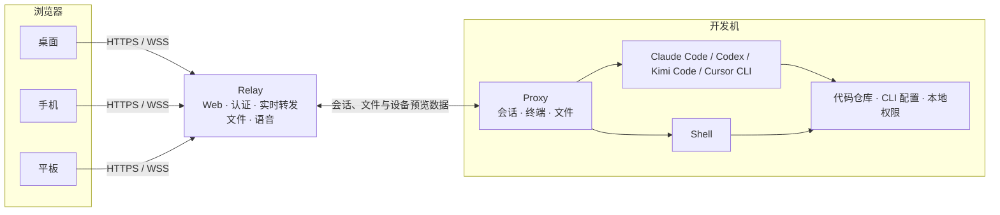

<div align="center">
  
  <h1>DEV Anywhere</h1>
  <p>通过浏览器连接开发机，随时继续 AI coding。</p>
  <p>
    <a href="./README.en.md">English</a>
    ·
    <a href="#快速开始">快速开始</a>
    ·
    <a href="#升级">升级</a>
    ·
    <a href="./docs/DEPLOYMENT.md">VPS 部署</a>
  </p>
  <p>
    <a href="https://www.npmjs.com/package/@dev-anywhere/proxy"></a>
    <a href="./LICENSE"></a>
    
  </p>
</div>


## 这是什么

DEV Anywhere 让你在电脑、手机或平板上远程使用开发机上的 Claude Code、Codex、Kimi Code、Cursor CLI 和 Shell。打开 Web 界面，就能与 coding agent 对话、操作终端、处理工具审批和传输文件，也能预览网页、操控开发机上已启动的 iOS Simulator 与 Android Emulator。

想让本地启动的 Claude Code、Codex、Kimi Code 或 Cursor CLI 随时能在浏览器中继续操作，只需在原命令前加上 `dev-anywhere`。启动后，你既可以在本地终端中照常操作，也可以随时随地在 DEV Anywhere 的 Web 界面里继续手头的开发工作，或创建新的 coding agent 会话。

> **为什么做这个？**
>
> 离开电脑后，我还是想通过开发机上的 coding agent 继续 vibe coding。我想在吃饭时 🍜 看看 coding agent 干到哪了，坐在马桶上 🚽 顺手处理一次审批；甚至在开车使用辅助驾驶时，也能通过语音交互 🎙️ 听取结果、下达指令。能在任意位置进行 AI coding，就是我开发这个项目的初心。

## 快速开始

### 前置条件

准备一台运行 macOS、Linux 或 Windows 11 的开发机。Windows 可以直接使用，无需安装 WSL。

在开发机上安装 [Node.js 22.22.2 或更高版本](https://nodejs.org/zh-cn/download)，npm 会随 Node.js 一起安装。可以用以下命令确认环境：

```bash
node --version
npm --version
```

在开发机上安装并登录你要使用的 coding agent：Claude Code、Codex、Kimi Code 或 Cursor CLI。只使用 Shell 时可以跳过这一步。

### 1. 安装 DEV Anywhere

在开发机上安装 DEV Anywhere 的本地程序（Proxy）：

```bash
npm install -g @dev-anywhere/proxy
```

### 2. 建立连接

根据使用需求，选择下面一种方式连接开发机：

| 方式                              | 适合场景           | 需要准备                        |
| --------------------------------- | ------------------ | ------------------------------- |
| Quick Tunnel                      | 首次体验、临时使用 | Node.js 22.22.2+、`cloudflared` |
| [VPS Relay](./docs/DEPLOYMENT.md) | 长期使用、稳定访问 | 有公网 IP 的 Linux VPS          |

#### 方式一：Quick Tunnel（体验）

Quick Tunnel 适合先体验功能：无需 VPS 或 Cloudflare 账号，就能生成一个临时 HTTPS 地址，用来远程访问开发机。

macOS 可以使用 Homebrew 安装 `cloudflared`：

```bash
brew install cloudflared
```

其他平台参见 Cloudflare 的 [`cloudflared` 安装说明](https://developers.cloudflare.com/cloudflare-one/networks/connectors/cloudflare-tunnel/downloads/)。

安装完成后，在开发机上运行：

```bash
dev-anywhere tunnel
```

首次运行会自动完成配置。等终端显示访问地址后，在另一台设备的浏览器中打开它，即可进入 DEV Anywhere。这个地址包含访问凭据，请妥善保管。

使用期间请保持命令运行；按 `Ctrl+C` 结束后，地址就会失效。每次启动都会生成随机地址，连接也可能不稳定，长期使用建议选择下面的 VPS Relay。

#### 方式二：VPS Relay（推荐）

长期使用时，推荐在 Linux VPS（云服务器）上部署 Relay，由它连接浏览器与开发机。你可以直接使用 VPS 的公网 IPv4，也可以使用指向 VPS 的域名，部署脚本会自动配置 HTTPS。

你可以从 macOS、Linux 或 Windows 电脑将 Relay 部署到 Linux VPS，无需克隆仓库。运行下面的命令前，请先配置 [SSH 密钥登录](./docs/DEPLOYMENT.md#配置-ssh-免密登录)；也可以选择 [直接登录 VPS 部署](./docs/DEPLOYMENT.md#直接在-vps-上运行)。

在 macOS 或 Linux 本地终端执行以下命令，将 `root@203.0.113.10` 换成 VPS 的 SSH 登录地址，将 `dev-anywhere.example.com` 换成 VPS 的域名或公网 IPv4：

```bash
curl -fsSL https://raw.githubusercontent.com/lichenxicatapple-blip/dev-anywhere/main/install.sh | bash -s -- --ssh root@203.0.113.10 dev-anywhere.example.com
```

Windows 用户在 PowerShell 中执行以下命令，再按提示填写 VPS 的 SSH 登录地址和域名或公网 IPv4：

```powershell
irm https://raw.githubusercontent.com/lichenxicatapple-blip/dev-anywhere/main/install.ps1 | iex
```

部署 Relay 后，在开发机上初始化 DEV Anywhere：

```bash
dev-anywhere init
```

编辑 `~/.dev-anywhere/config.json`（Windows 为 `%USERPROFILE%\.dev-anywhere\config.json`），填入 Relay 地址和部署脚本输出的 `RELAY_PROXY_TOKEN`：

```json
{
  "defaultProfile": "default",
  "profiles": {
    "default": {
      "relay": "cloud"
    }
  },
  "relays": {
    "cloud": {
      "url": "wss://203.0.113.10",
      "proxyToken": "部署输出中的 RELAY_PROXY_TOKEN"
    }
  }
}
```

使用域名时，将 `url` 换成 `wss://你的域名`。部署脚本也会根据你填写的域名或 IP 输出配置示例。

保存配置后，让开发机连接 Relay：

```bash
dev-anywhere serve start --relay cloud
dev-anywhere serve status
```

确认状态显示 Relay 已连接后，打开部署脚本输出的 Web 地址，在“设置 → Relay Token”中填写 `RELAY_CLIENT_TOKEN`，完成首次连接。

部署、升级和排障步骤见 [VPS 部署指南](./docs/DEPLOYMENT.md)。

### 3. 启动会话

连接成功后，你可以从开发机的终端或 DEV Anywhere 的 Web 界面启动会话。

#### 从 Web 界面启动

选择开发机，点击“新建”，选择 coding agent 或 Shell，并指定工作目录。创建 coding agent 会话时，还可以选择权限模式，以及终端或聊天视图。

如果已经安装了 coding agent，但仍提示“未找到”，请在新建会话窗口的“CLI 路径”中填写或浏览选择开发机上的启动程序路径，然后点击“保存”。

> **macOS 文件夹权限**：访问“桌面”“文稿”“下载”等目录时，可能需要在 Mac 上确认访问权限。远程使用前可以提前授权，具体步骤见[文件夹访问设置](./docs/SYSTEM-SERVICE.md#macos-文件夹访问)。

#### 从开发机的终端启动

在原命令前加上 `dev-anywhere` 即可启动会话。例如，将 `claude --permission-mode plan` 写成 `dev-anywhere claude --permission-mode plan`，原有参数照常传入。

**使用 VPS Relay 部署时**

```bash
dev-anywhere claude
dev-anywhere codex
dev-anywhere kimi
dev-anywhere cursor
```

Cursor CLI 也可以使用 `dev-anywhere agent ...` 启动。

**使用 Quick Tunnel 时**

保持 `dev-anywhere tunnel` 运行，并在另一个终端执行：

```bash
dev-anywhere --profile quick-tunnel claude
dev-anywhere --profile quick-tunnel codex
dev-anywhere --profile quick-tunnel kimi
dev-anywhere --profile quick-tunnel cursor
```

启动后，你可以继续在本地终端操作，也可以打开 DEV Anywhere 的 Web 界面，在会话列表中选择刚启动的会话，继续手头的开发工作。

## 自动启动

使用 VPS Relay 并确认连接正常后，可以设置开发机自动连接。开发机需要保持开机、联网，且不进入睡眠。

### 登录后启动

在开发机上运行：

```bash
dev-anywhere serve autostart enable
dev-anywhere serve autostart status
```

下次登录系统时，DEV Anywhere 会自动连接 Relay。取消时运行 `dev-anywhere serve autostart disable`；这些命令只修改自启动设置，不会启停当前运行的 Proxy。支持 macOS、提供 systemd 用户服务的 Linux 和 Windows。

### 开机后启动，无需登录

如果希望开发机开机后就能连接 Relay，无需登录桌面，可以启用系统服务。请在平时使用 DEV Anywhere 的账户下运行，并按提示完成管理员授权：

```bash
dev-anywhere serve autostart enable --system --now
```

服务会以这个账户运行，`--now` 会立即重启 Proxy。需要在退出桌面后继续使用的会话，请在启用服务后新建。此方式支持 macOS、使用 systemd 的 Linux 和 Windows；Windows 首次设置还需要账户密码，不能使用 PIN。

取消、验证和排障步骤见[系统服务指南](./docs/SYSTEM-SERVICE.md)。

> **macOS 开机解锁**：如果启用了 FileVault（文件保险箱），Mac 重启后需要先输入密码解锁磁盘，DEV Anywhere 才能启动。若希望重启后自动连接，需要关闭 FileVault 并启用系统服务，不必设置自动登录；关闭 FileVault 后，磁盘将不再受登录密码保护。操作步骤见[系统服务指南](./docs/SYSTEM-SERVICE.md)。

## 升级

升级前请确认开发机的 Node.js 版本满足要求。DEV Anywhere 的自动更新不会替你升级 Node.js。

### Quick Tunnel

先按 `Ctrl+C` 结束正在运行的 Quick Tunnel，然后更新本机 Proxy 并重新启动：

```bash
npm install -g @dev-anywhere/proxy@latest
dev-anywhere tunnel
```

### VPS Relay

重新运行部署命令即可拉取最新发布的 Relay 镜像。macOS 或 Linux：

```bash
curl -fsSL https://raw.githubusercontent.com/lichenxicatapple-blip/dev-anywhere/main/install.sh | bash -s -- --ssh root@203.0.113.10 dev-anywhere.example.com
```

Windows PowerShell：

```powershell
irm https://raw.githubusercontent.com/lichenxicatapple-blip/dev-anywhere/main/install.ps1 | iex
```

使用首次部署时的 SSH 登录地址和域名或公网 IPv4，脚本会保留已有的 Token。通过 npm 全局安装、且开启自动更新的 Proxy 会跟随 Relay 的新版本自动升级并重新连接。完成后刷新网页即可。

在开发机确认版本和连接状态：

```bash
dev-anywhere --version
dev-anywhere serve status
```

固定版本、关闭自动更新或从 0.9.2 之前版本迁移，见 [VPS 部署指南的升级章节](./docs/DEPLOYMENT.md#升级)；连接异常时见 [排障步骤](./docs/DEPLOYMENT.md#排障)。

## 主要功能

### 会话管理

- 在指定目录创建 coding agent 或 Shell 会话；coding agent 会话还可以选择权限模式和交互方式。
- 在 Web 界面中继续操作通过 `dev-anywhere` 从本地终端启动的会话，或恢复 coding agent 的历史会话。
- 重命名、终止或分离会话；从本地终端启动的会话在 Proxy 重启后可以重新连接。
- 在多台开发机之间切换，管理已连接的客户端和离线开发机。


### 终端与聊天视图

**终端视图**保留 CLI 的界面和键盘操作，适合熟悉终端的用户。**聊天视图**将回复、工具调用和审批整理成消息，方便阅读和触摸操作。

Claude Code、Codex、Kimi Code 和 Cursor CLI 都支持这两种视图。其中 Kimi Code 和 Cursor CLI 的聊天模式使用 ACP，支持流式回复、工具调用、取消当前回复和恢复历史会话；Cursor ACP 还支持提问、计划确认和待办列表。


### 网页与移动设备模拟器预览

从“新建”菜单选择“预览”，可以查看开发机上的网页效果，或直接查看和操控已经启动的 iOS Simulator 与 Android Emulator。


- **网页预览**：为开发机上的本地网站（如 `http://localhost`）、HTML 文件或网页目录生成临时 HTTPS 链接，方便在其他设备上打开或分享给别人。停止预览后，链接立即失效。
- **移动设备模拟器预览**：直接在浏览器中查看和操作模拟器。支持点击、长按、滑动等基本触控操作，也可以旋转画面、返回主屏幕、使用 Android 返回键和粘贴文字。

更新或重启 Proxy 时，网页预览链接会保留，模拟器画面会在重新连接后恢复。要结束分享，请停止对应的预览；仅停止 Proxy 不会让分享链接失效。


- 网页预览需要安装 `cloudflared` 或 `cpolar`；使用 Cpolar 前还需要完成账号认证。
- iOS Simulator 预览仅支持 macOS 开发机，并需要 Baguette 0.1.96 或更高版本。
- Android Emulator 预览需要 `adb`。

### 审批、搜索与文件

- 查看会话是否正在工作、等待审批或已经空闲，以及开发机的连接状态。
- 在页面中处理工具审批，也可为支持的会话开启 `Always Yes` 自动确认。Codex 终端会话需手动确认，或在创建时选择审批策略。
- 开启“会话空闲通知”后，coding agent 完成工作并进入空闲状态时，浏览器会发送提醒。
- 使用 `Cmd/Ctrl + F` 或菜单入口搜索终端与聊天记录，并定位到命中位置。
- 通过文件选择器、拖放或剪贴板上传图片和文件；点击 coding agent 输出中的文件路径，可以直接在浏览器中预览图片或下载文件。


### Voice Pilot

不方便一直看屏幕时，可以开启 Voice Pilot，用语音与 coding agent 对话。它会把你说的话转成文字发送出去，并朗读 coding agent 的回复。你还可以用语音处理审批、听取进度总结或重听上一条回复；说“退出语音助手”即可退出，期间也可以继续使用键盘和触摸操作。


### 跨设备访问

DEV Anywhere 可以在电脑、Android 手机、iPhone 和 iPad 上使用。移动端支持触摸选择、软键盘和终端辅助键，也适配了 iPad 搭配妙控键盘等实体键盘的操作。

<table>
  <tr>
    <td width="56%"><strong>iPad · Safari</strong></td>
    <td width="22%"><strong>Android · Chrome</strong></td>
    <td width="22%"><strong>iPhone · Safari</strong></td>
  </tr>
  <tr>
    <td></td>
    <td></td>
    <td></td>
  </tr>
</table>

## 工作方式


```mermaid
flowchart LR
  subgraph clients["浏览器"]
    direction TB
    desktop["桌面"]
    phone["手机"]
    tablet["平板"]
  end

  relay["Relay<br/>Web · 认证 · 实时转发<br/>文件 · 语音"]

  subgraph machine["开发机"]
    direction TB
    proxy["Proxy<br/>会话 · 终端 · 文件"]
    agent["Claude Code / Codex / Kimi Code / Cursor CLI"]
    shell["Shell"]
    local["代码仓库 · CLI 配置 · 本地权限"]

    proxy --> agent
    proxy --> shell
    agent --> local
    shell --> local
  end

  desktop -->|"HTTPS / WSS"| relay
  phone -->|"HTTPS / WSS"| relay
  tablet -->|"HTTPS / WSS"| relay
  relay <-->|"会话、文件与设备预览数据"| proxy
```

- **Web 界面**是你远程操作会话、文件和预览的入口。
- **Relay** 提供 Web 界面，验证连接身份，并在浏览器与开发机之间转发数据。
- **Proxy** 运行在开发机上，负责启动 coding agent 和 Shell、管理会话，并处理文件和预览操作。

Coding agent 和 Shell 都运行在开发机上，使用本机的环境和文件。网页预览通过 Cloudflare Tunnel 或 Cpolar 提供访问链接，页面和资源不经过 Relay；预览的创建和状态同步仍通过 Relay 完成。

## 浏览器端平台支持

下表列出访问 Web 界面时支持的平台和浏览器；运行 coding agent 的开发机支持 macOS、Linux 和 Windows 11。

| 平台    | 系统版本   | 浏览器                       |
| ------- | ---------- | ---------------------------- |
| macOS   | 26+        | Chrome、Edge、Safari         |
| Windows | 11+        | Chrome、Edge                 |
| Android | 16+        | Chrome、Edge                 |
| iPhone  | iOS 26+    | Safari、Chrome、Edge         |
| iPad    | iPadOS 26+ | Safari；暂不支持第三方浏览器 |

## 安全边界

- Coding agent 和 Shell 使用运行 Proxy 的账户权限，可以访问该账户有权使用的文件和进程；DEV Anywhere 不提供额外的沙箱隔离。
- 公网访问必须使用 HTTPS/WSS，但当前不提供端到端加密。Relay 能读取经它转发的会话、文件、语音、模拟器画面和操作，以及网页预览的设置和状态，因此应部署在你信任的服务器上。
- `RELAY_PROXY_TOKEN` 和 `RELAY_CLIENT_TOKEN` 分别用于开发机和浏览器连接，都是访问凭据。不要分享含 Token 的链接，也不要将 `~/.dev-anywhere/config.json` 放进项目仓库；凭据泄露后请及时更换。
- 从列表移除离线开发机不会撤销它的连接权限。如果设备丢失、出售或转让，请更换 Relay 的 Proxy Token，并更新其他开发机的配置。
- 工具审批会在需要授权的操作执行前让你确认。启用 `Always Yes` 或跳过审批后，确认会减少，误操作的影响也可能更大。
- 网页预览链接不受 Relay Token 保护，任何拿到链接的人都能访问。选择 HTML 文件时，其所在文件夹中的其他非隐藏文件也可能通过预览链接访问；选择目录时，目录中可提供的文件都可能被访问。请只预览可以公开的内容，并在使用后及时停止预览。

## 开发

如果你想修改项目代码，请先阅读[开发指南](./docs/DEVELOPMENT.md)，完成依赖安装和本地配置，再运行 `pnpm dev:restart` 启动开发环境，用 `pnpm dev:health` 检查连接。

本地开发支持 macOS、Linux 和原生 Windows 11，默认网页地址为 `http://localhost:5173`。仓库结构、调试、测试和发布说明也在开发指南中。

## 致谢

- [Ryan Yeung](https://github.com/Yangxulight)

## 许可证

[MIT License](./LICENSE)
