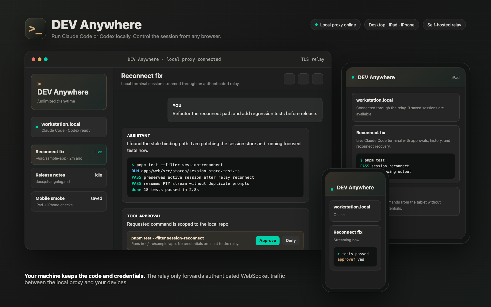
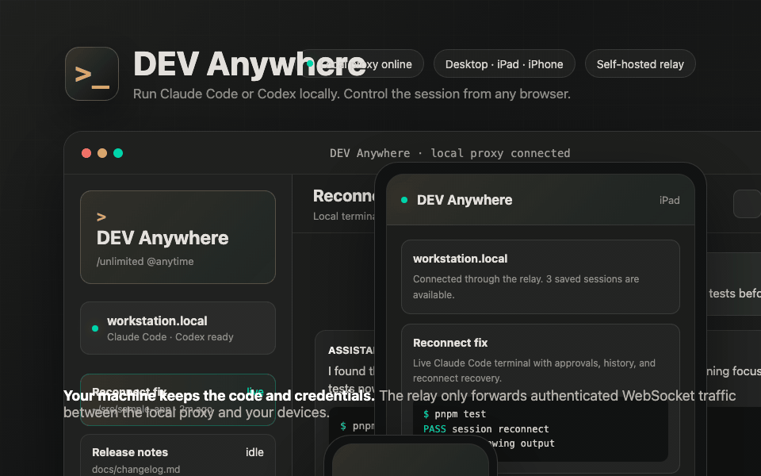
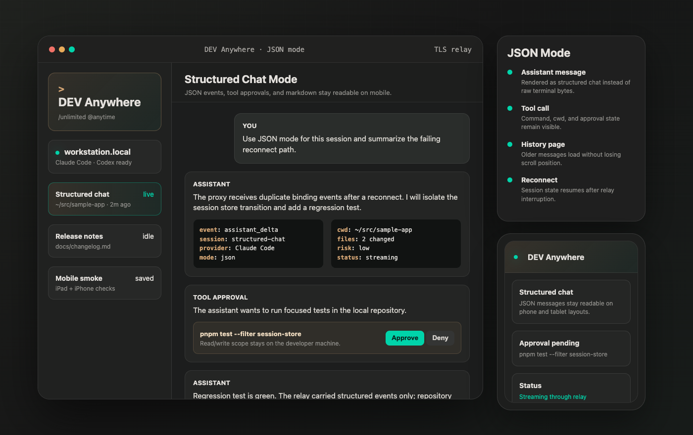
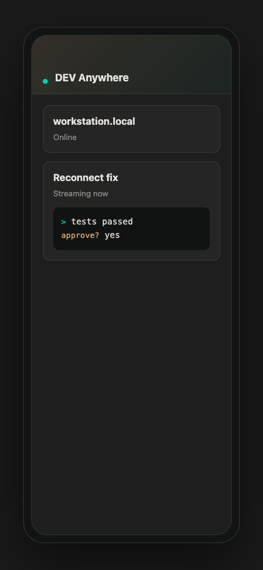

<p align="center">
  
</p>

<h1 align="center">DEV Anywhere</h1>

<p align="center">
  <strong>让 Claude Code 或 Codex 留在本机运行，在桌面、iPad、iPhone 或任意浏览器里远程控制。</strong>
</p>

<p align="center">
  <a href="README.md">English</a>
</p>

<p align="center">
  = 20" />
  
  
  
</p>

<p align="center">
  
</p>

DEV Anywhere 用来远程访问你本机上的 AI 编程 CLI 会话，同时不把仓库、Shell 环境或本地凭据搬到远端应用服务器。开发机继续拥有 Claude Code 或 Codex 进程；Relay 只负责在本地 Proxy 和你的设备之间转发已认证的 WebSocket 流量。

```text
Desktop / iPad / iPhone / Browser
        <-> Relay Server
        <-> Local Proxy
        <-> Claude Code / Codex
```

## 核心能力

- 在响应式 Web/PWA 客户端里控制本机 Claude Code 和 Codex 会话。
- PTY 终端模式适合交互式 CLI 工作流，JSON 模式适合结构化聊天。
- 支持会话历史、断线恢复、移动端布局和工具审批。
- 支持在 JSON 或 PTY 会话里粘贴截图，也可以点击聊天或终端输出里的本地图片路径，在 Web 端预览。
- Relay 可以自托管，并支持 token 认证和前置 TLS。
- Proxy 和 Relay 通过 npm 安装；Web/Relay 镜像由发布工作流构建。

## 截图

<p>
  
</p>

<p>
  
</p>

<p>
  
</p>

## 快速开始：云端 Relay + 本地 Proxy

1. 把 Relay 和 Web 客户端部署到 VPS：

```bash
IMAGE_TAG=latest ./scripts/deploy/install-relay.sh --ssh ubuntu@dev-anywhere.example.com dev-anywhere.example.com
```

安装脚本会输出 `RELAY_PROXY_TOKEN`、`RELAY_CLIENT_TOKEN` 和 Web UI 地址。

2. 在开发机上安装并初始化本地 Proxy：

```bash
npm install -g @dev-anywhere/proxy
dev-anywhere init
```

编辑 `~/.dev-anywhere/config.json`：

```json
{
  "defaultProfile": "default",
  "profiles": {
    "default": {
      "relay": "cloud"
    }
  },
  "relays": {
    "cloud": {
      "url": "wss://dev-anywhere.example.com",
      "proxyToken": "<RELAY_PROXY_TOKEN>"
    }
  }
}
```

3. 启动本地 daemon，并接入 AI CLI 会话：

```bash
dev-anywhere serve start --relay cloud
dev-anywhere claude
dev-anywhere codex
```

4. 打开安装脚本输出的 Web UI 地址：

```text
https://dev-anywhere.example.com/?relayToken=<RELAY_CLIENT_TOKEN>
```

选择你的开发机，创建或恢复会话。如果希望像 App 一样使用，可以在 iPhone 或 iPad 上把页面添加到主屏幕。

VPS 准备、升级、健康检查和 token 轮换见完整的 [部署指南](docs/DEPLOYMENT.md)。iPhone、iPad 和桌面端安装步骤见 [PWA 安装指南](docs/PWA.md)。

## 本地开发 Relay

如果只需要一个用于本地测试的 standalone relay，可以直接安装 relay 包：

```bash
npm install -g @dev-anywhere/relay
RELAY_PROXY_TOKEN="$(openssl rand -hex 24)" \
RELAY_CLIENT_TOKEN="$(openssl rand -hex 24)" \
PORT=3100 dev-anywhere-relay
```

npm relay 包本身不提供生产 Web 客户端。完整的 Web/PWA 托管部署请使用上面的 Docker 安装脚本。

## 日常使用

1. 在开发机上保持 `dev-anywhere serve start --relay cloud` 运行。
2. 在要工作的仓库目录里运行 `dev-anywhere claude` 或 `dev-anywhere codex`。
3. 用桌面、iPad 或 iPhone 打开 Web 客户端。
4. 选择开发机，恢复会话，审批工具调用，并查看终端或 JSON 模式输出。
5. 点击 `@.dev-anywhere/clipboard/<session>/shot.png` 或 `/tmp/shot.png` 这类图片路径，即可预览开发机上的截图。
6. 不希望这台机器继续通过 Relay 暴露时，运行 `dev-anywhere serve stop` 停掉本地 daemon。

## Packages

| Package               | 用途                                         |
| --------------------- | -------------------------------------------- |
| `@dev-anywhere/proxy` | 本地 daemon 和 Claude Code/Codex 会话封装。  |
| `@dev-anywhere/relay` | 连接 Proxy 与 Web 客户端的 WebSocket Relay。 |
| `@dev-anywhere/web`   | 以 Docker 镜像交付的浏览器/PWA 客户端。      |

## 安全模型

- Relay 不需要仓库访问权限，也不会运行 AI CLI。
- CLI 进程、Shell 状态、本地路径和凭据都留在开发机上。
- 公开 Relay 必须配置 `RELAY_PROXY_TOKEN`、`RELAY_CLIENT_TOKEN` 和 TLS。
- 客户端会展示工具审批，再由开发机执行对应的本地命令。
- 图片预览只读取会话工作目录、系统临时目录或配置的 `previewRoots` 里的显式图片路径；不会提供目录浏览。

未认证的 Relay 只适合本地开发。任何能访问未认证 Relay 的人，都可能尝试发现或绑定已连接的 Proxy。

## 仓库结构

```text
apps/proxy      本地 CLI Proxy 和会话运行时
apps/relay      WebSocket Relay 服务
apps/web        React Web/PWA 客户端
packages/shared 共享协议 schema 和工具
docs            公开文档和 README 素材
scripts         开发、验证和部署脚本
```

## 开发

```bash
pnpm install
pnpm typecheck
pnpm test
pnpm release:check
```

日常改 Web 时可以用 `pnpm dev:web -- --relay cloud --port 5174`，本地前端会连接云端 Relay，且不会触碰当前 Proxy daemon。开发完整的本地 proxy/relay/web 链路时，使用 `pnpm dev:restart` 和 `pnpm dev:health`；它们默认使用隔离的 `local` proxy profile，可以和云端 Proxy profile 同时存在。

## 文档

- [Proxy README](apps/proxy/README.md)
- [Relay README](apps/relay/README.md)
- [Deployment guide](docs/DEPLOYMENT.md)
- [PWA install guide](docs/PWA.md)
- [Publishing](PUBLISHING.md)
- [Script guide](docs/SCRIPTS.md)
- [Changelog](CHANGELOG.md)

## License

MIT
