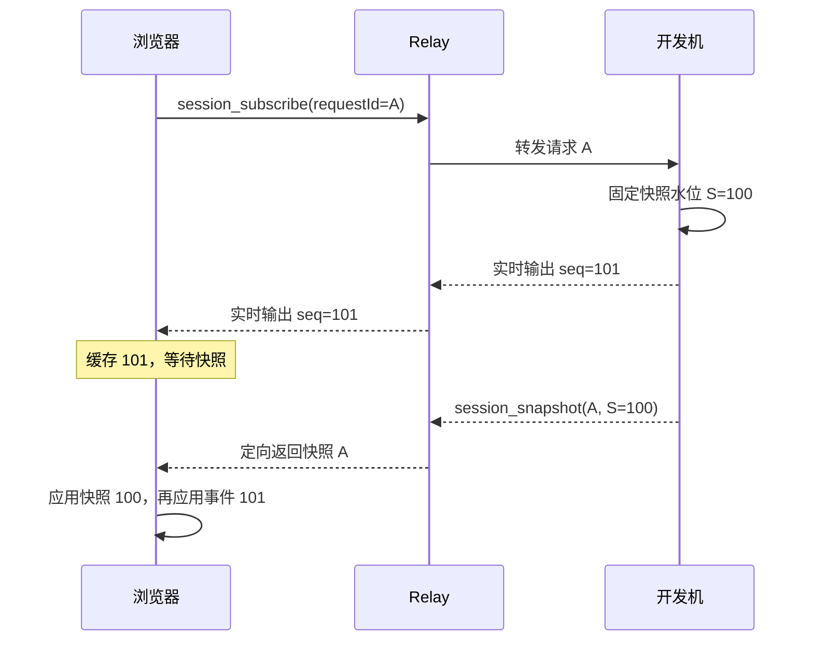

# PTY 网络同步设计

本文描述 DEV Anywhere 远程 PTY 的交互协议与故障恢复设计，规定各组件的职责、终端状态的一致性约束，以及正常同步和异常恢复时的行为。内容对应当前实现，用于协议评审与后续维护。

## 1. 背景与问题

DEV Anywhere 的 Shell 和 coding agent 运行在开发机上，通过 PTY（伪终端）接收输入、产生输出。浏览器通过网络接收终端数据，并使用本地 xterm 显示远程终端画面。

浏览器可能在会话运行一段时间后才接入，也可能在连接中断期间错过输出。PTY 输出包含文本、光标移动、清屏等控制序列，终端尺寸还会影响换行布局。因此，仅接收连接建立后的字节，无法保证浏览器与开发机处于相同的终端状态。

本设计需要解决三个问题：如何建立浏览器的初始终端状态，如何连续同步后续变化，以及如何在消息缺失或连接中断后恢复一致性。

## 2. 设计目标与范围

设计目标如下：

1. **实时性**：正常输出不等待逐帧确认，避免为每次终端更新引入网络往返。
2. **一致性**：输出和尺寸变化按生产端的顺序处理；重复消息、并发快照和异步解析不能造成重复应用、遗漏或几何错位。
3. **可恢复性**：原 PTY 生产端仍存活时，浏览器能够在连接恢复后重新建立终端状态，恢复过程不依赖 Relay 保存输出历史。
4. **资源约束**：限制终端历史、待处理事件和请求路由的保留量，并为缓冲淘汰定义恢复行为。

协议范围包括终端输出、远端尺寸变化、快照请求与响应，以及这些消息的排序、去重和恢复。同步对象是当前终端状态及其保留的滚动历史。输入投递保证、会话创建与终止、程序自身的持久化恢复不在本协议范围内。

## 3. 总体设计

### 3.1 组件职责与状态所有权

维护 PTY 会话的进程称为**生产端**。生产端使用 Headless xterm 解析输出并保存权威终端状态；浏览器 xterm 保存用于显示的副本。Proxy Serve 与 Relay 负责消息转发。


| 组件        | 职责                                     | 保留的同步状态                                       |
| ----------- | ---------------------------------------- | ---------------------------------------------------- |
| PTY 生产端  | 解析输出，为输出和 resize 编号，生成快照 | 权威终端状态、渲染事件序号                           |
| Proxy Serve | 在生产端与 Relay 之间转发消息            | 离线 JSON 队列、待转发快照请求；不保留离线二进制输出 |
| Relay       | 转发实时事件，将快照回复路由至请求方     | 会话关联、有界的快照请求路由；不保留 PTY 历史        |
| 浏览器      | 应用快照，排序和去重实时事件，触发恢复   | 终端副本、当前请求、连续事件序号和待处理事件         |

本地命令启动的会话由 [TerminalSession](../apps/proxy/src/terminal.ts) 维护；浏览器创建的 Shell 和 coding agent PTY 会话由独立的 [TerminalWorker](../apps/proxy/src/terminal-worker.ts) 维护。两类生产端的终端状态都保存在各自进程中；进程存活时，状态可跨 Proxy Serve 重启保留。

### 3.2 同步方式与设计取舍

协议使用**实时渲染事件与权威快照结合**的方式：正常运行时传递增量事件；初次接入和异常恢复时取得快照，再接续快照之后的事件。实时事件在快照生成和传输期间继续发送。

| 设计选择                   | 依据                                                                 | 代价或约束                                                   |
| -------------------------- | -------------------------------------------------------------------- | ------------------------------------------------------------ |
| 在生产端保存权威状态       | 网络中断不影响状态积累；生成快照不需要从 Relay 收集历史              | 每个生产端需要维护 Headless xterm；恢复依赖该进程存活        |
| 使用快照修复持久缺口       | 能恢复终端当前状态，无需保存并逐帧重放断线期间的全部输出             | 恢复需要传输和解析全量快照；不保留已经被覆盖或淘汰的历史画面 |
| 输出与 resize 使用统一序号 | 确保两端在相同尺寸下解释同一段输出                                   | 所有渲染事件必须经过统一的顺序入口                           |
| 按请求定向返回快照         | 隔离多个客户端及多轮恢复，避免向其他客户端发送大快照                 | Relay 需要维护有界的请求关联                                 |
| 实时事件按 Proxy 绑定广播  | Relay 使用开发机与客户端的绑定关系转发，无需维护客户端的会话订阅集合 | 未查看某个会话的客户端也会接收该会话的实时事件，占用网络带宽 |

## 4. 协议定义

### 4.1 渲染事件与标识

渲染事件分为两类：PTY 输出事件和终端尺寸变化事件。二者共享会话内的 `outputSeq`。

| 字段        | 含义                                       | 生成规则                                                   |
| ----------- | ------------------------------------------ | ---------------------------------------------------------- |
| `sessionId` | 标识消息所属的 PTY 会话                    | 同一个存活的生产端重新连接时沿用原会话 ID                  |
| `outputSeq` | 渲染事件序号；在快照中表示已覆盖的事件边界 | 生产端从 `0` 开始计数，每个非空输出事件或 resize 事件加一  |
| `requestId` | 标识一次逻辑快照请求                       | 浏览器生成；新一轮恢复使用新 ID，同一轮的超时重试沿用原 ID |

第一个渲染事件的序号为 `1`。订阅请求、快照响应和标题等其他消息不增加 `outputSeq`。序号的作用域是单个会话，与文本行数、字符数和其他会话的消息无关。

一个输出事件可以包含半行、多行或 ANSI 控制序列，也可以由多个 PTY 回调合并得到。生产端可在分配序号前合并 TUI 明确标记的一次同步重绘；排序单位是最终形成的渲染事件。

以下使用 `seq` 表示事件的 `outputSeq`，使用 `S` 表示快照水位，使用 `L` 表示浏览器已经按序交给渲染队列的最大序号。

### 4.2 消息与字段

下表中浏览器与生产端之间的通信均经过 Relay 和 Proxy Serve。所有列出的字段均为必填。

| 消息                      | 方向                  | 字段（不含 JSON 的 `type`）                                   |
| ------------------------- | --------------------- | ------------------------------------------------------------- |
| `session_subscribe`       | 浏览器 → 生产端       | `sessionId`、`requestId`                                      |
| `session_snapshot`        | 生产端 → 请求方浏览器 | `sessionId`、`requestId`、`cols`、`rows`、`data`、`outputSeq` |
| PTY 二进制输出            | 生产端 → 浏览器       | `sessionId`、`outputSeq`、输出字节                            |
| `terminal_resize_request` | 浏览器 → 生产端       | `sessionId`、`cols`、`rows`                                   |
| `terminal_resize`         | 生产端 → 浏览器       | `sessionId`、`cols`、`rows`、`outputSeq`                      |

PTY 二进制输出和 `terminal_resize` 按 Proxy 绑定广播：Relay 将消息转发给绑定该 Proxy 的所有在线客户端，不按客户端当前查看的会话筛选。浏览器收到后按 `sessionId` 分发给本地已注册的会话处理器；没有对应处理器时忽略该事件。快照响应按 4.4 节定向返回请求方。

转发与浏览器分发实现分别见 [Proxy 消息处理](../apps/relay/src/handlers/proxy.ts)和[浏览器 WebSocket 管理](../apps/web/src/services/websocket.ts)。

`sessionId` 和 `requestId` 为非空字符串；`cols`、`rows` 为正整数；JSON 中的 `outputSeq` 为非负整数。`session_snapshot.data` 是由 SerializeAddon 生成的 ANSI 字符串，用于重建终端内容、光标等状态及保留的滚动历史。

快照请求示例：

```json
{
  "type": "session_subscribe",
  "sessionId": "session-1",
  "requestId": "unique-request-a"
}
```

对应响应示例，其中 `data` 仅为内容占位：

```json
{
  "type": "session_snapshot",
  "sessionId": "session-1",
  "requestId": "unique-request-a",
  "cols": 80,
  "rows": 24,
  "data": "...ANSI 序列化内容...",
  "outputSeq": 100
}
```

`terminal_resize_request` 表达目标尺寸，不携带事件序号。生产端处理尺寸变化后分配 `outputSeq`，通过 `terminal_resize` 通知浏览器；本地命令会话的尺寸变化由宿主 TTY 驱动。

JSON 消息定义见 [relay-control.ts](../packages/shared/src/schemas/relay-control.ts)。

### 4.3 二进制编码

PTY 输出使用以下二进制格式：

```text
[1 字节：sessionId 的 UTF-8 字节长度 N]
[N 字节：sessionId]
[4 字节：outputSeq，uint32，小端序]
[剩余字节：PTY 输出数据]
```

`N` 的有效范围为 1–255。二进制输出属于会话事件流，不携带快照请求的 `requestId`。

本地 IPC 为该帧增加 `[0x00][4 字节内层帧长度，小端序]` 前缀；Proxy Serve 去掉外层后转发。编码定义见 [binary-frame.ts](../packages/shared/src/binary-frame.ts) 和 [ipc-protocol.ts](../apps/proxy/src/ipc/ipc-protocol.ts)。

### 4.4 快照请求关联

浏览器每轮恢复只接受与当前 `sessionId`、`requestId` 匹配的快照。请求 ID 通过页面随机作用域、控制器序号和请求序号组合生成，以避免不同页面、会话控制器和恢复轮次之间的冲突。

Relay 在转发订阅前记录 `(proxyId, sessionId, requestId)`、请求方浏览器 socket 和当时的 Proxy socket。收到响应时，只有完整关联匹配才向请求方发送快照；响应不广播给其他客户端。

一份有效响应被接受后，对应请求即被消费。重复响应、无关联响应和旧 Proxy socket 的响应不能再次应用。路由实现见 [pty-snapshot-route-registry.ts](../apps/relay/src/pty-snapshot-route-registry.ts)。

## 5. 一致性约束与同步流程

### 5.1 一致性约束

协议必须满足以下约束：

1. **快照边界一致**：水位为 `S` 的快照，其内容和尺寸反映全部 `seq <= S` 的事件效果，且不包含 `seq > S` 的效果。
2. **增量连续**：浏览器以快照为基准，丢弃 `seq <= S` 的缓存事件，只从 `S + 1` 开始按连续序号应用后续事件。
3. **渲染顺序一致**：输出和 resize 共享顺序；浏览器执行 resize 或 reset 前，必须等待此前已提交的 xterm 写入完成。
4. **恢复轮次隔离**：旧请求的响应和异步回调不能将旧事件应用到新一轮恢复建立的终端状态中。

快照保存的是事件产生的终端状态。ANSI 清屏、覆盖写和滚动历史淘汰的结果会体现在快照中，快照不逐字保存所有历史输出。

### 5.2 初始订阅与快照应用

初始订阅的前提是浏览器已完成 Relay 注册和开发机绑定。`session_subscribe` 请求一份当前终端快照；生产端生成和发送快照期间，仍持续发送新产生的输出和 resize。因此，浏览器必须先安装该会话的二进制及控制消息监听，再发送请求，并缓存快照应用前到达的事件。

下图展示实时输出先于快照到达的合法时序。Proxy Serve 与生产端合并为“开发机”，`A` 为请求 ID 的示意值：



等待快照以及解析快照期间，浏览器缓存收到的输出和 resize。接受有效响应后，按以下顺序建立状态：

1. 等待此前已提交给 xterm 的写入完成。
2. 执行 `reset`，按快照的 `cols`、`rows` 调整尺寸，写入 `data`。
3. 等待快照写入回调完成，将 `L` 设置为 `S`。
4. 丢弃缓存中 `seq <= S` 的事件，从 `S + 1` 开始将连续事件交给渲染队列；其余事件保留并按缺口处理。

例如，水位为 `100`，缓存按到达顺序包含 `99、102、100、101` 时，`99、100` 已由快照覆盖；浏览器随后按 `101 → 102` 应用其余事件。快照解析期间新到的事件也参加本轮合并。

### 5.3 实时事件与尺寸同步

实时事件采用单向推送：生产端发送一个输出或 resize 事件后继续发送后续事件，浏览器不逐条返回应用层接收确认。

浏览器建立初始状态后，使用 `L` 维护已按序提交的事件边界：

| 收到的事件    | 处理动作                                           |
| ------------- | -------------------------------------------------- |
| `seq <= L`    | 忽略重复或旧事件                                   |
| `seq = L + 1` | 提交该事件并推进 `L`，继续取出缓存中连续的后续事件 |
| `seq > L + 1` | 缓存该事件，标记缺口；在前序事件补齐前不得提交     |

`L` 在事件进入渲染队列时推进，不表示 xterm 已完成解析或屏幕已经绘制。解析完成和同步就绪分别受后续规则约束。

该排序规则同时作用于二进制输出和 JSON resize。例如：

```text
101：旧尺寸下的输出 → 102：resize 到 120 × 30 → 103：新尺寸下的输出
```

浏览器必须完成 `101` 的解析后执行 `102`，再处理 `103`。序号连续的 resize 沿实时流程处理，不触发快照、reset 或重新进入同步状态；resize 前存在缺口时，使用与输出相同的恢复规则。

单条 WebSocket 连接保持消息顺序，JSON 与二进制格式本身不造成乱序。本协议仍需要处理连接中断、应用层拒绝消息、缓冲淘汰及故障注入造成的缺口或乱序。

### 5.4 生产端快照屏障与浏览器执行顺序

生产端调用 `xterm.write()` 后，xterm 可能还没有解析完这段输出。如果立即读取快照，就可能出现水位已经是 `100`，内容却只包含到 `99` 的情况。浏览器随后会认为事件 `100` 已经包含在快照中，将它丢弃。

为保证快照的内容、尺寸与水位一致，PTY 生产端将输出、resize 和快照读取放入同一条 xterm 写入队列。每个输出或 resize 的序号分配和入队在同一次同步调用中完成。

收到浏览器的快照请求后，生产端按以下顺序生成快照：

1. 保存此时的 `outputSeq`，作为快照水位 `S`。
2. 紧接着调用 `xterm.write("", callback)`，在队列中插入一个读取快照的回调。这次空写入就是快照屏障。
3. 队列执行到屏障时，在回调中同步读取内容和尺寸，连同第 1 步保存的 `S` 一起返回快照。

保存水位和插入屏障也在同一次同步调用中完成，中间不会插入其他输出或 resize 操作。例如，在输出 `100` 入队后收到快照请求，队列顺序如下：

```text
输出 99 → 输出 100 → 屏障：读取快照（S=100）→ 输出 101
```

xterm 按队列顺序执行，因此屏障回调开始时，`100` 及之前的输出都已解析，`101` 还未开始解析。即使生产端此时已经为后续输出分配了更大的序号，快照仍使用先前保存的 `S = 100`。

resize 也通过空 `write` 的回调在这条队列中执行：排在快照屏障之前的尺寸变化已生效，排在之后的尚未生效。这样，快照的内容、尺寸和水位就对应同一个位置。快照和屏障本身不增加 `outputSeq`。

浏览器应用快照和实时事件时，同样需要处理 xterm 的异步写入。为保证执行顺序，[pty-frame-write-buffer.ts](../apps/web/src/lib/pty-frame-write-buffer.ts) 将输出、resize、reset 和快照写入放入同一条队列。每次调用 `xterm.write()` 后，都要等写入完成回调执行，才处理下一项。

在这个顺序下，相邻二进制输出可以合并为一次写入；遇到 resize、reset 或快照写入时，必须先完成前面的输出，再执行该操作。例如：

```text
队列：输出 A → 输出 B → resize → 输出 C
执行：write(A + B) → resize → write(C)
```

这样，输出 `C` 会按新尺寸解析。

开始新一轮恢复时，浏览器可以丢弃仍在自身队列中、尚未交给 xterm 的旧操作。已经传给 `xterm.write()` 的数据无法撤回，必须等解析完成后才能执行 reset 和写入新快照，否则旧输出可能在 reset 之后写入终端。

等待写入完成期间，还可能开始新一轮恢复。因此，浏览器使用 `snapshotGeneration` 记录当前恢复轮次，发起新请求或开始应用新快照时更新它。异步回调执行时，只有所属轮次仍与当前轮次一致，才继续应用快照或后续事件，避免旧回调干扰新的恢复过程。

### 5.5 同步完成条件

浏览器只有在以下条件同时成立时才能报告 `ready`：

1. 当前快照已经应用，或重连快照满足副本复用条件。
2. 当前没有已知的序号缺口或未解决的事件缓冲溢出。
3. 本次就绪检查时已经排队的增量事件全部完成解析。
4. 完成一次动画帧调度，且期间没有发生暂停、新恢复周期或新缺口。

浏览器只等待本次检查开始时已经排队的事件完成解析。之后收到的连续输出仍按序处理，不会让终端一直停留在同步状态。

## 6. 故障检测与恢复

### 6.1 序号缺口

已有快照时，如果收到的事件越过 `L + 1`，浏览器缓存后续事件并开始缺口计时。默认等待 2 秒，用于容纳短暂乱序。

缺口在等待期内补齐时，浏览器按序提交事件并取消计时。例如，从 `L = 100` 开始：

| 事件             | 处理动作                      | 连续序号 |
| ---------------- | ----------------------------- | -------- |
| 收到 `102`       | 缓存，等待 `101`，启动计时    | `100`    |
| 2 秒内收到 `101` | 按 `101 → 102` 提交，取消计时 | `102`    |
| 重复收到 `102`   | 忽略                          | `102`    |

缺口持续 2 秒时，浏览器开始新的快照请求，清理旧恢复窗口和未提交的渲染操作。例如，同样从 `L = 100` 开始：

| 事件                       | 处理动作                                   |
| -------------------------- | ------------------------------------------ |
| 收到 `102`，`101` 始终未到 | 保留缺口，等待计时到期                     |
| 缺口计时到期               | 使用新请求 ID `B` 发送 `session_subscribe` |
| 等待响应期间收到 `106`     | 缓存到新恢复窗口                           |
| 收到快照 `B`，水位为 `105` | 重建到 `105`，再提交 `106`                 |

水位 `105` 的快照覆盖了缺失事件留下的终端效果，恢复不需要找回这些事件的原始字节。协议未定义按事件序号请求补发的消息。开始恢复时清理的是待处理队列，已有画面保留到快照实际应用时再重建。

旧事件或重复事件不会清除已有缺口，也不会重新开始缺口计时。快照后的增量合并若仍有缺口，必须立即启动同一计时机制，无需等待下一条消息。排序与计时分别由 [pty-recovery.ts](../apps/web/src/lib/pty-recovery.ts) 和 [pty-session-transport.ts](../apps/web/src/lib/pty-session-transport.ts) 实现。

### 6.2 快照超时与响应失效

同一轮请求的重试沿用 `requestId`，使较早发送的请求仍可返回有效响应。重连或持久缺口触发的新一轮恢复必须使用新 ID，并使上一轮响应失效。响应即使带有更大的水位，也不能替代请求关联校验。

| 条件                           | 处理动作                                           |
| ------------------------------ | -------------------------------------------------- |
| 10 秒仍未完成快照应用          | 发出同步延迟通知                                   |
| 30 秒仍未收到有效响应          | 重发同一请求，之后每 30 秒继续重试                 |
| Relay 收到同一未应答请求的重试 | 距上次转发至少 25 秒才再次向 Proxy 转发            |
| 接受当前请求的有效响应         | 消费请求并立即停止重试；继续等待解析和同步完成条件 |
| transport 暂停或销毁           | 停止该 transport 的重试与恢复计时                  |

Relay 对请求 ID 冲突或路由容量不足返回 `relay_error`，其中 `code` 为 `INVALID_MESSAGE`，并回传原 `requestId`。此时不建立新的快照路由，PTY transport 继续按既定周期重试。

协议格式错误、无关联、已失效或来自旧 Proxy socket 的响应均不能触发终端重建。

### 6.3 连接中断与恢复

连接恢复必须先完成连接层注册与开发机绑定，再恢复终端同步。各段链路的处理如下：

| 断开位置                        | 状态保留                                                                                    | 恢复动作                                                                                       |
| ------------------------------- | ------------------------------------------------------------------------------------------- | ---------------------------------------------------------------------------------------------- |
| 浏览器 ↔ Relay                  | 浏览器暂停 PTY transport，保留 xterm；生产端可继续输出                                      | 注册和绑定恢复后，transport 恢复并发起新快照请求                                               |
| Proxy Serve ↔ Relay             | 生产端继续更新权威状态；Proxy 丢弃离线二进制帧，将发往 Relay 的 JSON 消息暂存在本地发送队列 | Proxy 重连并注册后，按入队顺序发送暂存消息，并同步会话列表；浏览器在感知开发机恢复后请求新快照 |
| 生产端 ↔ Proxy Serve 的本地 IPC | 存活的生产端保留原会话 ID、终端状态和序号                                                   | 生产端重连并重新注册；Serve 转发暂存的快照请求；仍在实时同步的浏览器可由后续序号缺口触发恢复   |

Proxy 暂存的 JSON 消息包括 `session_snapshot`（快照响应）、`terminal_resize`（尺寸变化通知）等。发送队列位于 Proxy 内存中，最多保留 10000 条消息；队列满时丢弃最旧的消息。

Proxy 重连后发送完整的 `session_sync`，包括 `sessions: []`，用于替换 Relay 的会话关联。该消息不包含终端画面，不能代替 `session_snapshot`。

浏览器根据 `proxy_offline / proxy_online` 恢复开发机绑定和 PTY transport，正常恢复不依赖下一次终端输出。如果短暂中断未使 transport 暂停，后续暴露的序号缺口仍可触发恢复。

重连时允许复用保留的浏览器终端，但必须同时满足：快照水位与保留序号一致；快照尺寸、保留尺寸及浏览器实际尺寸一致；没有快照水位之后的缓存事件，也没有未被覆盖的缓冲丢失。满足条件时省去 reset 和快照重写，已有写入仍必须完成后才能报告 `ready`。

### 6.4 半开连接检测

网络切换或浏览器挂起可能使失效连接暂时不触发 `close`。连接层使用以下检测机制终止半开连接，随后执行正常重连与快照恢复：

| 检测方           | 默认策略                                                                                            |
| ---------------- | --------------------------------------------------------------------------------------------------- |
| Proxy            | 每 15 秒发送 WebSocket ping；10 秒内没有 pong 或其他入站消息则终止 socket                           |
| Relay            | 每 30 秒检查一次；上一轮 ping 未收到 pong 则终止 socket                                             |
| 手机和平板浏览器 | 前台连续 15 秒无入站数据，或在后台至少 5 秒后恢复时进行应用层探测；2 秒内没有任何入站消息则更换连接 |

浏览器收到 `online` 事件时主动更换连接，可见性与焦点恢复也会唤醒连接检查。普通网络故障使用带随机抖动的指数退避，Web 和 Proxy 的单次退避上限均为 30 秒。连接检测、退避、注册、快照传输和解析共同决定恢复耗时，单项超时不构成端到端恢复时限。

### 6.5 事件缓冲淘汰

| 缓冲                         | 默认上限    | 淘汰与恢复规则                                           |
| ---------------------------- | ----------- | -------------------------------------------------------- |
| 等待或解析快照期间的事件缓存 | 5000 个事件 | 淘汰最早到达的事件，记录被淘汰事件的最大序号             |
| 已应用快照后的乱序缓存       | 1000 个事件 | 保留最接近缺口的事件，淘汰最远的未来事件，并保留溢出标记 |

快照覆盖了被淘汰的部分时，可以消除对应丢失；未覆盖时，浏览器必须保留缺口状态并按 6.1 节重新请求快照。不能仅因为缓存已被取空就判定恢复完成。快照解析后的检查必须识别淘汰造成的缺口，即使此后没有新事件到达，也要启动恢复计时。

## 7. 资源边界与已知限制

以下为当前实现的资源限制；事件缓冲上限见 6.5 节。

| 资源                 | 当前限制                                   | 影响                                                                       |
| -------------------- | ------------------------------------------ | -------------------------------------------------------------------------- |
| 两端 xterm 滚动历史  | `scrollback: 5000`                         | 除当前屏幕外，最多保留 5000 行历史；更早内容无法通过快照找回               |
| JSON 控制消息        | 8 MiB                                      | 按整条未压缩消息的字节数计量，包含 JSON 开销；持续超限的快照无法靠重试恢复 |
| 二进制帧             | 10 MiB                                     | 超限或畸形帧被拒绝；后续事件暴露缺口后可请求快照                           |
| Proxy 离线 JSON 队列 | 10000 条                                   | 超限丢最旧消息；二进制输出不进入队列                                       |
| Serve 待转发快照请求 | 每会话 8 个                                | 按 `requestId` 去重，超限丢最旧请求；后续重试可重新入队                    |
| Relay 快照路由       | 总量 4096 项，单客户端最多 64 个待响应请求 | 待响应记录保留 5 分钟；已完成或放弃的记录保留 120 秒以识别迟到响应         |
| 二进制事件序号       | uint32                                     | 当前没有回绕协议；超过 `0xffffffff` 后不能继续编码输出                     |

消息大小限制定义见 [wire-limits.ts](../packages/shared/src/constants/wire-limits.ts)。

恢复能力受以下条件限制：

- 权威状态保存在生产端内存中。生产端退出后，网络重连不能恢复原终端状态；恢复必须以原生产端仍存活、连接重新可用且协议准入成功为前提。
- 序号缺口检测依赖收到更大的序号或已有缓冲淘汰记录。若尾部事件丢失后不再有新事件，且连接状态没有变化，浏览器不能仅凭序号发现丢失。
- 快照恢复保证在有效快照基础上连续应用后续事件，不保证保留全部历史字节或中间画面；网络恢复后的最终同步还依赖有效快照可传输、可解析，以及后续缺口能够补齐或再次恢复。

## 8. 验证准则

设计验证以协议约束和可观察行为为准，覆盖正常流程、并发时序和故障恢复：

| 验证场景                               | 通过条件                                                                   | 对应覆盖                                                                                                                                         |
| -------------------------------------- | -------------------------------------------------------------------------- | ------------------------------------------------------------------------------------------------------------------------------------------------ |
| 输出、resize 与快照并发                | 快照内容、尺寸和水位属于同一事件边界，后续效果不会混入                     | [生产端顺序测试](../apps/proxy/src/__tests__/unit/pty-render-sequencer.test.ts)                                                                  |
| 快照前及解析期间到达实时事件           | 已覆盖事件被丢弃，剩余事件从 `S + 1` 连续应用                              | [浏览器恢复测试](../apps/web/src/lib/pty-recovery.test.ts)                                                                                       |
| 重复事件、短暂乱序、持久缺口和缓冲淘汰 | 不重复提交、不越过缺口；等待期内补齐则继续，未补齐则请求新快照             | [传输与恢复测试](../apps/web/src/lib/pty-session-transport.test.ts)                                                                              |
| xterm 仍在解析时发生 resize 或新恢复   | resize 与 reset 等待旧写入完成；旧回调不能继续提交旧事件                   | [渲染队列测试](../apps/web/src/lib/pty-frame-write-buffer.test.ts)、[跨层时序测试](../apps/web/src/lib/pty-sync-correctness-contract.test.ts)    |
| 多客户端请求、重复响应和旧连接响应     | 响应仅送达匹配请求方，失效响应不改变终端状态                               | [快照路由测试](../apps/relay/src/__tests__/unit/pty-snapshot-route-registry.test.ts)、[浏览器恢复测试](../apps/web/src/lib/pty-recovery.test.ts) |
| 重连复用与持续输出                     | 仅在复用条件满足时保留副本；ready 不越过缺口，也不因后续连续输出而无限推迟 | [传输与恢复测试](../apps/web/src/lib/pty-session-transport.test.ts)、[跨层时序测试](../apps/web/src/lib/pty-sync-correctness-contract.test.ts)   |
