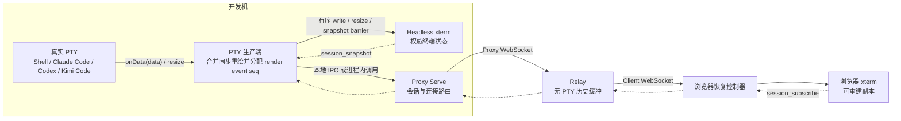
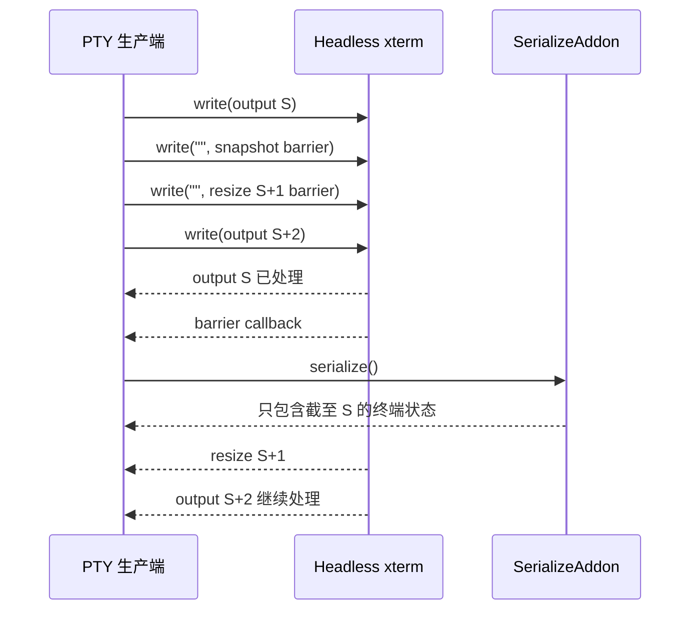
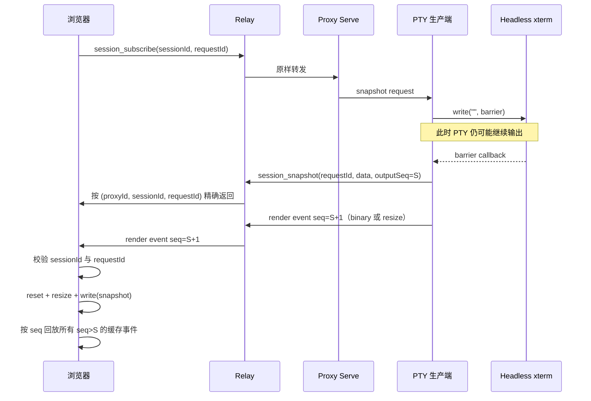
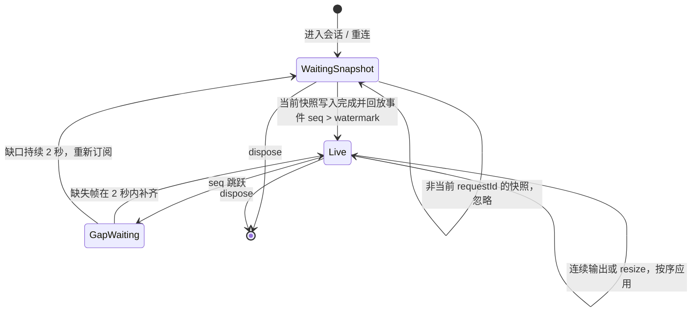
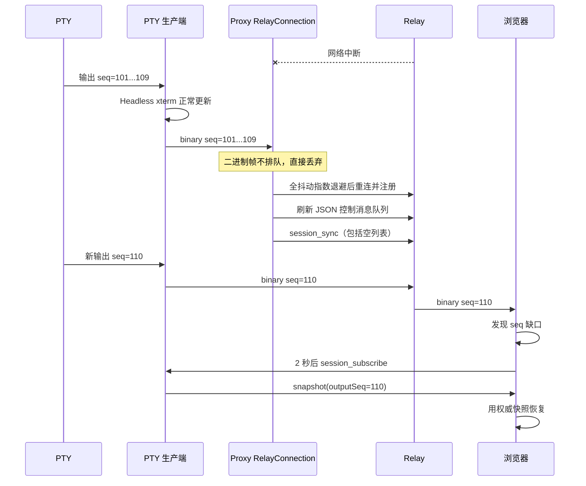

# PTY 网络同步机制

本文描述 DEV Anywhere 的 PTY 输出如何从开发机同步到浏览器，以及首次进入、重连、终端尺寸变化、乱序、重复和丢帧时如何恢复。

这里的“同步”只指 PTY 终端画面。聊天消息、文件传输、审批和 Voice Pilot 使用各自的协议，不在本文范围内。

## 设计目标

PTY 同步同时走两条路径：

- 实时输出使用二进制帧，减少编码和解析开销；
- 首次进入和异常恢复使用完整快照，把浏览器重新对齐到开发机上的权威状态。

这套机制需要满足四个条件：

1. 正常输出尽快到达浏览器，不为每一帧等待确认；
2. 浏览器可以区分新帧、重复帧和乱序帧；
3. 连接中断或中间帧丢失后，不依赖 Relay 保存历史也能恢复；
4. 快照与实时帧交错到达时，既不重复渲染，也不遗漏快照之后的新输出。

它不是无限期保存的终端日志。生产端和浏览器端的 xterm 都只保留最近 `5000` 行，超过后由 xterm 正常淘汰。

## 组件与权威状态



开发机上的 Headless xterm 是终端画面的权威状态。Relay 只负责转发，不保存 PTY 帧，也不负责从帧重建终端。浏览器里的 xterm 是可随时由快照重建的副本。

项目目前有三种 PTY 生产端：

| 会话来源                                                                    | 生产端                                                                | 与 Proxy Serve 的关系               |
| --------------------------------------------------------------------------- | --------------------------------------------------------------------- | ----------------------------------- |
| 本地执行 `dev-anywhere claude`、`dev-anywhere codex` 或 `dev-anywhere kimi` | [`TerminalSession`](../apps/proxy/src/terminal.ts)                    | 独立进程，通过 Unix socket IPC 接入 |
| 浏览器创建 Shell 会话                                                       | [`ShellTerminalWorker`](../apps/proxy/src/terminal-worker.ts)         | 独立进程，通过 Unix socket IPC 接入 |
| 浏览器创建 Claude Code、Codex 或 Kimi Code PTY 会话                         | [`HostedPtyRegistry`](../apps/proxy/src/serve/hosted-pty-registry.ts) | 由 Proxy Serve 直接托管             |

三条路径都复用 [`PtyRenderSequencer`](../apps/proxy/src/common/pty-render-sequencer.ts)。它统一拥有：

- 一个 render event 序号，线上字段仍命名为 `outputSeq`；
- 一个 `scrollback: 5000` 的 Headless xterm；
- 一个 `SerializeAddon`；
- 输出、resize 与快照屏障的唯一顺序入口。

因此生产端不存在“某处推进序号、另一处单独 resize、第三处读取快照”的多套状态。

## 实时渲染事件协议

每个会改变远端终端画面的事件都会推进 `outputSeq`：

- PTY 输出使用二进制帧；
- 终端尺寸变化使用带 `outputSeq` 的 `terminal_resize` 控制消息。

`outputSeq` 的准确含义是“该会话第几个远端渲染事件”，不是行号、字符偏移或全局消息序号。输出事件可以包含半行、多行、ANSI 控制序列或 TUI 的局部重绘；resize 事件则改变后续输出的解析几何。

二进制格式由 [`packages/shared/src/binary-frame.ts`](../packages/shared/src/binary-frame.ts) 统一定义：

```text
[1 byte sessionId UTF-8 长度]
[N bytes sessionId UTF-8]
[4 bytes outputSeq, uint32 little-endian]
[剩余 bytes: 原始 PTY 数据]
```

同一个会话的 `outputSeq` 从 `1` 开始单调递增。`0` 表示尚未产生输出，常见于刚创建会话时的空快照。

resize 控制消息格式为：

```json
{
  "type": "terminal_resize",
  "sessionId": "session-id",
  "cols": 122,
  "rows": 29,
  "outputSeq": 392
}
```

二进制输出与 JSON resize 使用不同的消息类型和转发路径，故障恢复或主动注入乱序时可能交错到达；浏览器必须依据共享的 `outputSeq` 恢复原始顺序，不能依据抵达先后直接操作 xterm。

本地独立进程到 Proxy Serve 之间还包一层 IPC 帧：

```text
[1 byte 0x00 标记]
[4 bytes 内层帧长度, uint32 little-endian]
[内层 PTY 二进制帧]
```

IPC 的编码和解析位于 [`apps/proxy/src/ipc/ipc-protocol.ts`](../apps/proxy/src/ipc/ipc-protocol.ts)。进入 Proxy Serve 后会去掉 IPC 外层，再使用共享二进制格式发往 Relay。

### 同步重绘事务

Kimi Code 等 TUI 会用 DEC synchronized output（`CSI ? 2026 h` 到 `CSI ? 2026 l`）包住一次完整重绘。一次 resize 可能产生数百 KiB 数据，并被 node-pty 拆成数百个 `onData` 回调。如果逐块发送，浏览器会在高延迟网络下长时间展示清屏后的中间状态。

三个生产端都在分配 `outputSeq` 之前使用 [`PtySynchronizedOutputCoalescer`](../apps/proxy/src/common/pty-synchronized-output-coalescer.ts)：

1. 普通输出立即通过；
2. 完整的 synchronized-output 事务合并为一个输出事件；
3. 解析器能够跨任意 chunk 边界识别标记，并忽略 OSC、DCS、APC 等字符串内部的伪标记；
4. 缓冲超过 `8 MiB`、事务空闲超过 `2` 秒或会话主动 flush 时，无损排空并进入 passthrough，直到真实结束标记；
5. overflow 会写结构化警告，不以截断输出换取内存安全。

这里合并的是 TUI 已明确声明为原子展示的事务，不会等待或猜测普通输出的边界。

### 本地终端的初始尺寸

本地执行 `dev-anywhere claude / codex / kimi` 时，宿主 TTY 尺寸既决定真实子进程的初始几何，也决定 Headless xterm 的初始几何。两边必须使用同一次读取结果，否则在第一条输出之前就可能产生不同的换行布局。

[`PtyManager`](../apps/proxy/src/terminal/pty-manager.ts) 使用调用方捕获的 `initialSize` 启动子 PTY，挂上宿主 `resize` listener 后立即再读取一次当前尺寸。若尺寸恰好在“首次读取到 listener 生效”之间变化，它会补发一次去重后的 resize；相同尺寸不会重复触发子进程重绘。

## 快照协议

浏览器通过 JSON 控制消息请求快照：

```json
{
  "type": "session_subscribe",
  "sessionId": "session-id",
  "requestId": "globally-unique-request-id"
}
```

生产端返回：

```json
{
  "type": "session_snapshot",
  "sessionId": "session-id",
  "requestId": "globally-unique-request-id",
  "cols": 122,
  "rows": 29,
  "data": "...SerializeAddon 生成的 ANSI 文本...",
  "outputSeq": 391
}
```

消息 schema 位于 [`packages/shared/src/schemas/relay-control.ts`](../packages/shared/src/schemas/relay-control.ts)。

### 快照水位不变量

`session_snapshot.outputSeq = S` 必须满足：

> `snapshot.data` 与 `snapshot.cols / rows` 表示生产端 Headless xterm 在处理完所有 `outputSeq <= S` 的渲染事件后形成的终端状态，并且不包含 `outputSeq > S` 的输出或 resize 效果。

“终端状态”不等于逐字保存所有历史字节。ANSI 清屏、覆盖写、光标移动和 `5000` 行 scrollback 淘汰都会改变最终状态。

这个不变量决定了浏览器如何合并快照和实时帧：

- `seq <= S` 的输出与 resize 已经反映在快照中，必须丢弃；
- `seq > S` 的事件发生在快照之后，必须按顺序补写或应用。

### 为什么需要写入屏障

xterm 的 `terminal.write(data)` 是异步的。调用返回时，`SerializeAddon.serialize()` 不一定已经能看到刚写入的数据。

如果生产端先把 `outputSeq` 增加到 `S`，调用 `terminal.write(data)` 后立刻序列化，就可能生成“水位已经是 `S`，内容却还停在 `S - 1`”的快照。浏览器随后会把实时帧 `S` 当作快照已包含的重复帧丢弃，造成永久缺行。

当前实现由 `PtyRenderSequencer` 向同一个 xterm 写入空字符串作为有序屏障。resize 也在同一条 xterm FIFO 中通过屏障执行：



`captureSnapshot` 在调用时捕获水位，在屏障回调中读取对应边界的 `cols`、`rows` 和序列化数据。这样不会出现“旧水位配上稍后 resize 后的新尺寸”，也不会让 resize 后的输出按旧几何解析。

## 正常订阅流程



浏览器在发送订阅请求前已经注册该 `sessionId` 的二进制与控制消息订阅。因此快照返回前到达的输出或 resize 不会直接操作 xterm，而是暂存在恢复控制器中。

快照、二进制输出和 resize 使用不同消息类型，网络和故障注入可能让它们交错到达。合并顺序只由 `requestId` 和 `outputSeq` 决定，不依赖某一种消息“应该先到”的假设。

### 多客户端与 requestId

Relay 在转发 `session_subscribe` 前记录 `(proxyId, sessionId, requestId)` 与请求浏览器 socket 的精确映射。Proxy 返回 `session_snapshot` 时，Relay 只把大快照发给该 socket；缺失 `requestId` 的消息会被协议 schema 拒绝，找不到匹配 pending route 的迟到或伪造快照会直接丢弃。因此，同时查看同一会话的其他客户端不会再支付这份快照的网络和解压成本。

浏览器生成的快照请求 ID 由三部分组成：

1. 页面加载时通过 Web Crypto 生成的随机作用域；
2. 当前页面内的恢复控制器序号；
3. 该控制器内的请求序号。

因此不同设备、标签页、会话控制器和重试请求不会从相同的 `pty-snapshot-1` 开始。接收端先按 `sessionId` 筛选，再只接受与当前活动请求 ID 完全一致的快照。其他客户端的快照和当前控制器已经淘汰的旧快照都会被忽略。

实现位于 [`apps/web/src/lib/pty-recovery.ts`](../apps/web/src/lib/pty-recovery.ts)。

### 传输压缩与资源边界

`/proxy` 与 `/client` 数据通道统一启用 `permessage-deflate`，不维护协议版本或兼容分支。超过 `32 KiB` 的 JSON 控制消息（尤其全量快照）使用 level 3、memLevel 7 压缩；两端都禁用 context takeover，并把 zlib 并发限制为 4，避免长连接字典和无界压缩任务占用 Relay 内存。PTY 实时帧与远程文件二进制帧在 Node 发送端明确设置 `compress: false`，避免给高频、小块或已经压缩的数据增加 CPU 与延迟。语音使用独立 WebSocket，完全不协商此扩展。

这是一次硬切换：Web、Relay 与 Proxy 都要求快照请求携带 `requestId`，部署时必须同步更新并刷新旧页面，不提供无 ID 广播回退。

## 浏览器恢复算法



上图中 `terminal_resize` 在正常连续序号下始终留在 `Live`。它不会重新订阅、不会显示“正在连接终端...”，也不会清屏或重放历史；只有序号缺口持续存在时才进入快照恢复。

### 1. 开始快照周期

[`attachPtySessionTransport`](../apps/web/src/lib/pty-session-transport.ts) 只在首次挂载、连接恢复和持久缺口恢复时开始新的快照周期：

1. 清理上一个快照重试、慢响应提示和缺口恢复计时器；
2. 清空尚未提交给 xterm 的渲染操作队列；
3. 生成新的全局唯一 `requestId`；
4. 清空上一周期的事件窗口；
5. 发送 `session_subscribe`；
6. 安排慢响应提示和重试。

快照 `10` 秒未应用时，UI 会进入“同步时间较长”的状态。快照仍未到达时，每隔 `30` 秒重发同一逻辑请求的 `requestId`，使已经在途的慢响应仍然有效，直到成功或 transport 被销毁。Relay 的未应答重发门槛为 `25` 秒，给浏览器的 `30` 秒定时器留出调度和网络抖动余量。

### 2. 快照前事件缓冲

快照应用前，输出和 resize 都保存在 `eventBuffer` 中，不直接操作浏览器 xterm。

- 上限为 `5000` 个事件；
- 超过上限时淘汰最早进入的事件，防止长时间断连或快照永久不到造成浏览器内存无界增长；
- 快照到达后，只保留 `seq > snapshot.outputSeq` 的事件；
- 保留事件按 `outputSeq` 排序后进入连续序号合并流程。

如果缓冲淘汰造成序号缺口，快照异步写入和回放完成后会立即启动同一套 `2` 秒缺口恢复计时，不必等待下一帧到达。

### 3. 应用快照

只有 `requestId` 与当前活动请求一致的快照可以应用。应用顺序是：

1. 等待已经提交给浏览器 xterm parser 的旧写入完成；
2. `reset()` 浏览器 xterm；
3. 按快照中的 `cols` 和 `rows` 调整尺寸；
4. 写入 `snapshot.data` 并等待异步写入回调；
5. 按序回放缓存中 `seq > snapshot.outputSeq` 的输出和 resize。

每次开始新请求或应用新快照都会推进 `snapshotGeneration`。旧快照的异步写入回调如果晚于新周期返回，会发现 generation 已变化，不再把旧帧写入新画面。

### 4. 实时事件排序与去重

快照应用后，恢复控制器维护 `appliedOutputSeq` 和 `pendingEvents`：

- `seq <= appliedOutputSeq`：重复或旧事件，忽略；
- `seq == appliedOutputSeq + 1`：立即成为下一个可应用事件；
- `seq > appliedOutputSeq + 1`：暂存在 `pendingEvents`，等待中间序号；
- 每次加入新事件后，从 `appliedOutputSeq + 1` 开始连续取出，直到再次遇到缺口。

`pendingEvents` 上限为 `1000`。超过后保留距离缺口最近的事件、淘汰最远的未来事件，并保持 overflow gap 标记，直到权威快照确实覆盖缺失范围。不能因为 Map 被裁空就误判为已经恢复。

### 5. 合并到浏览器 xterm

[`pty-frame-write-buffer.ts`](../apps/web/src/lib/pty-frame-write-buffer.ts) 实际是一条串行渲染操作队列：二进制写入、快照字符串、resize、reset、barrier 和 fence 都经过同一入口。每次写入必须等 xterm parser 的 callback 返回，下一项才能执行，因此即使控制消息与二进制消息交错到达，最终仍严格保持 `输出 A -> resize -> 输出 B`。

相邻二进制帧会在动画帧边界合并，默认累计不超过 `256 KiB`；单个更大的原子帧（例如 Kimi 的完整重绘事务）保持完整，不会为了批次上限重新切碎。控制操作会截断批次。新快照周期的 `clear()` 只丢弃尚未提交的队列，已经交给 parser 的写入先通过 barrier 排空，再执行 reset 和快照。

## 丢帧与断线恢复

### outputSeq 缺口

WebSocket 在单条连接上通常保持发送顺序，但以下情况仍会出现序号缺口：

- Proxy 到 Relay 断开时，生产端继续输出；
- Relay 主动丢弃超限或畸形二进制帧；
- 故障注入主动制造延迟、重复或乱序；
- 浏览器等待快照期间的本地缓冲达到上限。

短暂乱序不应立刻清屏。浏览器先等待 `2` 秒：

- 缺失事件补齐：取消计时器，继续实时输出；
- 缺口仍存在：清理当前帧批次并重新请求快照。

### Proxy 到 Relay 断开



[`RelayConnection`](../apps/proxy/src/serve/relay-connection.ts) 对两类数据采用不同策略：

- JSON 控制消息：离线时进入内存队列，上限 `10000` 条，重新注册成功后按队列顺序发送；
- PTY 二进制帧：离线时不排队。

不缓存二进制帧是有意设计。断线期间可能产生大量输出，排队会占用不可控内存，还可能在重连后长时间回放过时画面。Headless xterm 已经保存最终状态，因此重新取快照更直接。

Proxy 重连后始终发送完整 `session_sync`，即使当前活跃会话为零也发送 `sessions: []`。Relay 使用它替换旧的会话关联，不能把空列表解释成“不需要同步”。

### 浏览器到 Relay 断开

[`WebSocketManager`](../apps/web/src/services/websocket.ts) 使用最大 `30` 秒的全抖动指数退避重连。页面重新可见、浏览器重新获得焦点或系统触发 `online` 时，会取消等待并立即尝试恢复。

WebSocket 断开后，PTY transport 会随连接状态卸载。连接、客户端注册和开发机绑定恢复后，新的 transport 会重新订阅快照；它不依赖断线前的浏览器 xterm 继续追帧。

浏览器的 JSON 离线队列同样最多 `10000` 条，但只有调用方明确传入 `queueWhenDisconnected` 才会使用。PTY 快照订阅不依赖这个队列，而是在连接恢复后重新创建 transport。

### Proxy Serve 与本地 PTY 进程断开

本地接管的 coding agent 和 Shell worker 都在独立进程中维护 Headless xterm 与 `outputSeq`。Proxy Serve 的 Unix socket 断开后，它们会重连并使用原 `sessionId` 重新注册，因此本地权威状态可以跨 Serve 重启保留。

订阅请求先于本地 PTY 注册到达时，[`TerminalSubscriptionBacklog`](../apps/proxy/src/serve/terminal-subscription-backlog.ts) 为每个会话暂存最多 `8` 个请求，并按 `requestId` 去重。PTY 重新注册后，Proxy Serve 将这些请求转发给生产端。

## 心跳与半开连接

网络切换或移动设备锁屏后，TCP 连接可能既不收消息也不立即触发 `close`。

| 检测方 | 默认策略                                                                             |
| ------ | ------------------------------------------------------------------------------------ |
| Proxy  | 每 `15` 秒发送 ping；等待 pong 最多 `10` 秒，超时后 `terminate` 当前 socket          |
| Relay  | 每 `30` 秒轮询 Proxy、浏览器和语音 WebSocket；上一轮 ping 仍未收到 pong时终止连接    |
| 浏览器 | 由 Relay ping 触发标准 WebSocket pong；页面可见、`online`、窗口 focus 时主动唤醒重连 |

终止半开连接后，恢复仍走正常的重连和快照流程，不存在另一套特殊同步协议。

## 异常处理矩阵

| 异常                                | 当前处理                                            | 最终恢复来源                 |
| ----------------------------------- | --------------------------------------------------- | ---------------------------- |
| 重复输出或 resize                   | `seq <= appliedOutputSeq`，忽略                     | 当前浏览器状态               |
| 二进制输出与 resize 少量乱序        | 统一暂存并按连续 `seq` 排序                         | 后续缺失事件                 |
| 持久序号缺口                        | 等待 `2` 秒后重新订阅                               | Headless xterm 快照          |
| 快照前先到实时事件                  | 缓冲，快照应用后回放 `seq > watermark`              | 快照加事件缓冲               |
| 正常 terminal_resize                | 在现有 Live 流中按序应用，不订阅、不清屏            | 当前浏览器状态               |
| resize 与生产端快照请求并发         | Sequencer 的 FIFO 屏障使尺寸、内容与 watermark 一致 | 屏障后的快照                 |
| resize 前的浏览器写入仍在 parser    | 串行操作队列等待 callback，再 resize                | 当前有序事件流               |
| 旧快照异步回调晚到                  | `snapshotGeneration` 不匹配，停止旧回放             | 当前活动请求                 |
| 旧快照晚到                          | `requestId` 不匹配，忽略                            | 当前活动请求                 |
| 其他客户端的同会话快照              | 全局唯一 `requestId` 不匹配，忽略                   | 当前活动请求                 |
| 生产端刚写输出就收到订阅            | 空 `write` 屏障等待 xterm 消化已有输出              | 屏障后的快照                 |
| synchronized-output 超过 `8 MiB`    | 无损排空、passthrough 至结束并记录 overflow         | 当前有序事件流               |
| synchronized-output 超过 `2` 秒空闲 | 无损排空、passthrough 至结束                        | 当前有序事件流               |
| Proxy 到 Relay 断线                 | JSON 有界排队，PTY 二进制丢弃                       | 重连后的新快照               |
| 浏览器锁屏后连接半开                | Relay 心跳终止；唤醒事件触发立即重连                | 新 transport 的快照          |
| 本地 PTY 尚未注册                   | 每会话暂存最多 `8` 个订阅请求                       | PTY 注册后的快照             |
| JSON 控制消息超过 `8 MiB`           | Relay 记录警告并丢弃                                | 后续重试；持续超限需人工处理 |
| 二进制帧超过 `10 MiB`               | Relay 记录警告并丢弃                                | 下一事件形成缺口后重新取快照 |
| 无效 JSON 或不符合 schema           | 记录协议错误并丢弃；客户端请求可收到 `relay_error`  | 调用方重试或修正版本         |

## 固定上限与取舍

以下数值是当前实现，不是协议永久承诺：

| 项目                             |        当前值 | 定义位置                                                                                                |
| -------------------------------- | ------------: | ------------------------------------------------------------------------------------------------------- |
| 生产端 Headless xterm scrollback |     `5000` 行 | 三个 PTY 生产端                                                                                         |
| 浏览器 xterm scrollback          |     `5000` 行 | [`create-xterm.ts`](../apps/web/src/lib/create-xterm.ts)                                                |
| 同步重绘事务缓冲                 |       `8 MiB` | [`pty-synchronized-output-coalescer.ts`](../apps/proxy/src/common/pty-synchronized-output-coalescer.ts) |
| 同步重绘空闲排空                 |        `2` 秒 | [`pty-synchronized-output-coalescer.ts`](../apps/proxy/src/common/pty-synchronized-output-coalescer.ts) |
| 浏览器相邻二进制批次             |     `256 KiB` | [`pty-frame-write-buffer.ts`](../apps/web/src/lib/pty-frame-write-buffer.ts)                            |
| 快照前实时事件缓冲               |     `5000` 个 | [`pty-recovery.ts`](../apps/web/src/lib/pty-recovery.ts)                                                |
| 快照后乱序事件缓冲               |     `1000` 个 | [`pty-recovery.ts`](../apps/web/src/lib/pty-recovery.ts)                                                |
| 持久缺口判断                     |        `2` 秒 | [`pty-session-transport.ts`](../apps/web/src/lib/pty-session-transport.ts)                              |
| 快照慢响应提示                   |       `10` 秒 | [`pty-session-transport.ts`](../apps/web/src/lib/pty-session-transport.ts)                              |
| 快照重试间隔                     |       `30` 秒 | [`pty-session-transport.ts`](../apps/web/src/lib/pty-session-transport.ts)                              |
| Proxy JSON 离线队列              |    `10000` 条 | [`relay-connection.ts`](../apps/proxy/src/serve/relay-connection.ts)                                    |
| 浏览器可选 JSON 离线队列         |    `10000` 条 | [`websocket.ts`](../apps/web/src/services/websocket.ts)                                                 |
| 本地 PTY 待转发订阅              | 每会话 `8` 条 | [`terminal-subscription-backlog.ts`](../apps/proxy/src/serve/terminal-subscription-backlog.ts)          |
| Relay JSON 消息                  |       `8 MiB` | [`wire-limits.ts`](../packages/shared/src/constants/wire-limits.ts)                                     |
| Relay 二进制帧                   |      `10 MiB` | [`wire-limits.ts`](../packages/shared/src/constants/wire-limits.ts)                                     |
| Web / Proxy 重连退避上限         |       `30` 秒 | 两侧 WebSocket 管理器                                                                                   |

还有两个需要明确的边界：

- `outputSeq` 在二进制帧中编码为 `uint32`。当前实现没有处理超过 `0xffffffff` 后的回绕；单个会话必须产生超过 42 亿次输出或 resize 事件才会触及该边界；
- 单条快照持续超过 `8 MiB` 时，普通重试不会改变快照大小。Relay 日志会持续出现超限警告，此时需要检查异常宽行、海量 ANSI 状态或调整协议，而不是继续增加重试次数。

## 可观测性与排查

### Proxy 日志

默认服务日志：

```text
~/.dev-anywhere/logs/service.log
```

隔离 profile 的日志位于对应 profile 目录。与 PTY 同步直接相关的日志包括：

```text
Subscribe handled by hosted PTY
Subscribe forwarded to terminal
Subscribe failed: terminal socket not available
Hosted PTY snapshot sent
Snapshot sent via IPC
Session snapshot forwarded to relay
Pending PTY subscribes forwarded to terminal
Session list synced to relay
Relay connection heartbeat failed; terminating stale socket
Message queue overflow, oldest message dropped
```

快照日志应同时包含 `sessionId`、尺寸、数据长度和 `outputSeq`。排查缺行时，先确认生产端快照水位与浏览器收到的水位，而不是从滚动布局 trace 推断网络是否丢帧。

### Relay 日志

Relay 会记录：

```text
Forwarded control message from proxy to clients
Binary frame rejected: invalid size
Binary frame rejected: malformed sessionId prefix
JSON message rejected: exceeds max size
WebSocket heartbeat timeout
Invalid message from proxy
Invalid message from client
```

Relay 不记录每个正常 PTY 二进制帧，避免高吞吐会话把日志写满。

### 浏览器输入延迟 trace

需要区分“网络输出没有到达”和“已经到达但浏览器尚未写入或绘制”时，可以在开发者工具中启用 PTY 输入延迟 trace：

```js
localStorage.setItem("dev_anywhere_pty_input_latency_trace", "1");
location.reload();
```

完成一次输入后读取报告：

```js
window.__devAnywherePtyInputLatencyReport?.();
```

报告中的关键事件：

- `input:ws-send`：输入是否交给 WebSocket；
- `output:received`：带 `outputSeq` 的二进制帧已到浏览器；
- `output:xterm-write`：数据已交给 xterm；
- `output:paint`：xterm 写入后的下一动画帧。

PTY scroll trace 主要描述容器、xterm viewport 和触摸意图。它适合排查滚动跳变，但不能单独证明网络帧是否丢失。

## 测试覆盖

| 层级           | 文件                                                                                                                      | 主要覆盖                                       |
| -------------- | ------------------------------------------------------------------------------------------------------------------------- | ---------------------------------------------- |
| 共享协议       | [`binary-frame.test.ts`](../packages/shared/src/__tests__/binary-frame.test.ts)                                           | 二进制编码、端序、边界校验                     |
| 生产端顺序器   | [`pty-render-sequencer.test.ts`](../apps/proxy/src/__tests__/unit/pty-render-sequencer.test.ts)                           | 输出、resize、快照屏障、几何与水位一致性       |
| 同步重绘合并   | [`pty-synchronized-output-coalescer.test.ts`](../apps/proxy/src/__tests__/unit/pty-synchronized-output-coalescer.test.ts) | 分块标记、字符串状态、上限与无损排空           |
| 托管 PTY       | [`hosted-pty-registry.test.ts`](../apps/proxy/src/__tests__/unit/hosted-pty-registry.test.ts)                             | 真实大重绘合并与 snapshot/resize 竞态          |
| 重连全量同步   | [`control-messages.test.ts`](../apps/proxy/src/__tests__/unit/control-messages.test.ts)                                   | 活跃及空会话列表替换 Relay 状态                |
| 浏览器恢复     | [`pty-recovery.test.ts`](../apps/web/src/lib/pty-recovery.test.ts)                                                        | 输出/resize 排序、去重、overflow 与快照恢复    |
| Transport      | [`pty-session-transport.test.ts`](../apps/web/src/lib/pty-session-transport.test.ts)                                      | 正常 resize、订阅、重试、缺口与 ready 边界     |
| 渲染操作队列   | [`pty-frame-write-buffer.test.ts`](../apps/web/src/lib/pty-frame-write-buffer.test.ts)                                    | 写入/resize/reset 串行、批次与异步回调竞态     |
| 跨层正确性契约 | [`pty-sync-correctness-contract.test.ts`](../apps/web/src/lib/pty-sync-correctness-contract.test.ts)                      | parser 未完成、resize、gap snapshot 的真实顺序 |
| Relay 集成     | [`message-routing.test.ts`](../apps/relay/src/__tests__/integration/message-routing.test.ts)                              | 控制消息、二进制透传和大快照                   |
| 浏览器故障注入 | [`pty-render-chaos.spec.ts`](../apps/web/e2e/pc/chaos/pty-render-chaos.spec.ts)                                           | 旧快照、乱序事件、350 KiB 重绘与正常 resize    |
| 完整故障演练   | [`scripts/dev/chaos.sh`](../scripts/dev/chaos.sh)                                                                         | Relay / Proxy / Web 重启和真实 PTY 生命周期    |

针对同步改动的最小测试命令：

```bash
pnpm --filter @dev-anywhere/proxy exec vitest run \
  src/__tests__/unit/pty-render-sequencer.test.ts \
  src/__tests__/unit/pty-synchronized-output-coalescer.test.ts \
  src/__tests__/unit/hosted-pty-registry.test.ts \
  src/__tests__/unit/control-messages.test.ts

pnpm --filter @dev-anywhere/web exec vitest run \
  src/lib/pty-recovery.test.ts \
  src/lib/pty-session-transport.test.ts \
  src/lib/pty-frame-write-buffer.test.ts \
  src/lib/pty-sync-correctness-contract.test.ts
```

完整门禁：

```bash
pnpm test:unit
pnpm typecheck
pnpm build
```

需要验证真实重启和故障注入时：

```bash
pnpm dev:chaos
```

## 修改协议时的检查清单

修改 PTY 同步代码时，至少逐项确认：

1. `outputSeq` 是否仍在每个输出或 resize 事件上只增加一次；
2. 所有三种 PTY 生产端是否保持相同行为；
3. 快照内容、尺寸是否确实包含水位以内所有输出与 resize 的效果；
4. 水位之后的输出与 resize 是否会被缓存并按序回放；
5. 重复、乱序、持久缺口分别走哪条路径；
6. resize 是否只留在正常 Live 流，且不会触发重订阅或连接提示；
7. 浏览器 parser 未完成时，resize/reset/snapshot 是否仍通过同一队列保持顺序；
8. synchronized-output 是否只在完整顶层事务边界合并，异常排空是否无损；
9. 新快照是否能淘汰旧快照的异步回调；
10. 多客户端同时订阅同一会话时，响应是否会串用；
11. Relay 断线期间是否错误地引入了无界二进制队列；
12. 空会话集合是否仍会作为完整状态同步；
13. 缓冲和消息上限触发后是否存在明确的恢复路径；
14. shared schema、Proxy、Relay、Web 和测试是否同步更新；
15. 是否用真实 xterm 的异步 `write` 行为验证，而不只是使用同步 mock。

最重要的两条不变量是：

```text
snapshot.data 与 geometry 已反映所有 seq <= snapshot.outputSeq 的终端效果
浏览器只在当前快照基础上按序应用 seq > snapshot.outputSeq 的连续渲染事件
```

任何破坏这两条规则的改动，都可能表现为缺行、重复输出、画面回退或必须刷新后才能恢复。
