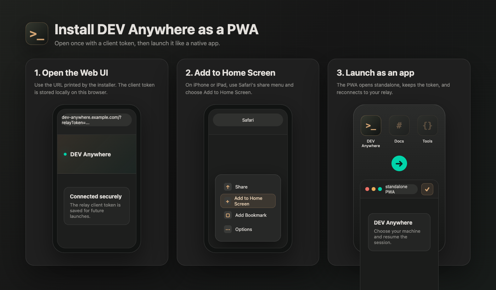

# Install the DEV Anywhere PWA

DEV Anywhere is a Progressive Web App. That means you can open it in a browser, then install it to the home screen or app launcher so it behaves like a small native app.

<p>
  
</p>

## Before You Install

Deploy the hosted relay/web stack first. The installer prints a Web UI URL like:

```text
https://dev-anywhere.example.com/?relayToken=<RELAY_CLIENT_TOKEN>
```

Open that full URL once on each browser or device. The app stores the client token locally and uses it for future relay connections.

## iPhone and iPad

1. Open Safari.
2. Visit the Web UI URL with `?relayToken=<RELAY_CLIENT_TOKEN>`.
3. Wait for DEV Anywhere to load and show your relay connection state.
4. Tap the Safari share button.
5. Tap **Add to Home Screen**.
6. Keep the name as `DEV Anywhere` and tap **Add**.
7. Launch DEV Anywhere from the home screen.

iOS and iPadOS require Safari for home-screen PWA installation. Chrome and other browsers on iOS can open the site, but Safari provides the home-screen install flow.

## Desktop Chrome or Edge

1. Open the Web UI URL with `?relayToken=<RELAY_CLIENT_TOKEN>`.
2. Click the install icon in the address bar. It may look like a monitor with a down arrow, or appear inside the browser menu.
3. Confirm **Install**.
4. Launch DEV Anywhere from the app launcher, dock, or desktop shortcut.

## Desktop Safari

On recent macOS Safari versions:

1. Open the Web UI URL with `?relayToken=<RELAY_CLIENT_TOKEN>`.
2. Use **File -> Add to Dock**.
3. Confirm the app name.

If your Safari version does not show **Add to Dock**, keep DEV Anywhere as a pinned tab or use Chrome/Edge for desktop PWA installation.

## Token Updates

If `RELAY_CLIENT_TOKEN` changes, open the app again with the new URL:

```text
https://dev-anywhere.example.com/?relayToken=<NEW_RELAY_CLIENT_TOKEN>
```

The new token replaces the saved one. If a device still cannot connect, clear site data for your DEV Anywhere domain and open the token URL again.

## What Gets Installed

The PWA stores only browser-local app state such as the relay client token and UI cache. Repository files, shell credentials, Claude Code sessions, and Codex sessions remain on the developer machine that runs `@dev-anywhere/proxy`.
